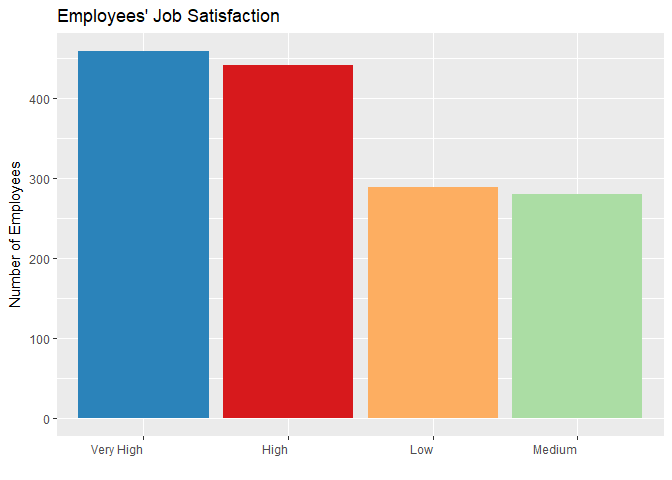

# Predicting And reducing Attrition Using Data Science


```r
# In order to import XLSX, we install the package "readxl" into our environment.  After loading library "readxl" we're able to use read_excel function to import the sheet "HR-employee-attrition Data" into a dataframe. 
library(ggplot2)
library(readxl)
attritionDF <- read_excel(path = "Attrition_Data_Clean.xlsx", sheet = "HR-employee-attrition Data")
```

## Introduction

Attrition, or voluntary employee turnover, comes as a high cost to companies.  The cost of interviewing, training, productivity, and negative impacts on morale are just a few. The key to success for companies, then, is to attract and retain talent. To help facilitate talent management and reduce attrition, thereby reducing real cost to companies, DDSAnalytics's in-house data science team, TAJAR, has compiled some important characteristics associated with increased risk of employee turnover. Our findings will allow companies to identify possible causes of employee turnover, create targeted approaches, and improve their talent management along with their company culture and profit margins.

DDSAnalytics is an analytics company that specializes in talent management solutions for Fortune 1000 companies. Talent management, broadly defined as the iterative process of developing and retaining employees, can include workforce planning, employee training programs, identifying high-potential employees and reducing/preventing voluntary employee turnover (attrition). DDSAnalytics has joined forces with TAJAR, their new in-house data science team, to apply data analysis to a dataset from IBM in order to help improve IBM's attrition rate, and more broadly, the attrition rate of Fortune 1000 companies. This report gives a picture of the employees in the dataset, the top factors for attrition, and suggests targeted ways for companies to mitigate their attrition rates.
 

## Methodology

This data, obtained from IBM's corporate office, allows a snapshot in to a large, thriving corporate company whose profit margins and general company culture could benefit from reducing attrition rates. After the data was cleaned and corrected for any formatting errors (since a few of the measures were self-reports from the employees), TAJAR reviewed the descriptive statistics. Then, TAJAR built a random forest model and edited it to identify the variables most strongly associated with attrition. After the initial findings, TAJAR continued to dig deeper and understand the "why" behind the numbers.

TAJAR used, in addition to some basic descriptive statistics, a random forest model to identify the most salient factors contributing to employee attrition (xxRAJAT**-- add more detail here. Expand on what you put in the slides if you started there first).

All of the code used to explore the data, including exploratory code not attached to this report, more details on the research methodology, and the data, as well a copy of this report, can be found online at https://github.com/R-Chandna/MSDS6306_CaseStudy_2.git.


```r
#1a	Tori: The client wants this to be reproducible and know exactly what you did.  There needs to be an informative Readme, complete with several sections, as referenced in Live Session.  Give contact information, session Info, and the objective of the repo at least.  
#1a: The README WILL be updated to look pretty and have the basic introduction to everything. **Tori**
#1b	An: You have a large data set, and it needs its own Codebook, formatted in an approachable way.  Make sure you describe peculiarities of the data by variable and what needs transforming.  However, do not make it too long either.
#1b: The codebook WILL BE added as a separate file and to the README - **AN**
#1c	Rajat: Create a file structure that is accessible and transparent.  Document it in the root directory, ideally in the Readme.
#1c: A clearly understandable directory WILL BE created and documented in the README **RAJAT**
```


## Dataset Overview, Demographics

The dataset used came without any missing values, and required only a little cleaning, mostly renaming the variables to be more readable and workable, and changing the format of a few variables so the data imported cleanly.


```r
library(stringr)

# 2A - a	Read the csv into R and take a look at the data set.  Output how many rows and columns the data.frame is.
# There are 1470 rows (observations) and 35 columns (variables)
dimDF <- dim(attritionDF)
names(dimDF) <- c("Rows", "Columns")
dimDF
```

```
##    Rows Columns 
##    1470      35
```

```r
# 2B - b	The column names are either too much or not enough.  Change the column names so that they do not have spaces, underscores, slashes, and the like. All column names should be under 12 characters. Make sure you’re updating your codebook with information on the tidied data set as well.
# Results of column names and its string length count.  
## Need to find a more elegant function to filter the list and subset only values greater than 12.  For now, this will suffice.
lettercount <- str_length(names(attritionDF))
countDF <- data.frame(cbind(names(attritionDF), lettercount))
names(countDF) <- c("Variable", "LetterCount")
countDF
```

```
##        Variable LetterCount
## 1           Age           3
## 2     Attrition           9
## 3    WorkTravel          10
## 4     DailyRate           9
## 5    Department          10
## 6  DistFromHome          12
## 7     Education           9
## 8  FieldOfStudy          12
## 9     Headcount           9
## 10   EmployeeID          10
## 11 EnvrSatIndex          12
## 12       Gender           6
## 13   HourlyRate          10
## 14    JobInvolv           9
## 15     JobLevel           8
## 16      JobRole           7
## 17  JobSatIndex          11
## 18 MaritalState          12
## 19  MonthlyInco          11
## 20  MonthlyRate          11
## 21 NumPriorComp          12
## 22       Over18           6
## 23     OverTime           8
## 24 PctSalaryInc          12
## 25   PerfRating          10
## 26 RelpSatIndex          12
## 27     StdHours           8
## 28  StockOptLvl          11
## 29   TotWorkExp          10
## 30 TrainedLstYr          12
## 31  WorkLifeFit          11
## 32 YrsAtCompany          12
## 33    YrsInRole           9
## 34 LastPromoted          12
## 35   YrsWithMgr          10
```

```r
# Replacing Original Variable names that have > 12 characters with new names under the Working column in Attrition_Col_Name_New.csv.

original <- names(attritionDF)
write.csv(original, "Attrition_Col_Name_Old.csv")
head(names(attritionDF))
```

```
## [1] "Age"          "Attrition"    "WorkTravel"   "DailyRate"   
## [5] "Department"   "DistFromHome"
```

```r
colNamesDF <- read.csv("Attrition_Col_Name_New.csv")
working <- colNamesDF$Working
names(attritionDF) <- working
head(names(attritionDF))
```

```
## [1] "Age"          "Attrition"    "WorkTravel"   "DailyRate"   
## [5] "Department"   "DistFromHome"
```

```r
# 2C - Due to Qualtrics, the following columns will have its integer value replaced by the definitions provided in the "Data Definitions" sheet.  
## Will need to seperate the integer and characters into two seperate columns.
datadefDF <- read_excel ("CaseStudy2-data.xlsx", "Data Definitions")
datadefDF
```

```
## # A tibble: 34 x 2
##    Education               `1 'Below College'`
##    <chr>                   <chr>              
##  1 <NA>                    2 'College'        
##  2 <NA>                    3 'Bachelor'       
##  3 <NA>                    4 'Master'         
##  4 <NA>                    5 'Doctor'         
##  5 <NA>                    <NA>               
##  6 EnvironmentSatisfaction 1 'Low'            
##  7 <NA>                    2 'Medium'         
##  8 <NA>                    3 'High'           
##  9 <NA>                    4 'Very High'      
## 10 <NA>                    <NA>               
## # ... with 24 more rows
```

```r
# 2D - d	Make sure your columns are the proper data types (i.e., numeric, character, etc.).  If they are incorrect, convert them. 
# Verifying the columns class type are numeric and character.
as.matrix(lapply(attritionDF, class))
```

```
##              [,1]       
## Age          "numeric"  
## Attrition    "character"
## WorkTravel   "character"
## DailyRate    "numeric"  
## Department   "character"
## DistFromHome "numeric"  
## Education    "character"
## FieldOfStudy "character"
## Headcount    "numeric"  
## EmployeeID   "numeric"  
## EnvrSatIndex "character"
## Gender       "character"
## HourlyRate   "numeric"  
## JobInvolv    "character"
## JobLevel     "numeric"  
## JobRole      "character"
## JobSatIndex  "character"
## MaritalState "character"
## MonthlyInco  "numeric"  
## MonthlyRate  "numeric"  
## NumPriorComp "numeric"  
## Over18       "character"
## OverTime     "character"
## PctSalaryInc "numeric"  
## PerfRating   "character"
## RelpSatIndex "character"
## StdHours     "numeric"  
## StockOptLvl  "numeric"  
## TotWorkExp   "numeric"  
## TrainedLstYr "numeric"  
## WorkLifeFit  "character"
## YrsAtCompany "numeric"  
## YrsInRole    "numeric"  
## LastPromoted "numeric"  
## YrsWithMgr   "numeric"
```

The dataset included information gathered on 1,470 employees who voluntarily filled out an online survey and had 35 variables that included whether or not they left the company (attrition), demographics such as age, gender, and marital status, as well as employee information such as job role, stock options, and compensation, and also included some other metrics, such as relationship, environment, and job satisfaction, etc. There is a codebook included with this report that details all 35 variables and their names as used in our code.


```r
#**ANDY** or **AN**, fill in the x's in this section, and edit the content to your heart's desire. Include any relevant code in the q3 code block below or wherever you see fit: 
```
Of the employees, xx were male and xx were female. The job roles listed were xx, xx, xx, xx, xx, and xx, spread across xx, xx, xx, xx, and xx departments. The xx department had xx employees, the xx department had xx employees, and the xx department had xx employees. 


```r
#3c. Give the frequencies (in table format or similar) for Gender, Education, and Occupation.  They can be separate tables, if that's your choice.
#Needs some refining
gendertable <- table(attritionDF$Gender)
gendertable
```

```
## 
## Female   Male 
##    588    882
```

```r
educationtable <- table(attritionDF$Education)
educationtable
```

```
## 
##      Bachelor Below College       College        Doctor        Master 
##           572           170           282            48           398
```

```r
occupationtable <- table(attritionDF$JobRole)
occupationtable
```

```
## 
## Healthcare Representative           Human Resources 
##                       131                        52 
##     Laboratory Technician                   Manager 
##                       259                       102 
##    Manufacturing Director         Research Director 
##                       145                        80 
##        Research Scientist           Sales Executive 
##                       292                       326 
##      Sales Representative 
##                        83
```

```r
#3d. Give the counts (again, table) of management positions.
#Needs some refining
library(plyr)
management <- count(attritionDF$JobRole)
management <- management[management$x=="Manager",]

#3b - b	Please provide (in table format or similar), descriptive statistics on at least 7 variables (age, Income, etc.).  Create a simple histogram for two of them.  Comment on the shape of the distribution in your markdown.
# Create a table of summary statistics of Variables with numerical values
SummaryStat <- matrix(ncol = 6, nrow = 0)
SummaryStat <- rbind(SummaryStat, summary(attritionDF$MonthlyInco))
SummaryStat <- rbind(SummaryStat, summary(attritionDF$Age))
SummaryStat <- rbind(SummaryStat, summary(attritionDF$DistFromHome))
SummaryStat <- rbind(SummaryStat, summary(attritionDF$PctSalaryInc))
SummaryStat <- rbind(SummaryStat, summary(attritionDF$TotWorkExp))
SummaryStat <- rbind(SummaryStat, summary(attritionDF$YrsAtCompany))
SummaryStat <- rbind(SummaryStat, summary(attritionDF$NumPriorComp))
SummaryStat <- as.data.frame(SummaryStat)
row.names(SummaryStat) <- c("MonthlyInco", "Age", "DistFromHome", "PctSalarInc", "TotWorkExp", "YrsAtCompany", "NumPriorComp")
SummaryStat
```

```
##              Min. 1st Qu. Median        Mean 3rd Qu.  Max.
## MonthlyInco  1009    2911   4919 6502.931293    8379 19999
## Age            18      30     36   36.923810      43    60
## DistFromHome    1       2      7    9.192517      14    29
## PctSalarInc    11      12     14   15.209524      18    25
## TotWorkExp      0       6     10   11.279592      15    40
## YrsAtCompany    0       3      5    7.008163       9    40
## NumPriorComp    0       1      2    2.693197       4     9
```


```r
#**ANDY** or **AN**, fill in the x's in this section, and edit the content to your heart's desire. Make sure to include the bar chart of age vs. attrition and the bar chart of income vs. attrition from the EDA. Include any relevant code in the code block below or wherever you see fit: 
```
Out of the xx employees, xx voluntarily left the company. The department with the most employees who left was the xx department. Employees between the ages of 18-21, who did not have stock options, who xx, who xx, and who xx also had higher attrition rates. However, there seemed to be no difference in attrition according to gender, xx, xx, or xx.m


```r
#Create table with summary of variables with categorial variables, using first two factors most likely to attribute to attrition
JobSatTable <- as.data.frame(table(attritionDF$JobSatIndex))
JobSatTable <- data.frame(JobSatTable[,-1], row.names = JobSatTable[,1])
colnames(JobSatTable) <- c("Freq")
#Barplot of Job Satisfaction Level
ggplot(JobSatTable, aes(reorder(x=row.names(JobSatTable), -Freq), y=Freq)) + geom_bar(stat = "identity", aes(fill = row.names(JobSatTable))) + labs(title = "Employees' Job Satisfaction", y = "Number of Employees", x = "") + theme(axis.text.x = element_text(angle = 0, hjust = 1), legend.position="none") + scale_fill_brewer(palette="Spectral")
```

<!-- -->

```r
OverTimeTable <- as.data.frame(table(attritionDF$OverTime))
OverTimeTable <- data.frame(OverTimeTable[,-1], row.names = OverTimeTable[,1])
colnames(OverTimeTable) <- c("Freq")

#Barplot of Over Time
ggplot(OverTimeTable, aes(reorder(x=row.names(OverTimeTable), -Freq), y=Freq)) + geom_bar(stat = "identity", aes(fill = row.names(OverTimeTable))) + labs(title = "Over Time", y = "Number of Employees", x = "") + theme(axis.text.x = element_text(angle = 0, hjust = 1), legend.position="none") + scale_fill_brewer(palette="Spectral")
```

<!-- -->

While exploring the data, these trends related to job role (and that may or may not directly relate to attrition) surfaced:


```r
#**JODI** Put the exploratory stuff about job role and overtime here, and you can also throw some info down under overtime

#**AN** put a visual here showing job satisfaction vs. job role and overtime vs. job satisfaction
```

For privacy reasons, IBM and TAJAR with DDSAnalytics did not want to run any analyses on minors. There were, however, no minors in the dataset. The age of the participating employees ranged from 18-60.


```r
#3a -	Remove all observations where the participant is under age 18.  No further analysis of underage individuals is permitted by your client.  Remove any other age outliers as you see fit, but be sure to tell what you’re doing and why.
# Age between 18 and 60, no children under 18 and no obvious age outliers.
summary(attritionDF$Age)
```

```
##    Min. 1st Qu.  Median    Mean 3rd Qu.    Max. 
##   18.00   30.00   36.00   36.92   43.00   60.00
```

```r
attritionDF$Over18[attritionDF$Over18 == 'N']
```

```
## character(0)
```

## Deeper Analysis, Evaluation, Results

Once TAJAR completed the random forest, it was found that the top 7 factors contributing to attrition were: 1) How satisfied an employee was with their hob, 2) Whether an employee reported working overtime, 3) How satisfied an employee was with their general environment, 4) What level their job was considered, on a scale from 1-5, 5) an employee's hourly rate, 6) An employee's work/life balance score, 7) and Whether or not the employee was married (which was closely correlated with their age.)


```r
#**ANDY and RAJAT** Check my wording above and fill in relevant info and code from the random forest. Please feel free to add copy, too.
```
ADD COPY HERE ABOUT WHAT WE FOUND WITH THE RANDOM FOREST

Since, during the demgraphics and exploratory phase of the data analysis, employees between the ages of 18-21 seemed to have a significant spike in attrition, and income seemed to have some relationship with attrition, TAJAR decided to further explore the relationship of these variables. It was found that age and income are correlated with each other. Age, though mostly normally distributed throughout the company, has a slightly larger amount of employees around the age of 36. The incomes of these employees, however are not normally distributed and a large majority of the employees make at or below 5,000 dollars a month, or 60,000 dollars a year or less.


```r
#An's code for Q4b
library(RColorBrewer)

#4b there seemed to be no relationship between age and MonthlyRate, DailyRate, or HourlyRate
##Monthly Rate
ggplot(data = attritionDF, aes(x = Age, y = MonthlyRate)) + geom_point(aes(colour = factor(Gender))) + geom_smooth(method = "lm", aes(group = Gender, colour = Gender)) + labs(title = "Montly Rate vs Age", x = "Age", y = "Monthly Rate", color = "Gender")
```

<!-- -->

```r
test <- lm(attritionDF$MonthlyRate ~ attritionDF$Age)
summary(test)
```

```
## 
## Call:
## lm(formula = attritionDF$MonthlyRate ~ attritionDF$Age)
## 
## Residuals:
##    Min     1Q Median     3Q    Max 
## -12452  -6193    -45   6111  13056 
## 
## Coefficients:
##                 Estimate Std. Error t value Pr(>|t|)    
## (Intercept)     13506.10     773.19  17.468   <2e-16 ***
## attritionDF$Age    21.86      20.33   1.075    0.282    
## ---
## Signif. codes:  0 '***' 0.001 '**' 0.01 '*' 0.05 '.' 0.1 ' ' 1
## 
## Residual standard error: 7117 on 1468 degrees of freedom
## Multiple R-squared:  0.0007869,	Adjusted R-squared:  0.0001062 
## F-statistic: 1.156 on 1 and 1468 DF,  p-value: 0.2825
```

```r
##Daily Rate
ggplot(data = attritionDF, aes(x = Age, y = DailyRate)) + geom_point(aes(colour = factor(Gender))) + geom_smooth(method = "lm", aes(group = Gender, colour = Gender)) + labs(title = "Daily Rate vs Age", x = "Age", y = "Daily Rate", color = "Gender")
```

<!-- -->

```r
test <- lm(attritionDF$DailyRate ~ attritionDF$Age)
summary(test)
```

```
## 
## Call:
## lm(formula = attritionDF$DailyRate ~ attritionDF$Age)
## 
## Residuals:
##     Min      1Q  Median      3Q     Max 
## -708.06 -337.55   -0.61  355.66  697.72 
## 
## Coefficients:
##                 Estimate Std. Error t value Pr(>|t|)    
## (Intercept)     785.0985    43.8469  17.905   <2e-16 ***
## attritionDF$Age   0.4709     1.1528   0.408    0.683    
## ---
## Signif. codes:  0 '***' 0.001 '**' 0.01 '*' 0.05 '.' 0.1 ' ' 1
## 
## Residual standard error: 403.6 on 1468 degrees of freedom
## Multiple R-squared:  0.0001137,	Adjusted R-squared:  -0.0005675 
## F-statistic: 0.1669 on 1 and 1468 DF,  p-value: 0.683
```

```r
##Hourly Rate
ggplot(data = attritionDF, aes(x = Age, y = HourlyRate)) + geom_point(aes(colour = factor(Gender))) + geom_smooth(method = "lm", aes(group = Gender, colour = Gender)) + labs(title = "Hourly Rate vs Age", x = "Age", y = "Hourly Rate", color = "Gender")
```

<!-- -->

```r
test <- lm(attritionDF$HourlyRate ~ attritionDF$Age)
summary(test)
```

```
## 
## Call:
## lm(formula = attritionDF$HourlyRate ~ attritionDF$Age)
## 
## Residuals:
##     Min      1Q  Median      3Q     Max 
## -36.868 -17.517   0.064  17.483  35.078 
## 
## Coefficients:
##                 Estimate Std. Error t value Pr(>|t|)    
## (Intercept)     63.89557    2.20855  28.931   <2e-16 ***
## attritionDF$Age  0.05405    0.05806   0.931    0.352    
## ---
## Signif. codes:  0 '***' 0.001 '**' 0.01 '*' 0.05 '.' 0.1 ' ' 1
## 
## Residual standard error: 20.33 on 1468 degrees of freedom
## Multiple R-squared:  0.0005898,	Adjusted R-squared:  -9.096e-05 
## F-statistic: 0.8664 on 1 and 1468 DF,  p-value: 0.3521
```

```r
#4b. MonthlyInco shows correlation with Age.  Tried linear regression on untransformed data and log, reciprocal, square root transformations
## untransformed
ggplot(data = attritionDF, aes(x = Age, y = MonthlyInco)) + geom_point(aes(colour = Gender)) + geom_smooth(method = 'lm', aes(group = Gender, colour = Gender)) + labs(title = "Montly Income vs Age", x = "Age", y = "Monthly Income", color = "Gender")
```

<!-- -->

```r
## log transformed
ggplot(data = attritionDF, aes(x = Age, y = log(MonthlyInco))) + geom_point(aes(colour = Gender)) + geom_smooth(method = 'lm', aes(group = Gender, colour = Gender)) + labs(title = "Montly Income vs Age", x = "Age", y = "log(Monthly Income)", color = "Gender", subtitle = "log transformed")
```

<!-- -->

```r
## reciprocal transformed
ggplot(data = attritionDF, aes(x = Age, y = -1/MonthlyInco)) + geom_point(aes(colour = Gender)) + geom_smooth(method = 'lm', aes(group = Gender, colour = Gender)) + labs(title = "Montly Income vs Age", x = "Age", y = "-1/(Monthly Income)", color = "Gender", subtitle = "negative reciprocal transformed")
```

<!-- -->

```r
## square root transformed
ggplot(data = attritionDF, aes(x = Age, y = sqrt(MonthlyInco))) + geom_point(aes(colour = Gender)) + geom_smooth(method = 'lm', aes(group = Gender, colour = Gender)) + labs(title = "Montly Income vs Age", x = "Age", y = "sqrt(Monthly Income)", color = "Gender", subtitle = "square root transformed")
```

<!-- -->

```r
#4b. Transformation did not yield better fit, fit test performed on most uncomplicated model, untransformed data
test <- lm(attritionDF$MonthlyInco ~ attritionDF$Age, subset = attritionDF$Gender == 'Male')
summary(test)
```

```
## 
## Call:
## lm(formula = attritionDF$MonthlyInco ~ attritionDF$Age, subset = attritionDF$Gender == 
##     "Male")
## 
## Residuals:
##     Min      1Q  Median      3Q     Max 
## -9940.2 -2524.5  -603.7  1659.1 12593.3 
## 
## Coefficients:
##                 Estimate Std. Error t value Pr(>|t|)    
## (Intercept)      -3028.8      577.6  -5.244 1.97e-07 ***
## attritionDF$Age    256.7       15.3  16.779  < 2e-16 ***
## ---
## Signif. codes:  0 '***' 0.001 '**' 0.01 '*' 0.05 '.' 0.1 ' ' 1
## 
## Residual standard error: 4106 on 880 degrees of freedom
## Multiple R-squared:  0.2424,	Adjusted R-squared:  0.2415 
## F-statistic: 281.5 on 1 and 880 DF,  p-value: < 2.2e-16
```

```r
test <- lm(attritionDF$MonthlyInco ~ attritionDF$Age, subset = attritionDF$Gender == 'Female')
summary(test)
```

```
## 
## Call:
## lm(formula = attritionDF$MonthlyInco ~ attritionDF$Age, subset = attritionDF$Gender == 
##     "Female")
## 
## Residuals:
##     Min      1Q  Median      3Q     Max 
## -9558.6 -2686.3  -783.7  1990.1 12347.8 
## 
## Coefficients:
##                 Estimate Std. Error t value Pr(>|t|)    
## (Intercept)     -2860.33     695.08  -4.115 4.42e-05 ***
## attritionDF$Age   255.74      18.07  14.151  < 2e-16 ***
## ---
## Signif. codes:  0 '***' 0.001 '**' 0.01 '*' 0.05 '.' 0.1 ' ' 1
## 
## Residual standard error: 4057 on 586 degrees of freedom
## Multiple R-squared:  0.2547,	Adjusted R-squared:  0.2534 
## F-statistic: 200.3 on 1 and 586 DF,  p-value: < 2.2e-16
```

```r
#Monthly Income is extremely left skewed, with the spike in values at or below $5000
ggplot(attritionDF, aes(MonthlyInco)) + geom_histogram(color = brewer.pal(11, "Spectral")[5], fill = brewer.pal(11, "Spectral")[4], bins = 30) + labs(title = "Monthly Income", y = "Employees", x = "USD")
```

<!-- -->

```r
#Age is slightly left skewed around 36 years of age
ggplot(attritionDF, aes(Age)) + geom_histogram(color = brewer.pal(11, "Spectral")[5], fill = brewer.pal(11, "Spectral")[4], bins = 30) + labs(title = "Employee's Ages", y = "Employees", x = "Years")
```

<!-- -->


```r
#**AN** or **ANDY** or **JODI** or **TORI** please evaluate the following sentence and fill in
```

Of the employees who make less than 60,000 dollars a year, xx report low job satisfaction.


## Summary


```r
#**JODI** update this summary along with the ppt. Tori will also help with this.
```

Employees who are happy, have a good work-life balance, and who feel valued by their company are more likely to stay than those who are not. Those who do not have to work too many hours, who like their current manager, who feel stable in their position, who feel valued by their company because they are given autonomy, stock options, and a higher salary, are not going to seek that value elsewhere. Companies wishing to retain the best talent at their companies and reduce attrition will want to focus on making their employees feel valued and prioritizing and encouraging a strong work-life balance.
