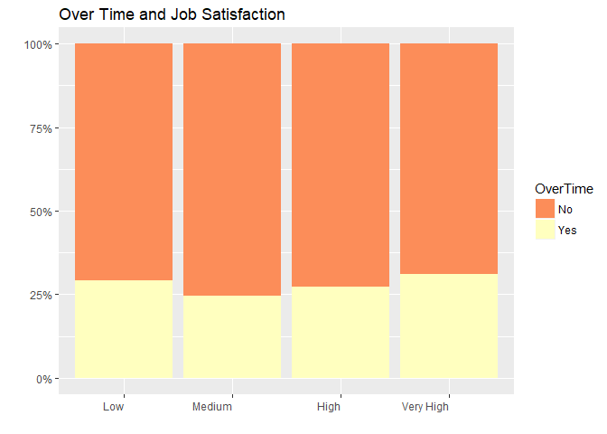
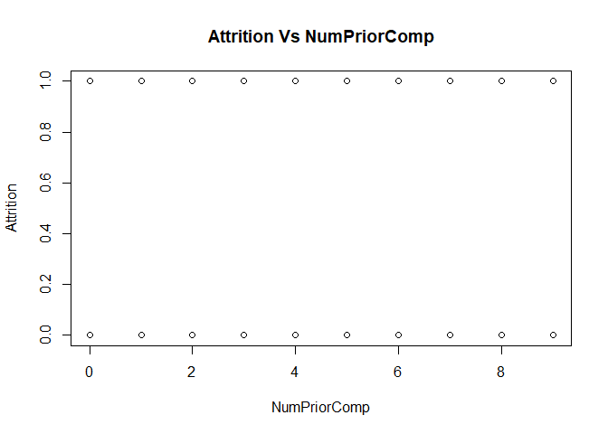
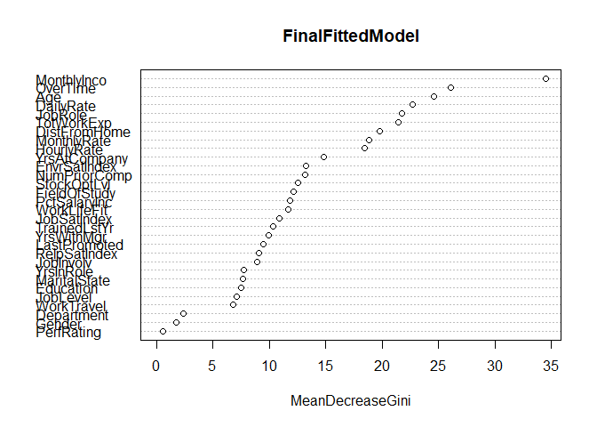

# Predicting And reducing Attrition Using Data Science


```r
# In order to import XLSX, we install the package "readxl" into our environment.  After loading library "readxl" we're able to use read_excel function to import the sheet "HR-employee-attrition Data" into a dataframe. 
library(ggplot2)
library(readxl)
library(randomForest)
```

```
## Warning: package 'randomForest' was built under R version 3.5.1
```

```
## randomForest 4.6-14
```

```
## Type rfNews() to see new features/changes/bug fixes.
```

```
## 
## Attaching package: 'randomForest'
```

```
## The following object is masked from 'package:ggplot2':
## 
##     margin
```

```r
library(stringr)
library(plyr)
library(dplyr)
```

```
## 
## Attaching package: 'dplyr'
```

```
## The following objects are masked from 'package:plyr':
## 
##     arrange, count, desc, failwith, id, mutate, rename, summarise,
##     summarize
```

```
## The following object is masked from 'package:randomForest':
## 
##     combine
```

```
## The following objects are masked from 'package:stats':
## 
##     filter, lag
```

```
## The following objects are masked from 'package:base':
## 
##     intersect, setdiff, setequal, union
```

```r
library(tidyr)
library(xlsx)
library(reshape2)
```

```
## 
## Attaching package: 'reshape2'
```

```
## The following object is masked from 'package:tidyr':
## 
##     smiths
```

```r
library(party)
```

```
## Warning: package 'party' was built under R version 3.5.1
```

```
## Loading required package: grid
```

```
## Loading required package: mvtnorm
```

```
## Loading required package: modeltools
```

```
## Warning: package 'modeltools' was built under R version 3.5.1
```

```
## Loading required package: stats4
```

```
## 
## Attaching package: 'modeltools'
```

```
## The following object is masked from 'package:plyr':
## 
##     empty
```

```
## Loading required package: strucchange
```

```
## Warning: package 'strucchange' was built under R version 3.5.1
```

```
## Loading required package: zoo
```

```
## 
## Attaching package: 'zoo'
```

```
## The following objects are masked from 'package:base':
## 
##     as.Date, as.Date.numeric
```

```
## Loading required package: sandwich
```

```
## 
## Attaching package: 'strucchange'
```

```
## The following object is masked from 'package:stringr':
## 
##     boundary
```

```r
library(gmodels)
```

```
## Warning: package 'gmodels' was built under R version 3.5.1
```

```r
library(vcd)
```

```
## Warning: package 'vcd' was built under R version 3.5.1
```

```r
library(caret)
```

```
## Warning: package 'caret' was built under R version 3.5.1
```

```
## Loading required package: lattice
```

```r
library(e1071)
```

```
## Warning: package 'e1071' was built under R version 3.5.1
```

```r
library(tm)
```

```
## Warning: package 'tm' was built under R version 3.5.1
```

```
## Loading required package: NLP
```

```
## 
## Attaching package: 'NLP'
```

```
## The following object is masked from 'package:ggplot2':
## 
##     annotate
```

```r
library(SnowballC)
library(wordcloud)
```

```
## Warning: package 'wordcloud' was built under R version 3.5.1
```

```
## Loading required package: RColorBrewer
```

```r
library(RColorBrewer)
sessionInfo()
```

```
## R version 3.5.0 (2018-04-23)
## Platform: x86_64-w64-mingw32/x64 (64-bit)
## Running under: Windows 10 x64 (build 17134)
## 
## Matrix products: default
## 
## locale:
## [1] LC_COLLATE=English_United States.1252 
## [2] LC_CTYPE=English_United States.1252   
## [3] LC_MONETARY=English_United States.1252
## [4] LC_NUMERIC=C                          
## [5] LC_TIME=English_United States.1252    
## 
## attached base packages:
## [1] stats4    grid      stats     graphics  grDevices utils     datasets 
## [8] methods   base     
## 
## other attached packages:
##  [1] wordcloud_2.5       RColorBrewer_1.1-2  SnowballC_0.5.1    
##  [4] tm_0.7-5            NLP_0.1-11          e1071_1.7-0        
##  [7] caret_6.0-80        lattice_0.20-35     vcd_1.4-4          
## [10] gmodels_2.18.1      party_1.3-0         strucchange_1.5-1  
## [13] sandwich_2.4-0      zoo_1.8-1           modeltools_0.2-22  
## [16] mvtnorm_1.0-8       reshape2_1.4.3      xlsx_0.6.1         
## [19] tidyr_0.8.0         dplyr_0.7.4         plyr_1.8.4         
## [22] stringr_1.3.1       randomForest_4.6-14 readxl_1.1.0       
## [25] ggplot2_2.2.1      
## 
## loaded via a namespace (and not attached):
##  [1] nlme_3.1-137       lubridate_1.7.4    dimRed_0.1.0      
##  [4] rprojroot_1.3-2    tools_3.5.0        backports_1.1.2   
##  [7] R6_2.2.2           rpart_4.1-13       lazyeval_0.2.1    
## [10] colorspace_1.3-2   nnet_7.3-12        withr_2.1.2       
## [13] tidyselect_0.2.4   mnormt_1.5-5       compiler_3.5.0    
## [16] xml2_1.2.0         slam_0.1-43        scales_0.5.0      
## [19] sfsmisc_1.1-2      lmtest_0.9-36      DEoptimR_1.0-8    
## [22] psych_1.8.4        robustbase_0.93-0  digest_0.6.15     
## [25] foreign_0.8-70     rmarkdown_1.9      pkgconfig_2.0.1   
## [28] htmltools_0.3.6    rlang_0.2.0        ddalpha_1.3.3     
## [31] bindr_0.1.1        gtools_3.8.1       ModelMetrics_1.1.0
## [34] magrittr_1.5       Matrix_1.2-14      Rcpp_0.12.16      
## [37] munsell_0.4.3      abind_1.4-5        stringi_1.1.7     
## [40] multcomp_1.4-8     yaml_2.1.19        MASS_7.3-49       
## [43] recipes_0.1.2      parallel_3.5.0     gdata_2.18.0      
## [46] splines_3.5.0      xlsxjars_0.6.1     knitr_1.20        
## [49] pillar_1.2.2       codetools_0.2-15   CVST_0.2-2        
## [52] magic_1.5-8        glue_1.2.0         evaluate_0.10.1   
## [55] foreach_1.4.4      cellranger_1.1.0   gtable_0.2.0      
## [58] purrr_0.2.4        kernlab_0.9-26     assertthat_0.2.0  
## [61] DRR_0.0.3          gower_0.1.2        coin_1.2-2        
## [64] prodlim_2018.04.18 broom_0.4.4        class_7.3-14      
## [67] survival_2.41-3    geometry_0.3-6     timeDate_3043.102 
## [70] RcppRoll_0.3.0     tibble_1.4.2       rJava_0.9-10      
## [73] iterators_1.0.9    bindrcpp_0.2.2     lava_1.6.1        
## [76] TH.data_1.0-9      ipred_0.9-6
```

```r
attritionDF <- read_excel(path = "Attrition_Data_Clean.xlsx", sheet = "HR-employee-attrition Data")
```

## Introduction

Attrition, or voluntary employee turnover, comes as a high cost to companies.  The cost of interviewing, training, productivity, and negative impacts on morale are just a few. The key to success for companies, then, is to attract and retain talent. To help facilitate talent management and reduce attrition, thereby reducing real cost to companies, DDSAnalytics's in-house data science team, TAJAR, has compiled some important characteristics associated with increased risk of employee turnover. Our findings will allow companies to identify possible causes of employee turnover, create targeted approaches, and improve their talent management along with their company culture and profit margins.

DDSAnalytics is an analytics company that specializes in talent management solutions for Fortune 1000 companies. Talent management, broadly defined as the iterative process of developing and retaining employees, can include workforce planning, employee training programs, identifying high-potential employees and reducing/preventing voluntary employee turnover (attrition). DDSAnalytics has joined forces with TAJAR, their new in-house data science team, to apply data analysis to a dataset from IBM in order to help improve IBM's attrition rate, and more broadly, the attrition rate of Fortune 1000 companies. This report gives a picture of the employees in the dataset, the top factors for attrition, and suggests targeted ways for companies to mitigate their attrition rates.
 

## Methodology

This data, obtained from IBM's corporate office, allows a snapshot in to a large, thriving corporate company whose profit margins and general company culture could benefit from reducing attrition rates. After the data was cleaned and corrected for any formatting errors (since a few of the measures were self-reports from the employees), TAJAR reviewed the descriptive statistics. Then, TAJAR built a random forest model and edited it to identify the variables most strongly associated with attrition. After the initial findings, TAJAR continued to dig deeper and understand the "why" behind the numbers.

TAJAR used, in addition to some basic descriptive statistics, a random forest model to identify the most salient factors contributing to employee attrition.x

All of the code used to explore the data, including exploratory code not attached to this report, more details on the research methodology, and the data, as well a copy of this report, can be found online at https://github.com/R-Chandna/MSDS6306_CaseStudy_2.git.


```r
#1a The client wants this to be reproducible and know exactly what you did.  There needs to be an informative Readme, complete with several sections, as referenced in Live Session.  Give contact information, session Info, and the objective of the repo at least.  
#1a: The README was updated to look pretty and have the basic introduction to everything. 
#1b	You have a large data set, and it needs its own Codebook, formatted in an approachable way.  Make sure you describe peculiarities of the data by variable and what needs transforming.  However, do not make it too long either.
#1b: The codebook was added as a separate file and to the README
#1c	Create a file structure that is accessible and transparent.  Document it in the root directory, ideally in the Readme.
#1c: A clearly understandable directory was created and documented in the README 
```

## Dataset Overview, Demographics

The dataset used came without any missing values, and required only a little cleaning, mostly renaming the variables to be more readable and workable, and changing the format of a few variables so the data imported cleanly.


```r
# 2A - a	Read the csv into R and take a look at the data set.  Output how many rows and columns the data.frame is.
# There are 1470 rows (observations) and 35 columns (variables)
dimDF <- dim(attritionDF)
names(dimDF) <- c("Rows", "Columns")
dimDF
```

```
##    Rows Columns 
##    1470      35
```

```r
# 2B - b	The column names are either too much or not enough.  Change the column names so that they do not have spaces, underscores, slashes, and the like. All column names should be under 12 characters. Make sure you’re updating your codebook with information on the tidied data set as well.
# Results of column names and its string length count.  
## Need to find a more elegant function to filter the list and subset only values greater than 12.  For now, this will suffice.
lettercount <- str_length(names(attritionDF))
countDF <- data.frame(cbind(names(attritionDF), lettercount))
names(countDF) <- c("Variable", "LetterCount")
countDF
```

```
##        Variable LetterCount
## 1           Age           3
## 2     Attrition           9
## 3    WorkTravel          10
## 4     DailyRate           9
## 5    Department          10
## 6  DistFromHome          12
## 7     Education           9
## 8  FieldOfStudy          12
## 9     Headcount           9
## 10   EmployeeID          10
## 11 EnvrSatIndex          12
## 12       Gender           6
## 13   HourlyRate          10
## 14    JobInvolv           9
## 15     JobLevel           8
## 16      JobRole           7
## 17  JobSatIndex          11
## 18 MaritalState          12
## 19  MonthlyInco          11
## 20  MonthlyRate          11
## 21 NumPriorComp          12
## 22       Over18           6
## 23     OverTime           8
## 24 PctSalaryInc          12
## 25   PerfRating          10
## 26 RelpSatIndex          12
## 27     StdHours           8
## 28  StockOptLvl          11
## 29   TotWorkExp          10
## 30 TrainedLstYr          12
## 31  WorkLifeFit          11
## 32 YrsAtCompany          12
## 33    YrsInRole           9
## 34 LastPromoted          12
## 35   YrsWithMgr          10
```

```r
# Replacing Original Variable names that have > 12 characters with new names under the Working column in Attrition_Col_Name_New.csv.

original <- names(attritionDF)
write.csv(original, "Attrition_Col_Name_Old.csv")
head(names(attritionDF))
```

```
## [1] "Age"          "Attrition"    "WorkTravel"   "DailyRate"   
## [5] "Department"   "DistFromHome"
```

```r
colNamesDF <- read.csv("Attrition_Col_Name_New.csv")
working <- colNamesDF$Working
names(attritionDF) <- working
head(names(attritionDF))
```

```
## [1] "Age"          "Attrition"    "WorkTravel"   "DailyRate"   
## [5] "Department"   "DistFromHome"
```

```r
# 2C - Due to Qualtrics, the following columns will have its integer value replaced by the definitions provided in the "Data Definitions" sheet.  
## Will need to seperate the integer and characters into two seperate columns.
datadefDF <- read_excel ("CaseStudy2-data.xlsx", "Data Definitions")
datadefDF
```

```
## # A tibble: 34 x 2
##    Education               `1 'Below College'`
##    <chr>                   <chr>              
##  1 <NA>                    2 'College'        
##  2 <NA>                    3 'Bachelor'       
##  3 <NA>                    4 'Master'         
##  4 <NA>                    5 'Doctor'         
##  5 <NA>                    <NA>               
##  6 EnvironmentSatisfaction 1 'Low'            
##  7 <NA>                    2 'Medium'         
##  8 <NA>                    3 'High'           
##  9 <NA>                    4 'Very High'      
## 10 <NA>                    <NA>               
## # ... with 24 more rows
```

```r
# 2D - d	Make sure your columns are the proper data types (i.e., numeric, character, etc.).  If they are incorrect, convert them. 
# Verifying the columns class type are numeric and character.
as.matrix(lapply(attritionDF, class))
```

```
##              [,1]       
## Age          "numeric"  
## Attrition    "character"
## WorkTravel   "character"
## DailyRate    "numeric"  
## Department   "character"
## DistFromHome "numeric"  
## Education    "character"
## FieldOfStudy "character"
## Headcount    "numeric"  
## EmployeeID   "numeric"  
## EnvrSatIndex "character"
## Gender       "character"
## HourlyRate   "numeric"  
## JobInvolv    "character"
## JobLevel     "numeric"  
## JobRole      "character"
## JobSatIndex  "character"
## MaritalState "character"
## MonthlyInco  "numeric"  
## MonthlyRate  "numeric"  
## NumPriorComp "numeric"  
## Over18       "character"
## OverTime     "character"
## PctSalaryInc "numeric"  
## PerfRating   "character"
## RelpSatIndex "character"
## StdHours     "numeric"  
## StockOptLvl  "numeric"  
## TotWorkExp   "numeric"  
## TrainedLstYr "numeric"  
## WorkLifeFit  "character"
## YrsAtCompany "numeric"  
## YrsInRole    "numeric"  
## LastPromoted "numeric"  
## YrsWithMgr   "numeric"
```

The dataset included information gathered on 1,470 employees who voluntarily filled out an online survey and had 35 variables that included whether or not they left the company (attrition), demographics such as age, gender, and marital status, as well as employee information such as job role, stock options, and compensation, and also included some other metrics, such as relationship, environment, and job satisfaction, etc. There is a codebook included with this report that details all 35 variables and their names as used in our code.


```r
table(attritionDF$Gender)
```

```
## 
## Female   Male 
##    588    882
```

```r
sort(unique(attritionDF$JobRole))
```

```
## [1] "Healthcare Representative" "Human Resources"          
## [3] "Laboratory Technician"     "Manager"                  
## [5] "Manufacturing Director"    "Research Director"        
## [7] "Research Scientist"        "Sales Executive"          
## [9] "Sales Representative"
```

```r
table(attritionDF$Department)
```

```
## 
##        Human Resources Research & Development                  Sales 
##                     63                    961                    446
```

For privacy reasons, IBM and TAJAR with DDSAnalytics did not want to run any analyses on minors. There were, however, no minors in the dataset. The age of the participating employees ranged from 18-60.


```r
#3a -	Remove all observations where the participant is under age 18.  No further analysis of underage individuals is permitted by your client.  Remove any other age outliers as you see fit, but be sure to tell what you’re doing and why.
# Age between 18 and 60, no children under 18 and no obvious age outliers.
summary(attritionDF$Age)
```

```
##    Min. 1st Qu.  Median    Mean 3rd Qu.    Max. 
##   18.00   30.00   36.00   36.92   43.00   60.00
```

```r
attritionDF$Over18[attritionDF$Over18 == 'N']
```

```
## character(0)
```
Of the employees, 882 were male and 588 were female. The job roles listed were Healthcare Representative, Human Resources, Laboratory Technician, Manager, Manufacturing Director, Research Director, Research Scientist, Sales Executive, and Sales Represantative spread across Human Resources with 63 employees, Research & Development with 961 employees, and Sales with 446 employees. Of Human Resource's 63 employees, 11 were managers. Of R&D's 961, 54 were managers, and of Sales' 446, 37 were managers.


```r
#3c. Give the frequencies (in table format or similar) for Gender, Education, and Occupation.  They can be separate tables, if that's your choice.
gendertable <- table(attritionDF$Gender)
gendertable
```

```
## 
## Female   Male 
##    588    882
```

```r
educationtable <- table(attritionDF$Education)
educationtable
```

```
## 
##      Bachelor Below College       College        Doctor        Master 
##           572           170           282            48           398
```

```r
occupationtable <- table(attritionDF$JobRole)
occupationtable
```

```
## 
## Healthcare Representative           Human Resources 
##                       131                        52 
##     Laboratory Technician                   Manager 
##                       259                       102 
##    Manufacturing Director         Research Director 
##                       145                        80 
##        Research Scientist           Sales Executive 
##                       292                       326 
##      Sales Representative 
##                        83
```

```r
#3d. Give the counts (again, table) of management positions.
#all the counts of all the positions (for comparison)
management <- count(attritionDF, Department, JobRole)
management
```

```
## # A tibble: 11 x 3
##    Department             JobRole                       n
##    <chr>                  <chr>                     <int>
##  1 Human Resources        Human Resources              52
##  2 Human Resources        Manager                      11
##  3 Research & Development Healthcare Representative   131
##  4 Research & Development Laboratory Technician       259
##  5 Research & Development Manager                      54
##  6 Research & Development Manufacturing Director      145
##  7 Research & Development Research Director            80
##  8 Research & Development Research Scientist          292
##  9 Sales                  Manager                      37
## 10 Sales                  Sales Executive             326
## 11 Sales                  Sales Representative         83
```

```r
#just the manager positions
filter(management, JobRole=="Manager")
```

```
## # A tibble: 3 x 3
##   Department             JobRole     n
##   <chr>                  <chr>   <int>
## 1 Human Resources        Manager    11
## 2 Research & Development Manager    54
## 3 Sales                  Manager    37
```

```r
#3b - b	Please provide (in table format or similar), descriptive statistics on at least 7 variables (age, Income, etc.).  Create a simple histogram for two of them.  Comment on the shape of the distribution in your markdown.
# Create a table of summary statistics of Variables with numerical values
SummaryStat <- matrix(ncol = 6, nrow = 0)
SummaryStat <- rbind(SummaryStat, summary(attritionDF$MonthlyInco))
SummaryStat <- rbind(SummaryStat, summary(attritionDF$Age))
SummaryStat <- rbind(SummaryStat, summary(attritionDF$DistFromHome))
SummaryStat <- rbind(SummaryStat, summary(attritionDF$PctSalaryInc))
SummaryStat <- rbind(SummaryStat, summary(attritionDF$TotWorkExp))
SummaryStat <- rbind(SummaryStat, summary(attritionDF$YrsAtCompany))
SummaryStat <- rbind(SummaryStat, summary(attritionDF$NumPriorComp))
SummaryStat <- as.data.frame(SummaryStat)
row.names(SummaryStat) <- c("MonthlyInco", "Age", "DistFromHome", "PctSalarInc", "TotWorkExp", "YrsAtCompany", "NumPriorComp")
SummaryStat
```

```
##              Min. 1st Qu. Median        Mean 3rd Qu.  Max.
## MonthlyInco  1009    2911   4919 6502.931293    8379 19999
## Age            18      30     36   36.923810      43    60
## DistFromHome    1       2      7    9.192517      14    29
## PctSalarInc    11      12     14   15.209524      18    25
## TotWorkExp      0       6     10   11.279592      15    40
## YrsAtCompany    0       3      5    7.008163       9    40
## NumPriorComp    0       1      2    2.693197       4     9
```

Out of the 1470 employees, 237 voluntarily left the company, or roughly 16%. The department with the most employees who left was the the Sales department with ~20.6% attrition rate followed by Human Resources with ~19.0% and R&D with ~13.8%. There were notable spikes in attrition for employees aged 18-21 and for employees who made less than 30,000 dollars a year, or 2,500 dollars a month. However, there seemed to be no significant difference in attrition according to gender or distance from home.


```r
#Create table with summary of variables with categorial variables, using first two factors most likely to attribute to attrition
JobSatTable <- as.data.frame(table(attritionDF$JobSatIndex))
JobSatTable <- data.frame(JobSatTable[,-1], row.names = JobSatTable[,1])
colnames(JobSatTable) <- c("Freq")

#Barplot of Job Satisfaction Level
ggplot(JobSatTable, aes(reorder(x=row.names(JobSatTable), -Freq), y=Freq)) + geom_bar(stat = "identity", aes(fill = row.names(JobSatTable))) + labs(title = "Employees' Job Satisfaction", y = "Number of Employees", x = "") + theme(axis.text.x = element_text(angle = 0, hjust = 1), legend.position="none") + scale_fill_brewer(palette="Spectral")
```

<!-- -->

```r
OverTimeTable <- as.data.frame(table(attritionDF$OverTime))
OverTimeTable <- data.frame(OverTimeTable[,-1], row.names = OverTimeTable[,1])
colnames(OverTimeTable) <- c("Freq")

#Barplot of Over Time
ggplot(OverTimeTable, aes(reorder(x=row.names(OverTimeTable), -Freq), y=Freq)) + geom_bar(stat = "identity", aes(fill = row.names(OverTimeTable))) + labs(title = "Over Time", y = "Number of Employees", x = "") + theme(axis.text.x = element_text(angle = 0, hjust = 1), legend.position="none") + scale_fill_brewer(palette="Spectral")
```

<!-- -->

```r
table(attritionDF$Attrition)
```

```
## 
##   No  Yes 
## 1233  237
```

```r
#Department
ggplot(attritionDF, aes(x = Department, fill = Attrition)) + geom_bar(position = "fill") + labs(title = "Attrition per Department", x = "", y = "", color = "") + scale_y_continuous(labels = scales::percent) + scale_fill_manual(values=c(brewer.pal(11, "Spectral")[3], brewer.pal(11, "Spectral")[10]))
```

<!-- -->

```r
tempDF <- attritionDF[,c("Attrition","Department")]
table(melt(tempDF))
```

```
## Using Attrition, Department as id variables
```

```
##          Department
## Attrition Human Resources Research & Development Sales
##       No               51                    828   354
##       Yes              12                    133    92
```

```r
#Age
ggplot(attritionDF, aes(x = Age, fill = Attrition)) + geom_histogram(position = "fill") + labs(title = "Attrition per Age Groups", x = "Age (years)", y = "", color = "") + scale_y_continuous(labels = scales::percent) + scale_fill_manual(values=c(brewer.pal(11, "Spectral")[3], brewer.pal(11, "Spectral")[10]))
```

```
## `stat_bin()` using `bins = 30`. Pick better value with `binwidth`.
```

<!-- -->

```r
#Income
ggplot(attritionDF, aes(x = MonthlyInco, fill = Attrition)) + geom_histogram(position = "fill") + labs(title = "Attrition per Monthly Income", x = "USD", y = "", color = "") + scale_y_continuous(labels = scales::percent) + scale_fill_manual(values=c(brewer.pal(11, "Spectral")[3], brewer.pal(11, "Spectral")[10]))
```

```
## `stat_bin()` using `bins = 30`. Pick better value with `binwidth`.
```

<!-- -->

## Deeper Analysis

Since, during the demgraphics and exploratory phase of the data analysis, employees between the ages of 18-21 seemed to have a significant spike in attrition, and income seemed to have some relationship with attrition, TAJAR decided to further explore the relationship of these variables. It was found that age and income are correlated with each other. Age, though mostly normally distributed throughout the company, has a slightly larger amount of employees around the age of 36. The incomes of these employees, however are not normally distributed and a large majority of the employees make at or below 5,000 dollars a month, or 60,000 dollars a year or less.


```r
#An's code for Q4b
library(RColorBrewer)

#4b there seemed to be no relationship between age and MonthlyRate, DailyRate, or HourlyRate
##Monthly Rate
ggplot(data = attritionDF, aes(x = Age, y = MonthlyRate)) + geom_point(aes(colour = factor(Gender))) + geom_smooth(method = "lm", aes(group = Gender, colour = Gender)) + labs(title = "Montly Rate vs Age", x = "Age", y = "Monthly Rate", color = "Gender")
```

<!-- -->

```r
test <- lm(attritionDF$MonthlyRate ~ attritionDF$Age)
summary(test)
```

```
## 
## Call:
## lm(formula = attritionDF$MonthlyRate ~ attritionDF$Age)
## 
## Residuals:
##    Min     1Q Median     3Q    Max 
## -12452  -6193    -45   6111  13056 
## 
## Coefficients:
##                 Estimate Std. Error t value Pr(>|t|)    
## (Intercept)     13506.10     773.19  17.468   <2e-16 ***
## attritionDF$Age    21.86      20.33   1.075    0.282    
## ---
## Signif. codes:  0 '***' 0.001 '**' 0.01 '*' 0.05 '.' 0.1 ' ' 1
## 
## Residual standard error: 7117 on 1468 degrees of freedom
## Multiple R-squared:  0.0007869,	Adjusted R-squared:  0.0001062 
## F-statistic: 1.156 on 1 and 1468 DF,  p-value: 0.2825
```

```r
##Daily Rate
ggplot(data = attritionDF, aes(x = Age, y = DailyRate)) + geom_point(aes(colour = factor(Gender))) + geom_smooth(method = "lm", aes(group = Gender, colour = Gender)) + labs(title = "Daily Rate vs Age", x = "Age", y = "Daily Rate", color = "Gender")
```

<!-- -->

```r
test <- lm(attritionDF$DailyRate ~ attritionDF$Age)
summary(test)
```

```
## 
## Call:
## lm(formula = attritionDF$DailyRate ~ attritionDF$Age)
## 
## Residuals:
##     Min      1Q  Median      3Q     Max 
## -708.06 -337.55   -0.61  355.66  697.72 
## 
## Coefficients:
##                 Estimate Std. Error t value Pr(>|t|)    
## (Intercept)     785.0985    43.8469  17.905   <2e-16 ***
## attritionDF$Age   0.4709     1.1528   0.408    0.683    
## ---
## Signif. codes:  0 '***' 0.001 '**' 0.01 '*' 0.05 '.' 0.1 ' ' 1
## 
## Residual standard error: 403.6 on 1468 degrees of freedom
## Multiple R-squared:  0.0001137,	Adjusted R-squared:  -0.0005675 
## F-statistic: 0.1669 on 1 and 1468 DF,  p-value: 0.683
```

```r
##Hourly Rate
ggplot(data = attritionDF, aes(x = Age, y = HourlyRate)) + geom_point(aes(colour = factor(Gender))) + geom_smooth(method = "lm", aes(group = Gender, colour = Gender)) + labs(title = "Hourly Rate vs Age", x = "Age", y = "Hourly Rate", color = "Gender")
```

<!-- -->

```r
test <- lm(attritionDF$HourlyRate ~ attritionDF$Age)
summary(test)
```

```
## 
## Call:
## lm(formula = attritionDF$HourlyRate ~ attritionDF$Age)
## 
## Residuals:
##     Min      1Q  Median      3Q     Max 
## -36.868 -17.517   0.064  17.483  35.078 
## 
## Coefficients:
##                 Estimate Std. Error t value Pr(>|t|)    
## (Intercept)     63.89557    2.20855  28.931   <2e-16 ***
## attritionDF$Age  0.05405    0.05806   0.931    0.352    
## ---
## Signif. codes:  0 '***' 0.001 '**' 0.01 '*' 0.05 '.' 0.1 ' ' 1
## 
## Residual standard error: 20.33 on 1468 degrees of freedom
## Multiple R-squared:  0.0005898,	Adjusted R-squared:  -9.096e-05 
## F-statistic: 0.8664 on 1 and 1468 DF,  p-value: 0.3521
```

```r
#4b. MonthlyInco shows correlation with Age.  Tried linear regression on untransformed data and log, reciprocal, square root transformations
## untransformed
ggplot(data = attritionDF, aes(x = Age, y = MonthlyInco)) + geom_point(aes(colour = Gender)) + geom_smooth(method = 'lm', aes(group = Gender, colour = Gender)) + labs(title = "Montly Income vs Age", x = "Age", y = "Monthly Income", color = "Gender")
```

<!-- -->

```r
## log transformed
ggplot(data = attritionDF, aes(x = Age, y = log(MonthlyInco))) + geom_point(aes(colour = Gender)) + geom_smooth(method = 'lm', aes(group = Gender, colour = Gender)) + labs(title = "Montly Income vs Age", x = "Age", y = "log(Monthly Income)", color = "Gender", subtitle = "log transformed")
```

<!-- -->

```r
## reciprocal transformed
ggplot(data = attritionDF, aes(x = Age, y = -1/MonthlyInco)) + geom_point(aes(colour = Gender)) + geom_smooth(method = 'lm', aes(group = Gender, colour = Gender)) + labs(title = "Montly Income vs Age", x = "Age", y = "-1/(Monthly Income)", color = "Gender", subtitle = "negative reciprocal transformed")
```

<!-- -->

```r
## square root transformed
ggplot(data = attritionDF, aes(x = Age, y = sqrt(MonthlyInco))) + geom_point(aes(colour = Gender)) + geom_smooth(method = 'lm', aes(group = Gender, colour = Gender)) + labs(title = "Montly Income vs Age", x = "Age", y = "sqrt(Monthly Income)", color = "Gender", subtitle = "square root transformed")
```

<!-- -->

```r
#4b. Transformation did not yield better fit, fit test performed on most uncomplicated model, untransformed data
test <- lm(attritionDF$MonthlyInco ~ attritionDF$Age, subset = attritionDF$Gender == 'Male')
summary(test)
```

```
## 
## Call:
## lm(formula = attritionDF$MonthlyInco ~ attritionDF$Age, subset = attritionDF$Gender == 
##     "Male")
## 
## Residuals:
##     Min      1Q  Median      3Q     Max 
## -9940.2 -2524.5  -603.7  1659.1 12593.3 
## 
## Coefficients:
##                 Estimate Std. Error t value Pr(>|t|)    
## (Intercept)      -3028.8      577.6  -5.244 1.97e-07 ***
## attritionDF$Age    256.7       15.3  16.779  < 2e-16 ***
## ---
## Signif. codes:  0 '***' 0.001 '**' 0.01 '*' 0.05 '.' 0.1 ' ' 1
## 
## Residual standard error: 4106 on 880 degrees of freedom
## Multiple R-squared:  0.2424,	Adjusted R-squared:  0.2415 
## F-statistic: 281.5 on 1 and 880 DF,  p-value: < 2.2e-16
```

```r
test <- lm(attritionDF$MonthlyInco ~ attritionDF$Age, subset = attritionDF$Gender == 'Female')
summary(test)
```

```
## 
## Call:
## lm(formula = attritionDF$MonthlyInco ~ attritionDF$Age, subset = attritionDF$Gender == 
##     "Female")
## 
## Residuals:
##     Min      1Q  Median      3Q     Max 
## -9558.6 -2686.3  -783.7  1990.1 12347.8 
## 
## Coefficients:
##                 Estimate Std. Error t value Pr(>|t|)    
## (Intercept)     -2860.33     695.08  -4.115 4.42e-05 ***
## attritionDF$Age   255.74      18.07  14.151  < 2e-16 ***
## ---
## Signif. codes:  0 '***' 0.001 '**' 0.01 '*' 0.05 '.' 0.1 ' ' 1
## 
## Residual standard error: 4057 on 586 degrees of freedom
## Multiple R-squared:  0.2547,	Adjusted R-squared:  0.2534 
## F-statistic: 200.3 on 1 and 586 DF,  p-value: < 2.2e-16
```

```r
#Monthly Income is extremely left skewed, with the spike in values at or below $5000
ggplot(attritionDF, aes(MonthlyInco)) + geom_histogram(color = brewer.pal(11, "Spectral")[5], fill = brewer.pal(11, "Spectral")[4], bins = 30) + labs(title = "Monthly Income", y = "Employees", x = "USD")
```

<!-- -->

```r
#Age is slightly left skewed around 36 years of age
ggplot(attritionDF, aes(Age)) + geom_histogram(color = brewer.pal(11, "Spectral")[5], fill = brewer.pal(11, "Spectral")[4], bins = 30) + labs(title = "Employee's Ages", y = "Employees", x = "Years")
```

<!-- -->

When examining Life Satisfaction, we looked at the participants who were no longer working at the company against the self-reporting Work Life Balance rating of "Bad", "Good", "Better", or "Best" and the Job Satisfaction Index of "Low", "Medium", "High", and "Very High". Most employees who stay at the company feel satisfied with their role, even if they feel they don’t have a great Work-Life Balance. Even with the a self-reported Job Satisfaction Rating at “Very High”, there is still a great loss due to attrition when they are self-reporting a Work-Life Balance of “Bad” or even “Good”.


```r
#Create a Life Satisfaction data frame with Attrition (Yes), Work Life Balance and Job Satsifaction.
Satisfaction <- subset(attritionDF, Attrition=="Yes", select=c(JobSatIndex, WorkLifeFit, Attrition))
head(Satisfaction)
```

```
## # A tibble: 6 x 3
##   JobSatIndex WorkLifeFit Attrition
##   <chr>       <chr>       <chr>    
## 1 Very High   Bad         Yes      
## 2 High        Better      Yes      
## 3 High        Better      Yes      
## 4 Low         Better      Yes      
## 5 Low         Better      Yes      
## 6 Low         Better      Yes
```

```r
#Create a visual to display.
ggplot(Satisfaction, aes(x = WorkLifeFit, fill = JobSatIndex)) + geom_bar(position = "fill") + labs(title = "Life Satisfaction - Attrition", x = "work-Life Balance with Job Satisfaction", y = "", color = "")+ scale_y_continuous(labels = scales::percent) + theme(axis.text.x = element_text(angle = 45, hjust = 1)) + scale_x_discrete(limits=c("Bad","Good","Better","Best"))
```

<!-- -->

```r
#Create a Life Satisfaction data frame with Attrition (No), Work Life Balance and Job Satsifaction.
SatisfactionN <- subset(attritionDF, Attrition=="No", select=c(JobSatIndex, WorkLifeFit, Attrition))
head(SatisfactionN)
```

```
## # A tibble: 6 x 3
##   JobSatIndex WorkLifeFit Attrition
##   <chr>       <chr>       <chr>    
## 1 Medium      Better      No       
## 2 High        Better      No       
## 3 Medium      Better      No       
## 4 Very High   Good        No       
## 5 Low         Good        No       
## 6 High        Better      No
```

```r
#Create a visual to display.
ggplot(SatisfactionN, aes(x = WorkLifeFit, fill = JobSatIndex)) + geom_bar(position = "fill") + labs(title = "Life Satisfaction - Not Lost to Attrition", x = "Work-Life Balance with Job Satisfaction", y = "", color = "")+ scale_y_continuous(labels = scales::percent) + theme(axis.text.x = element_text(angle = 45, hjust = 1)) + scale_x_discrete(limits=c("Bad","Good","Better","Best"))
```

<!-- -->

TAJAR was asked specifically to investigate the attrition rate as it related to Job Role of the employee. When examined, it was found that, with one notable exception, job satisfaction did not have an effect on attrition. However, in the Human Resources Department, it is predicted that the low job satisfaction likely has some role in the high department attrition rate. Additionally, it was found that working overtime also did not have a significant effect on job satisfaction, although it did on attrition. And, when separated by job role, working overtime did not significantly predict an employee leaving. However, the jobs with the lowest monthly income had a higher turnover rate, which is reflected in overall department departures as well.


```r
#Job Satisfaction vs Job Role in %
attritionDF$JobSatIndex <- factor(attritionDF$JobSatIndex, levels = c("Low", "Medium", "High", "Very High"))
ggplot(attritionDF, aes(JobRole, fill = JobSatIndex)) + geom_bar(position = "fill")  + labs(title = "Job Satisfaction per Job Role" , y = "", x = "") + theme(axis.text.x = element_text(angle = 55, hjust = 1)) + scale_fill_brewer(palette="Spectral") + scale_y_continuous(labels = scales::percent)
```

<!-- -->

```r
#Over Time vs Job Satisfaction in %
ggplot(attritionDF, aes(JobSatIndex, fill = OverTime)) + geom_bar(position = "fill")  + labs(title = "Over Time and Job Satisfaction" , y = "", x = "") + theme(axis.text.x = element_text(angle = 0, hjust = 1)) + scale_fill_brewer(palette="Spectral") + scale_y_continuous(labels = scales::percent)
```

<!-- -->

```r
attritionDF$JobSatIndex <- as.character(attritionDF$JobSatIndex)

#Over Time vs Attrition in %
ggplot(attritionDF, aes(Attrition, fill = OverTime)) + geom_bar(position = "fill")  + labs(title = "Over Time and Attrition" , y = "", x = "") + theme(axis.text.x = element_text(angle = 0, hjust = 1)) + scale_fill_brewer(palette="Spectral") + scale_y_continuous(labels = scales::percent)
```

<!-- -->

```r
attritionDF$Attrition <- as.character(attritionDF$Attrition)

#What was the percentage of people who worked overtime that left, by JobRole?
Attrition <- filter(attritionDF, Attrition == "Yes")
attrition.aggregate <- count(Attrition, JobRole, OverTime)
attrition.percentages <- attrition.aggregate %>% group_by(JobRole) %>% mutate(totalInRole=sum(n)) %>% group_by(OverTime) %>% mutate(percentage=paste0(round(100*n/totalInRole,2),'%'))
attrition.percentages
```

```
## # A tibble: 18 x 5
## # Groups:   OverTime [2]
##    JobRole                   OverTime     n totalInRole percentage
##    <chr>                     <chr>    <int>       <int> <chr>     
##  1 Healthcare Representative No           7           9 77.78%    
##  2 Healthcare Representative Yes          2           9 22.22%    
##  3 Human Resources           No           7          12 58.33%    
##  4 Human Resources           Yes          5          12 41.67%    
##  5 Laboratory Technician     No          31          62 50%       
##  6 Laboratory Technician     Yes         31          62 50%       
##  7 Manager                   No           1           5 20%       
##  8 Manager                   Yes          4           5 80%       
##  9 Manufacturing Director    No           6          10 60%       
## 10 Manufacturing Director    Yes          4          10 40%       
## 11 Research Director         No           1           2 50%       
## 12 Research Director         Yes          1           2 50%       
## 13 Research Scientist        No          14          47 29.79%    
## 14 Research Scientist        Yes         33          47 70.21%    
## 15 Sales Executive           No          26          57 45.61%    
## 16 Sales Executive           Yes         31          57 54.39%    
## 17 Sales Representative      No          17          33 51.52%    
## 18 Sales Representative      Yes         16          33 48.48%
```

```r
#How many people left per JobRole?
count(attritionDF, JobRole)
```

```
## # A tibble: 9 x 2
##   JobRole                       n
##   <chr>                     <int>
## 1 Healthcare Representative   131
## 2 Human Resources              52
## 3 Laboratory Technician       259
## 4 Manager                     102
## 5 Manufacturing Director      145
## 6 Research Director            80
## 7 Research Scientist          292
## 8 Sales Executive             326
## 9 Sales Representative         83
```

```r
count(filter(attritionDF, Attrition == "Yes"), JobRole)
```

```
## # A tibble: 9 x 2
##   JobRole                       n
##   <chr>                     <int>
## 1 Healthcare Representative     9
## 2 Human Resources              12
## 3 Laboratory Technician        62
## 4 Manager                       5
## 5 Manufacturing Director       10
## 6 Research Director             2
## 7 Research Scientist           47
## 8 Sales Executive              57
## 9 Sales Representative         33
```

```r
#Total Monthly income per Job Role
testDF <- dplyr::group_by(attritionDF, JobRole)
summarize(testDF, avgMonthlySalary = mean(MonthlyInco))
```

```
## # A tibble: 9 x 2
##   JobRole                   avgMonthlySalary
##   <chr>                                <dbl>
## 1 Healthcare Representative            7529.
## 2 Human Resources                      4236.
## 3 Laboratory Technician                3237.
## 4 Manager                             17182.
## 5 Manufacturing Director               7295.
## 6 Research Director                   16034.
## 7 Research Scientist                   3240.
## 8 Sales Executive                      6924.
## 9 Sales Representative                 2626
```

When looking at job satisfaction, which executive leadership hypothesized would have a significant effect on attrition, the opposite was found to be true. In general, job satisfaction was found to be consistent across all ages and Job Roles, and when those who left the company were examined, those most likely to leave (ages 18-21 and those with the Job Roles of Sales Representatives, Lab technicians, and non-manage Human Resources Department Workers) were more likely to have a higher job satisfaction rating (with the notable and previously noted exception of Human Resources). 


```r
#Plot Job Satisfaction by Age- ATTRITION YES
#Create a Job Satisfaction data frame with Attrition (Yes), Work Life Balance and Job Satsifaction.
JobSatisfaction <- subset(attritionDF, Attrition=="Yes", select=c(JobSatIndex, WorkLifeFit, Attrition, Age))
head(Satisfaction)
```

```
## # A tibble: 6 x 3
##   JobSatIndex WorkLifeFit Attrition
##   <chr>       <chr>       <chr>    
## 1 Very High   Bad         Yes      
## 2 High        Better      Yes      
## 3 High        Better      Yes      
## 4 Low         Better      Yes      
## 5 Low         Better      Yes      
## 6 Low         Better      Yes
```

```r
#organize factors for the plot
JobSatisfaction$JobSatIndex <- factor(JobSatisfaction$JobSatIndex, levels = c("Very High", "High", "Medium", "Low"))

#Plot JobSatIndex by Age
ggplot(JobSatisfaction, aes(x = Age, fill = JobSatIndex)) + geom_bar(position = "fill") + labs(title = "Job Satisfaction by Age", x = "Age", y = "", color = "")+ scale_y_continuous(labels = scales::percent) + theme(axis.text.x = element_text(angle = 45, hjust = 1))
```

<!-- -->

```r
#Plot Job Satisfaction by Age
#Create a Job Satisfaction data frame with Attrition (Yes), Work Life Balance and Job Satsifaction.
JobSatisfactionT <- subset(attritionDF, select=c(JobSatIndex, WorkLifeFit, Attrition, Age))
head(JobSatisfactionT)
```

```
## # A tibble: 6 x 4
##   JobSatIndex WorkLifeFit Attrition   Age
##   <chr>       <chr>       <chr>     <dbl>
## 1 Very High   Bad         Yes          41
## 2 Medium      Better      No           49
## 3 High        Better      Yes          37
## 4 High        Better      No           33
## 5 Medium      Better      No           27
## 6 Very High   Good        No           32
```

```r
#organize factors for the plot
JobSatisfactionT$JobSatIndex <- factor(JobSatisfactionT$JobSatIndex, levels = c("Very High", "High", "Medium", "Low"))

#Plot JobSatIndex by Age
ggplot(JobSatisfactionT, aes(x = Age, fill = JobSatIndex)) + geom_bar(position = "fill") + labs(title = "Job Satisfaction by Age", x = "Age", y = "", color = "")+ scale_y_continuous(labels = scales::percent) + theme(axis.text.x = element_text(angle = 45, hjust = 1))
```

<!-- -->

## Evaluation, Results

Once TAJAR completed the random forest, it was found that the top 7 factors contributing to attrition were: 1) How much an employee made per month, 2) Whether an employee reported working overtime, 3) How old and employee was, 4) What their Daily Rate was, 5) Their Job Role (Job Title), 6) An employee's marital status, 7) and Whether or not the employee was offered stock options. Since age and income were very closely correlated, and certain job roles had much lower incomes than others, together, these tops variables put together a picture that employees who feel like they are fairly compensated and who are not tied down by other obligations won't leave a company.


```r
# Create a copy of original DataFrame
formattedAttrDF <- data.frame(attritionDF)
str(formattedAttrDF)
```

```
## 'data.frame':	1470 obs. of  35 variables:
##  $ Age         : num  41 49 37 33 27 32 59 30 38 36 ...
##  $ Attrition   : chr  "Yes" "No" "Yes" "No" ...
##  $ WorkTravel  : chr  "Travel_Rarely" "Travel_Frequently" "Travel_Rarely" "Travel_Frequently" ...
##  $ DailyRate   : num  1102 279 1373 1392 591 ...
##  $ Department  : chr  "Sales" "Research & Development" "Research & Development" "Research & Development" ...
##  $ DistFromHome: num  1 8 2 3 2 2 3 24 23 27 ...
##  $ Education   : chr  "College" "Below College" "College" "Master" ...
##  $ FieldOfStudy: chr  "Life Sciences" "Life Sciences" "Other" "Life Sciences" ...
##  $ Headcount   : num  1 1 1 1 1 1 1 1 1 1 ...
##  $ EmployeeID  : num  1 2 4 5 7 8 10 11 12 13 ...
##  $ EnvrSatIndex: chr  "Medium" "High" "Very High" "Very High" ...
##  $ Gender      : chr  "Female" "Male" "Male" "Female" ...
##  $ HourlyRate  : num  94 61 92 56 40 79 81 67 44 94 ...
##  $ JobInvolv   : chr  "High" "Medium" "Medium" "High" ...
##  $ JobLevel    : num  2 2 1 1 1 1 1 1 3 2 ...
##  $ JobRole     : chr  "Sales Executive" "Research Scientist" "Laboratory Technician" "Research Scientist" ...
##  $ JobSatIndex : chr  "Very High" "Medium" "High" "High" ...
##  $ MaritalState: chr  "Single" "Married" "Single" "Married" ...
##  $ MonthlyInco : num  5993 5130 2090 2909 3468 ...
##  $ MonthlyRate : num  19479 24907 2396 23159 16632 ...
##  $ NumPriorComp: num  8 1 6 1 9 0 4 1 0 6 ...
##  $ Over18      : chr  "Y" "Y" "Y" "Y" ...
##  $ OverTime    : chr  "Yes" "No" "Yes" "Yes" ...
##  $ PctSalaryInc: num  11 23 15 11 12 13 20 22 21 13 ...
##  $ PerfRating  : chr  "Excellent" "Outstanding" "Excellent" "Excellent" ...
##  $ RelpSatIndex: chr  "Low" "Very High" "Medium" "High" ...
##  $ StdHours    : num  80 80 80 80 80 80 80 80 80 80 ...
##  $ StockOptLvl : num  0 1 0 0 1 0 3 1 0 2 ...
##  $ TotWorkExp  : num  8 10 7 8 6 8 12 1 10 17 ...
##  $ TrainedLstYr: num  0 3 3 3 3 2 3 2 2 3 ...
##  $ WorkLifeFit : chr  "Bad" "Better" "Better" "Better" ...
##  $ YrsAtCompany: num  6 10 0 8 2 7 1 1 9 7 ...
##  $ YrsInRole   : num  4 7 0 7 2 7 0 0 7 7 ...
##  $ LastPromoted: num  0 1 0 3 2 3 0 0 1 7 ...
##  $ YrsWithMgr  : num  5 7 0 0 2 6 0 0 8 7 ...
```


```r
as.data.frame(apply(formattedAttrDF, 2, function(x) length(unique(x))))
```

```
##              apply(formattedAttrDF, 2, function(x) length(unique(x)))
## Age                                                                43
## Attrition                                                           2
## WorkTravel                                                          3
## DailyRate                                                         886
## Department                                                          3
## DistFromHome                                                       29
## Education                                                           5
## FieldOfStudy                                                        6
## Headcount                                                           1
## EmployeeID                                                       1470
## EnvrSatIndex                                                        4
## Gender                                                              2
## HourlyRate                                                         71
## JobInvolv                                                           4
## JobLevel                                                            5
## JobRole                                                             9
## JobSatIndex                                                         4
## MaritalState                                                        3
## MonthlyInco                                                      1349
## MonthlyRate                                                      1427
## NumPriorComp                                                       10
## Over18                                                              1
## OverTime                                                            2
## PctSalaryInc                                                       15
## PerfRating                                                          2
## RelpSatIndex                                                        4
## StdHours                                                            1
## StockOptLvl                                                         4
## TotWorkExp                                                         40
## TrainedLstYr                                                        7
## WorkLifeFit                                                         4
## YrsAtCompany                                                       37
## YrsInRole                                                          19
## LastPromoted                                                       16
## YrsWithMgr                                                         18
```

```r
# Converting relevant Character Variables to Factors since these have levels. 
convertToFactors <- c("Attrition", "WorkTravel", "Department", "Education", "FieldOfStudy", "EnvrSatIndex", "Gender", "JobInvolv", "JobLevel", "JobRole", "JobSatIndex" , "MaritalState", "Over18", "OverTime", "PerfRating", "RelpSatIndex", "StockOptLvl", "WorkLifeFit")
for(columnName in convertToFactors){
  formattedAttrDF[,columnName] <- as.factor(formattedAttrDF[,columnName])
}
# Extra Debug--Remove
lapply(formattedAttrDF, function(x){if(is.factor(x)) levels(x)})
```

```
## $Age
## NULL
## 
## $Attrition
## [1] "No"  "Yes"
## 
## $WorkTravel
## [1] "Non-Travel"        "Travel_Frequently" "Travel_Rarely"    
## 
## $DailyRate
## NULL
## 
## $Department
## [1] "Human Resources"        "Research & Development"
## [3] "Sales"                 
## 
## $DistFromHome
## NULL
## 
## $Education
## [1] "Bachelor"      "Below College" "College"       "Doctor"       
## [5] "Master"       
## 
## $FieldOfStudy
## [1] "Human Resources"  "Life Sciences"    "Marketing"       
## [4] "Medical"          "Other"            "Technical Degree"
## 
## $Headcount
## NULL
## 
## $EmployeeID
## NULL
## 
## $EnvrSatIndex
## [1] "High"      "Low"       "Medium"    "Very High"
## 
## $Gender
## [1] "Female" "Male"  
## 
## $HourlyRate
## NULL
## 
## $JobInvolv
## [1] "High"      "Low"       "Medium"    "Very High"
## 
## $JobLevel
## [1] "1" "2" "3" "4" "5"
## 
## $JobRole
## [1] "Healthcare Representative" "Human Resources"          
## [3] "Laboratory Technician"     "Manager"                  
## [5] "Manufacturing Director"    "Research Director"        
## [7] "Research Scientist"        "Sales Executive"          
## [9] "Sales Representative"     
## 
## $JobSatIndex
## [1] "High"      "Low"       "Medium"    "Very High"
## 
## $MaritalState
## [1] "Divorced" "Married"  "Single"  
## 
## $MonthlyInco
## NULL
## 
## $MonthlyRate
## NULL
## 
## $NumPriorComp
## NULL
## 
## $Over18
## [1] "Y"
## 
## $OverTime
## [1] "No"  "Yes"
## 
## $PctSalaryInc
## NULL
## 
## $PerfRating
## [1] "Excellent"   "Outstanding"
## 
## $RelpSatIndex
## [1] "High"      "Low"       "Medium"    "Very High"
## 
## $StdHours
## NULL
## 
## $StockOptLvl
## [1] "0" "1" "2" "3"
## 
## $TotWorkExp
## NULL
## 
## $TrainedLstYr
## NULL
## 
## $WorkLifeFit
## [1] "Bad"    "Best"   "Better" "Good"  
## 
## $YrsAtCompany
## NULL
## 
## $YrsInRole
## NULL
## 
## $LastPromoted
## NULL
## 
## $YrsWithMgr
## NULL
```

```r
levelsInfoDf <- read.xlsx2(file = "CaseStudy2-data.xlsx",sheetName = "Data Definitions", startRow = 3, header = F)
str(levelsInfoDf)
```

```
## 'data.frame':	35 obs. of  2 variables:
##  $ X1: Factor w/ 8 levels "","Education",..: 2 1 1 1 1 1 3 1 1 1 ...
##  $ X2: Factor w/ 16 levels "","1 'Bad'","1 'Below College'",..: 3 5 8 13 16 1 4 7 11 15 ...
```

```r
levelsInfoDf[ , c("levelNo", "levelName")] <- colsplit(levelsInfoDf$X2, " ", c("levelNo", "levelName"))
levelsInfoDf$levelName <- gsub('[[:punct:]]+','',levelsInfoDf$levelName)
levelsInfoDf
```

```
##                          X1                X2 levelNo     levelName
## 1                 Education 1 'Below College'       1 Below College
## 2                                 2 'College'       2       College
## 3                                3 'Bachelor'       3      Bachelor
## 4                                  4 'Master'       4        Master
## 5                                  5 'Doctor'       5        Doctor
## 6                                                  NA              
## 7   EnvironmentSatisfaction           1 'Low'       1           Low
## 8                                  2 'Medium'       2        Medium
## 9                                    3 'High'       3          High
## 10                              4 'Very High'       4     Very High
## 11                                                 NA              
## 12           JobInvolvement           1 'Low'       1           Low
## 13                                 2 'Medium'       2        Medium
## 14                                   3 'High'       3          High
## 15                              4 'Very High'       4     Very High
## 16                                                 NA              
## 17          JobSatisfaction           1 'Low'       1           Low
## 18                                 2 'Medium'       2        Medium
## 19                                   3 'High'       3          High
## 20                              4 'Very High'       4     Very High
## 21                                                 NA              
## 22        PerformanceRating           1 'Low'       1           Low
## 23                                   2 'Good'       2          Good
## 24                              3 'Excellent'       3     Excellent
## 25                            4 'Outstanding'       4   Outstanding
## 26                                                 NA              
## 27 RelationshipSatisfaction           1 'Low'       1           Low
## 28                                 2 'Medium'       2        Medium
## 29                                   3 'High'       3          High
## 30                              4 'Very High'       4     Very High
## 31                                                 NA              
## 32          WorkLifeBalance           1 'Bad'       1           Bad
## 33                                   2 'Good'       2          Good
## 34                                 3 'Better'       3        Better
## 35                                   4 'Best'       4          Best
```

```r
# Give Meaningful Category Names to Levels of factors that have levels as "1", "2" etc 
# This will be done based upon the data definations present in the case study sheet
levels(formattedAttrDF$Education) <- levelsInfoDf[1:5, "levelName"]
levels(formattedAttrDF$EnvrSatIndex) <- levelsInfoDf[7:10, "levelName"]
levels(formattedAttrDF$JobInvolv) <- levelsInfoDf[12:15, "levelName"]
levels(formattedAttrDF$JobSatIndex) <- levelsInfoDf[17:20, "levelName"]
levels(formattedAttrDF$PerfRating) <- levelsInfoDf[22:25, "levelName"]
levels(formattedAttrDF$RelpSatIndex) <- levelsInfoDf[27:30, "levelName"]
levels(formattedAttrDF$WorkLifeFit) <- levelsInfoDf[32:35, "levelName"]
# Assigning Levels to variables Job Level and Stock Options as these are not mentioned in data defination sheet
levels(formattedAttrDF$JobLevel) <- c("Entry", "Experienced", "First-Level Management", "Middle-Level Management", "Top-Level Management")
levels(formattedAttrDF$WorkTravel) <- c("Non-Travel", "Travel_Rarely", "Travel_Frequently")
lapply(formattedAttrDF, function(x){if(is.factor(x)) levels(x)})
```

```
## $Age
## NULL
## 
## $Attrition
## [1] "No"  "Yes"
## 
## $WorkTravel
## [1] "Non-Travel"        "Travel_Rarely"     "Travel_Frequently"
## 
## $DailyRate
## NULL
## 
## $Department
## [1] "Human Resources"        "Research & Development"
## [3] "Sales"                 
## 
## $DistFromHome
## NULL
## 
## $Education
## [1] "Below College" "College"       "Bachelor"      "Master"       
## [5] "Doctor"       
## 
## $FieldOfStudy
## [1] "Human Resources"  "Life Sciences"    "Marketing"       
## [4] "Medical"          "Other"            "Technical Degree"
## 
## $Headcount
## NULL
## 
## $EmployeeID
## NULL
## 
## $EnvrSatIndex
## [1] "Low"       "Medium"    "High"      "Very High"
## 
## $Gender
## [1] "Female" "Male"  
## 
## $HourlyRate
## NULL
## 
## $JobInvolv
## [1] "Low"       "Medium"    "High"      "Very High"
## 
## $JobLevel
## [1] "Entry"                   "Experienced"            
## [3] "First-Level Management"  "Middle-Level Management"
## [5] "Top-Level Management"   
## 
## $JobRole
## [1] "Healthcare Representative" "Human Resources"          
## [3] "Laboratory Technician"     "Manager"                  
## [5] "Manufacturing Director"    "Research Director"        
## [7] "Research Scientist"        "Sales Executive"          
## [9] "Sales Representative"     
## 
## $JobSatIndex
## [1] "Low"       "Medium"    "High"      "Very High"
## 
## $MaritalState
## [1] "Divorced" "Married"  "Single"  
## 
## $MonthlyInco
## NULL
## 
## $MonthlyRate
## NULL
## 
## $NumPriorComp
## NULL
## 
## $Over18
## [1] "Y"
## 
## $OverTime
## [1] "No"  "Yes"
## 
## $PctSalaryInc
## NULL
## 
## $PerfRating
## [1] "Low"         "Good"        "Excellent"   "Outstanding"
## 
## $RelpSatIndex
## [1] "Low"       "Medium"    "High"      "Very High"
## 
## $StdHours
## NULL
## 
## $StockOptLvl
## [1] "0" "1" "2" "3"
## 
## $TotWorkExp
## NULL
## 
## $TrainedLstYr
## NULL
## 
## $WorkLifeFit
## [1] "Bad"    "Good"   "Better" "Best"  
## 
## $YrsAtCompany
## NULL
## 
## $YrsInRole
## NULL
## 
## $LastPromoted
## NULL
## 
## $YrsWithMgr
## NULL
```

```r
all(complete.cases(formattedAttrDF))
```

```
## [1] TRUE
```


```r
## Create a vector of all categorical variables
categoricalVarVec <- c("WorkTravel", "Department", "Education", "FieldOfStudy", "EnvrSatIndex", "Gender", "JobInvolv", "JobLevel", "JobRole", "JobSatIndex" , "MaritalState", "OverTime", "PerfRating", "RelpSatIndex", "StockOptLvl", "WorkLifeFit")
for(categoricalVar in categoricalVarVec){
  CrossTable(formattedAttrDF[ ,categoricalVar], formattedAttrDF$Attrition, chisq = T)
  mosaicplot(CrossTable(formattedAttrDF[ ,categoricalVar], formattedAttrDF$Attrition)$t, main = paste("Attrition Vs", categoricalVar, sep = " "), xlab = categoricalVar, ylab = "Attrition", color = T)
}
```

```
## 
##  
##    Cell Contents
## |-------------------------|
## |                       N |
## | Chi-square contribution |
## |           N / Row Total |
## |           N / Col Total |
## |         N / Table Total |
## |-------------------------|
## 
##  
## Total Observations in Table:  1470 
## 
##  
##                                   | formattedAttrDF$Attrition 
## formattedAttrDF[, categoricalVar] |        No |       Yes | Row Total | 
## ----------------------------------|-----------|-----------|-----------|
##                        Non-Travel |       138 |        12 |       150 | 
##                                   |     1.180 |     6.138 |           | 
##                                   |     0.920 |     0.080 |     0.102 | 
##                                   |     0.112 |     0.051 |           | 
##                                   |     0.094 |     0.008 |           | 
## ----------------------------------|-----------|-----------|-----------|
##                     Travel_Rarely |       208 |        69 |       277 | 
##                                   |     2.550 |    13.267 |           | 
##                                   |     0.751 |     0.249 |     0.188 | 
##                                   |     0.169 |     0.291 |           | 
##                                   |     0.141 |     0.047 |           | 
## ----------------------------------|-----------|-----------|-----------|
##                 Travel_Frequently |       887 |       156 |      1043 | 
##                                   |     0.169 |     0.879 |           | 
##                                   |     0.850 |     0.150 |     0.710 | 
##                                   |     0.719 |     0.658 |           | 
##                                   |     0.603 |     0.106 |           | 
## ----------------------------------|-----------|-----------|-----------|
##                      Column Total |      1233 |       237 |      1470 | 
##                                   |     0.839 |     0.161 |           | 
## ----------------------------------|-----------|-----------|-----------|
## 
##  
## Statistics for All Table Factors
## 
## 
## Pearson's Chi-squared test 
## ------------------------------------------------------------
## Chi^2 =  24.18241     d.f. =  2     p =  5.608614e-06 
## 
## 
##  
## 
##  
##    Cell Contents
## |-------------------------|
## |                       N |
## | Chi-square contribution |
## |           N / Row Total |
## |           N / Col Total |
## |         N / Table Total |
## |-------------------------|
## 
##  
## Total Observations in Table:  1470 
## 
##  
##                                   | formattedAttrDF$Attrition 
## formattedAttrDF[, categoricalVar] |        No |       Yes | Row Total | 
## ----------------------------------|-----------|-----------|-----------|
##                        Non-Travel |       138 |        12 |       150 | 
##                                   |     1.180 |     6.138 |           | 
##                                   |     0.920 |     0.080 |     0.102 | 
##                                   |     0.112 |     0.051 |           | 
##                                   |     0.094 |     0.008 |           | 
## ----------------------------------|-----------|-----------|-----------|
##                     Travel_Rarely |       208 |        69 |       277 | 
##                                   |     2.550 |    13.267 |           | 
##                                   |     0.751 |     0.249 |     0.188 | 
##                                   |     0.169 |     0.291 |           | 
##                                   |     0.141 |     0.047 |           | 
## ----------------------------------|-----------|-----------|-----------|
##                 Travel_Frequently |       887 |       156 |      1043 | 
##                                   |     0.169 |     0.879 |           | 
##                                   |     0.850 |     0.150 |     0.710 | 
##                                   |     0.719 |     0.658 |           | 
##                                   |     0.603 |     0.106 |           | 
## ----------------------------------|-----------|-----------|-----------|
##                      Column Total |      1233 |       237 |      1470 | 
##                                   |     0.839 |     0.161 |           | 
## ----------------------------------|-----------|-----------|-----------|
## 
## 
```

<!-- -->

```
## 
##  
##    Cell Contents
## |-------------------------|
## |                       N |
## | Chi-square contribution |
## |           N / Row Total |
## |           N / Col Total |
## |         N / Table Total |
## |-------------------------|
## 
##  
## Total Observations in Table:  1470 
## 
##  
##                                   | formattedAttrDF$Attrition 
## formattedAttrDF[, categoricalVar] |        No |       Yes | Row Total | 
## ----------------------------------|-----------|-----------|-----------|
##                   Human Resources |        51 |        12 |        63 | 
##                                   |     0.064 |     0.334 |           | 
##                                   |     0.810 |     0.190 |     0.043 | 
##                                   |     0.041 |     0.051 |           | 
##                                   |     0.035 |     0.008 |           | 
## ----------------------------------|-----------|-----------|-----------|
##            Research & Development |       828 |       133 |       961 | 
##                                   |     0.597 |     3.106 |           | 
##                                   |     0.862 |     0.138 |     0.654 | 
##                                   |     0.672 |     0.561 |           | 
##                                   |     0.563 |     0.090 |           | 
## ----------------------------------|-----------|-----------|-----------|
##                             Sales |       354 |        92 |       446 | 
##                                   |     1.079 |     5.615 |           | 
##                                   |     0.794 |     0.206 |     0.303 | 
##                                   |     0.287 |     0.388 |           | 
##                                   |     0.241 |     0.063 |           | 
## ----------------------------------|-----------|-----------|-----------|
##                      Column Total |      1233 |       237 |      1470 | 
##                                   |     0.839 |     0.161 |           | 
## ----------------------------------|-----------|-----------|-----------|
## 
##  
## Statistics for All Table Factors
## 
## 
## Pearson's Chi-squared test 
## ------------------------------------------------------------
## Chi^2 =  10.79601     d.f. =  2     p =  0.004525607 
## 
## 
##  
## 
##  
##    Cell Contents
## |-------------------------|
## |                       N |
## | Chi-square contribution |
## |           N / Row Total |
## |           N / Col Total |
## |         N / Table Total |
## |-------------------------|
## 
##  
## Total Observations in Table:  1470 
## 
##  
##                                   | formattedAttrDF$Attrition 
## formattedAttrDF[, categoricalVar] |        No |       Yes | Row Total | 
## ----------------------------------|-----------|-----------|-----------|
##                   Human Resources |        51 |        12 |        63 | 
##                                   |     0.064 |     0.334 |           | 
##                                   |     0.810 |     0.190 |     0.043 | 
##                                   |     0.041 |     0.051 |           | 
##                                   |     0.035 |     0.008 |           | 
## ----------------------------------|-----------|-----------|-----------|
##            Research & Development |       828 |       133 |       961 | 
##                                   |     0.597 |     3.106 |           | 
##                                   |     0.862 |     0.138 |     0.654 | 
##                                   |     0.672 |     0.561 |           | 
##                                   |     0.563 |     0.090 |           | 
## ----------------------------------|-----------|-----------|-----------|
##                             Sales |       354 |        92 |       446 | 
##                                   |     1.079 |     5.615 |           | 
##                                   |     0.794 |     0.206 |     0.303 | 
##                                   |     0.287 |     0.388 |           | 
##                                   |     0.241 |     0.063 |           | 
## ----------------------------------|-----------|-----------|-----------|
##                      Column Total |      1233 |       237 |      1470 | 
##                                   |     0.839 |     0.161 |           | 
## ----------------------------------|-----------|-----------|-----------|
## 
## 
```

<!-- -->

```
## 
##  
##    Cell Contents
## |-------------------------|
## |                       N |
## | Chi-square contribution |
## |           N / Row Total |
## |           N / Col Total |
## |         N / Table Total |
## |-------------------------|
## 
##  
## Total Observations in Table:  1470 
## 
##  
##                                   | formattedAttrDF$Attrition 
## formattedAttrDF[, categoricalVar] |        No |       Yes | Row Total | 
## ----------------------------------|-----------|-----------|-----------|
##                     Below College |       473 |        99 |       572 | 
##                                   |     0.096 |     0.498 |           | 
##                                   |     0.827 |     0.173 |     0.389 | 
##                                   |     0.384 |     0.418 |           | 
##                                   |     0.322 |     0.067 |           | 
## ----------------------------------|-----------|-----------|-----------|
##                           College |       139 |        31 |       170 | 
##                                   |     0.090 |     0.471 |           | 
##                                   |     0.818 |     0.182 |     0.116 | 
##                                   |     0.113 |     0.131 |           | 
##                                   |     0.095 |     0.021 |           | 
## ----------------------------------|-----------|-----------|-----------|
##                          Bachelor |       238 |        44 |       282 | 
##                                   |     0.009 |     0.047 |           | 
##                                   |     0.844 |     0.156 |     0.192 | 
##                                   |     0.193 |     0.186 |           | 
##                                   |     0.162 |     0.030 |           | 
## ----------------------------------|-----------|-----------|-----------|
##                            Master |        43 |         5 |        48 | 
##                                   |     0.186 |     0.969 |           | 
##                                   |     0.896 |     0.104 |     0.033 | 
##                                   |     0.035 |     0.021 |           | 
##                                   |     0.029 |     0.003 |           | 
## ----------------------------------|-----------|-----------|-----------|
##                            Doctor |       340 |        58 |       398 | 
##                                   |     0.114 |     0.593 |           | 
##                                   |     0.854 |     0.146 |     0.271 | 
##                                   |     0.276 |     0.245 |           | 
##                                   |     0.231 |     0.039 |           | 
## ----------------------------------|-----------|-----------|-----------|
##                      Column Total |      1233 |       237 |      1470 | 
##                                   |     0.839 |     0.161 |           | 
## ----------------------------------|-----------|-----------|-----------|
## 
##  
## Statistics for All Table Factors
## 
## 
## Pearson's Chi-squared test 
## ------------------------------------------------------------
## Chi^2 =  3.073961     d.f. =  4     p =  0.5455253 
## 
## 
##  
## 
##  
##    Cell Contents
## |-------------------------|
## |                       N |
## | Chi-square contribution |
## |           N / Row Total |
## |           N / Col Total |
## |         N / Table Total |
## |-------------------------|
## 
##  
## Total Observations in Table:  1470 
## 
##  
##                                   | formattedAttrDF$Attrition 
## formattedAttrDF[, categoricalVar] |        No |       Yes | Row Total | 
## ----------------------------------|-----------|-----------|-----------|
##                     Below College |       473 |        99 |       572 | 
##                                   |     0.096 |     0.498 |           | 
##                                   |     0.827 |     0.173 |     0.389 | 
##                                   |     0.384 |     0.418 |           | 
##                                   |     0.322 |     0.067 |           | 
## ----------------------------------|-----------|-----------|-----------|
##                           College |       139 |        31 |       170 | 
##                                   |     0.090 |     0.471 |           | 
##                                   |     0.818 |     0.182 |     0.116 | 
##                                   |     0.113 |     0.131 |           | 
##                                   |     0.095 |     0.021 |           | 
## ----------------------------------|-----------|-----------|-----------|
##                          Bachelor |       238 |        44 |       282 | 
##                                   |     0.009 |     0.047 |           | 
##                                   |     0.844 |     0.156 |     0.192 | 
##                                   |     0.193 |     0.186 |           | 
##                                   |     0.162 |     0.030 |           | 
## ----------------------------------|-----------|-----------|-----------|
##                            Master |        43 |         5 |        48 | 
##                                   |     0.186 |     0.969 |           | 
##                                   |     0.896 |     0.104 |     0.033 | 
##                                   |     0.035 |     0.021 |           | 
##                                   |     0.029 |     0.003 |           | 
## ----------------------------------|-----------|-----------|-----------|
##                            Doctor |       340 |        58 |       398 | 
##                                   |     0.114 |     0.593 |           | 
##                                   |     0.854 |     0.146 |     0.271 | 
##                                   |     0.276 |     0.245 |           | 
##                                   |     0.231 |     0.039 |           | 
## ----------------------------------|-----------|-----------|-----------|
##                      Column Total |      1233 |       237 |      1470 | 
##                                   |     0.839 |     0.161 |           | 
## ----------------------------------|-----------|-----------|-----------|
## 
## 
```

```
## Warning in chisq.test(t, correct = FALSE, ...): Chi-squared approximation
## may be incorrect
```

<!-- -->

```
## 
##  
##    Cell Contents
## |-------------------------|
## |                       N |
## | Chi-square contribution |
## |           N / Row Total |
## |           N / Col Total |
## |         N / Table Total |
## |-------------------------|
## 
##  
## Total Observations in Table:  1470 
## 
##  
##                                   | formattedAttrDF$Attrition 
## formattedAttrDF[, categoricalVar] |        No |       Yes | Row Total | 
## ----------------------------------|-----------|-----------|-----------|
##                   Human Resources |        20 |         7 |        27 | 
##                                   |     0.309 |     1.610 |           | 
##                                   |     0.741 |     0.259 |     0.018 | 
##                                   |     0.016 |     0.030 |           | 
##                                   |     0.014 |     0.005 |           | 
## ----------------------------------|-----------|-----------|-----------|
##                     Life Sciences |       517 |        89 |       606 | 
##                                   |     0.149 |     0.775 |           | 
##                                   |     0.853 |     0.147 |     0.412 | 
##                                   |     0.419 |     0.376 |           | 
##                                   |     0.352 |     0.061 |           | 
## ----------------------------------|-----------|-----------|-----------|
##                         Marketing |       124 |        35 |       159 | 
##                                   |     0.658 |     3.421 |           | 
##                                   |     0.780 |     0.220 |     0.108 | 
##                                   |     0.101 |     0.148 |           | 
##                                   |     0.084 |     0.024 |           | 
## ----------------------------------|-----------|-----------|-----------|
##                           Medical |       401 |        63 |       464 | 
##                                   |     0.358 |     1.864 |           | 
##                                   |     0.864 |     0.136 |     0.316 | 
##                                   |     0.325 |     0.266 |           | 
##                                   |     0.273 |     0.043 |           | 
## ----------------------------------|-----------|-----------|-----------|
##                             Other |        71 |        11 |        82 | 
##                                   |     0.072 |     0.373 |           | 
##                                   |     0.866 |     0.134 |     0.056 | 
##                                   |     0.058 |     0.046 |           | 
##                                   |     0.048 |     0.007 |           | 
## ----------------------------------|-----------|-----------|-----------|
##                  Technical Degree |       100 |        32 |       132 | 
##                                   |     1.038 |     5.398 |           | 
##                                   |     0.758 |     0.242 |     0.090 | 
##                                   |     0.081 |     0.135 |           | 
##                                   |     0.068 |     0.022 |           | 
## ----------------------------------|-----------|-----------|-----------|
##                      Column Total |      1233 |       237 |      1470 | 
##                                   |     0.839 |     0.161 |           | 
## ----------------------------------|-----------|-----------|-----------|
## 
##  
## Statistics for All Table Factors
## 
## 
## Pearson's Chi-squared test 
## ------------------------------------------------------------
## Chi^2 =  16.02467     d.f. =  5     p =  0.00677398 
## 
## 
##  
## 
##  
##    Cell Contents
## |-------------------------|
## |                       N |
## | Chi-square contribution |
## |           N / Row Total |
## |           N / Col Total |
## |         N / Table Total |
## |-------------------------|
## 
##  
## Total Observations in Table:  1470 
## 
##  
##                                   | formattedAttrDF$Attrition 
## formattedAttrDF[, categoricalVar] |        No |       Yes | Row Total | 
## ----------------------------------|-----------|-----------|-----------|
##                   Human Resources |        20 |         7 |        27 | 
##                                   |     0.309 |     1.610 |           | 
##                                   |     0.741 |     0.259 |     0.018 | 
##                                   |     0.016 |     0.030 |           | 
##                                   |     0.014 |     0.005 |           | 
## ----------------------------------|-----------|-----------|-----------|
##                     Life Sciences |       517 |        89 |       606 | 
##                                   |     0.149 |     0.775 |           | 
##                                   |     0.853 |     0.147 |     0.412 | 
##                                   |     0.419 |     0.376 |           | 
##                                   |     0.352 |     0.061 |           | 
## ----------------------------------|-----------|-----------|-----------|
##                         Marketing |       124 |        35 |       159 | 
##                                   |     0.658 |     3.421 |           | 
##                                   |     0.780 |     0.220 |     0.108 | 
##                                   |     0.101 |     0.148 |           | 
##                                   |     0.084 |     0.024 |           | 
## ----------------------------------|-----------|-----------|-----------|
##                           Medical |       401 |        63 |       464 | 
##                                   |     0.358 |     1.864 |           | 
##                                   |     0.864 |     0.136 |     0.316 | 
##                                   |     0.325 |     0.266 |           | 
##                                   |     0.273 |     0.043 |           | 
## ----------------------------------|-----------|-----------|-----------|
##                             Other |        71 |        11 |        82 | 
##                                   |     0.072 |     0.373 |           | 
##                                   |     0.866 |     0.134 |     0.056 | 
##                                   |     0.058 |     0.046 |           | 
##                                   |     0.048 |     0.007 |           | 
## ----------------------------------|-----------|-----------|-----------|
##                  Technical Degree |       100 |        32 |       132 | 
##                                   |     1.038 |     5.398 |           | 
##                                   |     0.758 |     0.242 |     0.090 | 
##                                   |     0.081 |     0.135 |           | 
##                                   |     0.068 |     0.022 |           | 
## ----------------------------------|-----------|-----------|-----------|
##                      Column Total |      1233 |       237 |      1470 | 
##                                   |     0.839 |     0.161 |           | 
## ----------------------------------|-----------|-----------|-----------|
## 
## 
```

<!-- -->

```
## 
##  
##    Cell Contents
## |-------------------------|
## |                       N |
## | Chi-square contribution |
## |           N / Row Total |
## |           N / Col Total |
## |         N / Table Total |
## |-------------------------|
## 
##  
## Total Observations in Table:  1470 
## 
##  
##                                   | formattedAttrDF$Attrition 
## formattedAttrDF[, categoricalVar] |        No |       Yes | Row Total | 
## ----------------------------------|-----------|-----------|-----------|
##                               Low |       391 |        62 |       453 | 
##                                   |     0.320 |     1.667 |           | 
##                                   |     0.863 |     0.137 |     0.308 | 
##                                   |     0.317 |     0.262 |           | 
##                                   |     0.266 |     0.042 |           | 
## ----------------------------------|-----------|-----------|-----------|
##                            Medium |       212 |        72 |       284 | 
##                                   |     2.884 |    15.006 |           | 
##                                   |     0.746 |     0.254 |     0.193 | 
##                                   |     0.172 |     0.304 |           | 
##                                   |     0.144 |     0.049 |           | 
## ----------------------------------|-----------|-----------|-----------|
##                              High |       244 |        43 |       287 | 
##                                   |     0.044 |     0.231 |           | 
##                                   |     0.850 |     0.150 |     0.195 | 
##                                   |     0.198 |     0.181 |           | 
##                                   |     0.166 |     0.029 |           | 
## ----------------------------------|-----------|-----------|-----------|
##                         Very High |       386 |        60 |       446 | 
##                                   |     0.379 |     1.971 |           | 
##                                   |     0.865 |     0.135 |     0.303 | 
##                                   |     0.313 |     0.253 |           | 
##                                   |     0.263 |     0.041 |           | 
## ----------------------------------|-----------|-----------|-----------|
##                      Column Total |      1233 |       237 |      1470 | 
##                                   |     0.839 |     0.161 |           | 
## ----------------------------------|-----------|-----------|-----------|
## 
##  
## Statistics for All Table Factors
## 
## 
## Pearson's Chi-squared test 
## ------------------------------------------------------------
## Chi^2 =  22.50388     d.f. =  3     p =  5.123469e-05 
## 
## 
##  
## 
##  
##    Cell Contents
## |-------------------------|
## |                       N |
## | Chi-square contribution |
## |           N / Row Total |
## |           N / Col Total |
## |         N / Table Total |
## |-------------------------|
## 
##  
## Total Observations in Table:  1470 
## 
##  
##                                   | formattedAttrDF$Attrition 
## formattedAttrDF[, categoricalVar] |        No |       Yes | Row Total | 
## ----------------------------------|-----------|-----------|-----------|
##                               Low |       391 |        62 |       453 | 
##                                   |     0.320 |     1.667 |           | 
##                                   |     0.863 |     0.137 |     0.308 | 
##                                   |     0.317 |     0.262 |           | 
##                                   |     0.266 |     0.042 |           | 
## ----------------------------------|-----------|-----------|-----------|
##                            Medium |       212 |        72 |       284 | 
##                                   |     2.884 |    15.006 |           | 
##                                   |     0.746 |     0.254 |     0.193 | 
##                                   |     0.172 |     0.304 |           | 
##                                   |     0.144 |     0.049 |           | 
## ----------------------------------|-----------|-----------|-----------|
##                              High |       244 |        43 |       287 | 
##                                   |     0.044 |     0.231 |           | 
##                                   |     0.850 |     0.150 |     0.195 | 
##                                   |     0.198 |     0.181 |           | 
##                                   |     0.166 |     0.029 |           | 
## ----------------------------------|-----------|-----------|-----------|
##                         Very High |       386 |        60 |       446 | 
##                                   |     0.379 |     1.971 |           | 
##                                   |     0.865 |     0.135 |     0.303 | 
##                                   |     0.313 |     0.253 |           | 
##                                   |     0.263 |     0.041 |           | 
## ----------------------------------|-----------|-----------|-----------|
##                      Column Total |      1233 |       237 |      1470 | 
##                                   |     0.839 |     0.161 |           | 
## ----------------------------------|-----------|-----------|-----------|
## 
## 
```

<!-- -->

```
## 
##  
##    Cell Contents
## |-------------------------|
## |                       N |
## | Chi-square contribution |
## |           N / Row Total |
## |           N / Col Total |
## |         N / Table Total |
## |-------------------------|
## 
##  
## Total Observations in Table:  1470 
## 
##  
##                                   | formattedAttrDF$Attrition 
## formattedAttrDF[, categoricalVar] |        No |       Yes | Row Total | 
## ----------------------------------|-----------|-----------|-----------|
##                            Female |       501 |        87 |       588 | 
##                                   |     0.123 |     0.642 |           | 
##                                   |     0.852 |     0.148 |     0.400 | 
##                                   |     0.406 |     0.367 |           | 
##                                   |     0.341 |     0.059 |           | 
## ----------------------------------|-----------|-----------|-----------|
##                              Male |       732 |       150 |       882 | 
##                                   |     0.082 |     0.428 |           | 
##                                   |     0.830 |     0.170 |     0.600 | 
##                                   |     0.594 |     0.633 |           | 
##                                   |     0.498 |     0.102 |           | 
## ----------------------------------|-----------|-----------|-----------|
##                      Column Total |      1233 |       237 |      1470 | 
##                                   |     0.839 |     0.161 |           | 
## ----------------------------------|-----------|-----------|-----------|
## 
##  
## Statistics for All Table Factors
## 
## 
## Pearson's Chi-squared test 
## ------------------------------------------------------------
## Chi^2 =  1.275216     d.f. =  1     p =  0.2587904 
## 
## Pearson's Chi-squared test with Yates' continuity correction 
## ------------------------------------------------------------
## Chi^2 =  1.116967     d.f. =  1     p =  0.2905724 
## 
##  
## 
##  
##    Cell Contents
## |-------------------------|
## |                       N |
## | Chi-square contribution |
## |           N / Row Total |
## |           N / Col Total |
## |         N / Table Total |
## |-------------------------|
## 
##  
## Total Observations in Table:  1470 
## 
##  
##                                   | formattedAttrDF$Attrition 
## formattedAttrDF[, categoricalVar] |        No |       Yes | Row Total | 
## ----------------------------------|-----------|-----------|-----------|
##                            Female |       501 |        87 |       588 | 
##                                   |     0.123 |     0.642 |           | 
##                                   |     0.852 |     0.148 |     0.400 | 
##                                   |     0.406 |     0.367 |           | 
##                                   |     0.341 |     0.059 |           | 
## ----------------------------------|-----------|-----------|-----------|
##                              Male |       732 |       150 |       882 | 
##                                   |     0.082 |     0.428 |           | 
##                                   |     0.830 |     0.170 |     0.600 | 
##                                   |     0.594 |     0.633 |           | 
##                                   |     0.498 |     0.102 |           | 
## ----------------------------------|-----------|-----------|-----------|
##                      Column Total |      1233 |       237 |      1470 | 
##                                   |     0.839 |     0.161 |           | 
## ----------------------------------|-----------|-----------|-----------|
## 
## 
```

<!-- -->

```
## 
##  
##    Cell Contents
## |-------------------------|
## |                       N |
## | Chi-square contribution |
## |           N / Row Total |
## |           N / Col Total |
## |         N / Table Total |
## |-------------------------|
## 
##  
## Total Observations in Table:  1470 
## 
##  
##                                   | formattedAttrDF$Attrition 
## formattedAttrDF[, categoricalVar] |        No |       Yes | Row Total | 
## ----------------------------------|-----------|-----------|-----------|
##                               Low |       743 |       125 |       868 | 
##                                   |     0.307 |     1.596 |           | 
##                                   |     0.856 |     0.144 |     0.590 | 
##                                   |     0.603 |     0.527 |           | 
##                                   |     0.505 |     0.085 |           | 
## ----------------------------------|-----------|-----------|-----------|
##                            Medium |        55 |        28 |        83 | 
##                                   |     3.070 |    15.969 |           | 
##                                   |     0.663 |     0.337 |     0.056 | 
##                                   |     0.045 |     0.118 |           | 
##                                   |     0.037 |     0.019 |           | 
## ----------------------------------|-----------|-----------|-----------|
##                              High |       304 |        71 |       375 | 
##                                   |     0.353 |     1.838 |           | 
##                                   |     0.811 |     0.189 |     0.255 | 
##                                   |     0.247 |     0.300 |           | 
##                                   |     0.207 |     0.048 |           | 
## ----------------------------------|-----------|-----------|-----------|
##                         Very High |       131 |        13 |       144 | 
##                                   |     0.864 |     4.496 |           | 
##                                   |     0.910 |     0.090 |     0.098 | 
##                                   |     0.106 |     0.055 |           | 
##                                   |     0.089 |     0.009 |           | 
## ----------------------------------|-----------|-----------|-----------|
##                      Column Total |      1233 |       237 |      1470 | 
##                                   |     0.839 |     0.161 |           | 
## ----------------------------------|-----------|-----------|-----------|
## 
##  
## Statistics for All Table Factors
## 
## 
## Pearson's Chi-squared test 
## ------------------------------------------------------------
## Chi^2 =  28.49202     d.f. =  3     p =  2.863181e-06 
## 
## 
##  
## 
##  
##    Cell Contents
## |-------------------------|
## |                       N |
## | Chi-square contribution |
## |           N / Row Total |
## |           N / Col Total |
## |         N / Table Total |
## |-------------------------|
## 
##  
## Total Observations in Table:  1470 
## 
##  
##                                   | formattedAttrDF$Attrition 
## formattedAttrDF[, categoricalVar] |        No |       Yes | Row Total | 
## ----------------------------------|-----------|-----------|-----------|
##                               Low |       743 |       125 |       868 | 
##                                   |     0.307 |     1.596 |           | 
##                                   |     0.856 |     0.144 |     0.590 | 
##                                   |     0.603 |     0.527 |           | 
##                                   |     0.505 |     0.085 |           | 
## ----------------------------------|-----------|-----------|-----------|
##                            Medium |        55 |        28 |        83 | 
##                                   |     3.070 |    15.969 |           | 
##                                   |     0.663 |     0.337 |     0.056 | 
##                                   |     0.045 |     0.118 |           | 
##                                   |     0.037 |     0.019 |           | 
## ----------------------------------|-----------|-----------|-----------|
##                              High |       304 |        71 |       375 | 
##                                   |     0.353 |     1.838 |           | 
##                                   |     0.811 |     0.189 |     0.255 | 
##                                   |     0.247 |     0.300 |           | 
##                                   |     0.207 |     0.048 |           | 
## ----------------------------------|-----------|-----------|-----------|
##                         Very High |       131 |        13 |       144 | 
##                                   |     0.864 |     4.496 |           | 
##                                   |     0.910 |     0.090 |     0.098 | 
##                                   |     0.106 |     0.055 |           | 
##                                   |     0.089 |     0.009 |           | 
## ----------------------------------|-----------|-----------|-----------|
##                      Column Total |      1233 |       237 |      1470 | 
##                                   |     0.839 |     0.161 |           | 
## ----------------------------------|-----------|-----------|-----------|
## 
## 
```

<!-- -->

```
## 
##  
##    Cell Contents
## |-------------------------|
## |                       N |
## | Chi-square contribution |
## |           N / Row Total |
## |           N / Col Total |
## |         N / Table Total |
## |-------------------------|
## 
##  
## Total Observations in Table:  1470 
## 
##  
##                                   | formattedAttrDF$Attrition 
## formattedAttrDF[, categoricalVar] |        No |       Yes | Row Total | 
## ----------------------------------|-----------|-----------|-----------|
##                             Entry |       400 |       143 |       543 | 
##                                   |     6.752 |    35.128 |           | 
##                                   |     0.737 |     0.263 |     0.369 | 
##                                   |     0.324 |     0.603 |           | 
##                                   |     0.272 |     0.097 |           | 
## ----------------------------------|-----------|-----------|-----------|
##                       Experienced |       482 |        52 |       534 | 
##                                   |     2.595 |    13.501 |           | 
##                                   |     0.903 |     0.097 |     0.363 | 
##                                   |     0.391 |     0.219 |           | 
##                                   |     0.328 |     0.035 |           | 
## ----------------------------------|-----------|-----------|-----------|
##            First-Level Management |       186 |        32 |       218 | 
##                                   |     0.054 |     0.282 |           | 
##                                   |     0.853 |     0.147 |     0.148 | 
##                                   |     0.151 |     0.135 |           | 
##                                   |     0.127 |     0.022 |           | 
## ----------------------------------|-----------|-----------|-----------|
##           Middle-Level Management |       101 |         5 |       106 | 
##                                   |     1.644 |     8.553 |           | 
##                                   |     0.953 |     0.047 |     0.072 | 
##                                   |     0.082 |     0.021 |           | 
##                                   |     0.069 |     0.003 |           | 
## ----------------------------------|-----------|-----------|-----------|
##              Top-Level Management |        64 |         5 |        69 | 
##                                   |     0.648 |     3.372 |           | 
##                                   |     0.928 |     0.072 |     0.047 | 
##                                   |     0.052 |     0.021 |           | 
##                                   |     0.044 |     0.003 |           | 
## ----------------------------------|-----------|-----------|-----------|
##                      Column Total |      1233 |       237 |      1470 | 
##                                   |     0.839 |     0.161 |           | 
## ----------------------------------|-----------|-----------|-----------|
## 
##  
## Statistics for All Table Factors
## 
## 
## Pearson's Chi-squared test 
## ------------------------------------------------------------
## Chi^2 =  72.52901     d.f. =  4     p =  6.634685e-15 
## 
## 
##  
## 
##  
##    Cell Contents
## |-------------------------|
## |                       N |
## | Chi-square contribution |
## |           N / Row Total |
## |           N / Col Total |
## |         N / Table Total |
## |-------------------------|
## 
##  
## Total Observations in Table:  1470 
## 
##  
##                                   | formattedAttrDF$Attrition 
## formattedAttrDF[, categoricalVar] |        No |       Yes | Row Total | 
## ----------------------------------|-----------|-----------|-----------|
##                             Entry |       400 |       143 |       543 | 
##                                   |     6.752 |    35.128 |           | 
##                                   |     0.737 |     0.263 |     0.369 | 
##                                   |     0.324 |     0.603 |           | 
##                                   |     0.272 |     0.097 |           | 
## ----------------------------------|-----------|-----------|-----------|
##                       Experienced |       482 |        52 |       534 | 
##                                   |     2.595 |    13.501 |           | 
##                                   |     0.903 |     0.097 |     0.363 | 
##                                   |     0.391 |     0.219 |           | 
##                                   |     0.328 |     0.035 |           | 
## ----------------------------------|-----------|-----------|-----------|
##            First-Level Management |       186 |        32 |       218 | 
##                                   |     0.054 |     0.282 |           | 
##                                   |     0.853 |     0.147 |     0.148 | 
##                                   |     0.151 |     0.135 |           | 
##                                   |     0.127 |     0.022 |           | 
## ----------------------------------|-----------|-----------|-----------|
##           Middle-Level Management |       101 |         5 |       106 | 
##                                   |     1.644 |     8.553 |           | 
##                                   |     0.953 |     0.047 |     0.072 | 
##                                   |     0.082 |     0.021 |           | 
##                                   |     0.069 |     0.003 |           | 
## ----------------------------------|-----------|-----------|-----------|
##              Top-Level Management |        64 |         5 |        69 | 
##                                   |     0.648 |     3.372 |           | 
##                                   |     0.928 |     0.072 |     0.047 | 
##                                   |     0.052 |     0.021 |           | 
##                                   |     0.044 |     0.003 |           | 
## ----------------------------------|-----------|-----------|-----------|
##                      Column Total |      1233 |       237 |      1470 | 
##                                   |     0.839 |     0.161 |           | 
## ----------------------------------|-----------|-----------|-----------|
## 
## 
```

<!-- -->

```
## 
##  
##    Cell Contents
## |-------------------------|
## |                       N |
## | Chi-square contribution |
## |           N / Row Total |
## |           N / Col Total |
## |         N / Table Total |
## |-------------------------|
## 
##  
## Total Observations in Table:  1470 
## 
##  
##                                   | formattedAttrDF$Attrition 
## formattedAttrDF[, categoricalVar] |        No |       Yes | Row Total | 
## ----------------------------------|-----------|-----------|-----------|
##         Healthcare Representative |       122 |         9 |       131 | 
##                                   |     1.337 |     6.956 |           | 
##                                   |     0.931 |     0.069 |     0.089 | 
##                                   |     0.099 |     0.038 |           | 
##                                   |     0.083 |     0.006 |           | 
## ----------------------------------|-----------|-----------|-----------|
##                   Human Resources |        40 |        12 |        52 | 
##                                   |     0.300 |     1.560 |           | 
##                                   |     0.769 |     0.231 |     0.035 | 
##                                   |     0.032 |     0.051 |           | 
##                                   |     0.027 |     0.008 |           | 
## ----------------------------------|-----------|-----------|-----------|
##             Laboratory Technician |       197 |        62 |       259 | 
##                                   |     1.886 |     9.813 |           | 
##                                   |     0.761 |     0.239 |     0.176 | 
##                                   |     0.160 |     0.262 |           | 
##                                   |     0.134 |     0.042 |           | 
## ----------------------------------|-----------|-----------|-----------|
##                           Manager |        97 |         5 |       102 | 
##                                   |     1.531 |     7.965 |           | 
##                                   |     0.951 |     0.049 |     0.069 | 
##                                   |     0.079 |     0.021 |           | 
##                                   |     0.066 |     0.003 |           | 
## ----------------------------------|-----------|-----------|-----------|
##            Manufacturing Director |       135 |        10 |       145 | 
##                                   |     1.471 |     7.655 |           | 
##                                   |     0.931 |     0.069 |     0.099 | 
##                                   |     0.109 |     0.042 |           | 
##                                   |     0.092 |     0.007 |           | 
## ----------------------------------|-----------|-----------|-----------|
##                 Research Director |        78 |         2 |        80 | 
##                                   |     1.770 |     9.208 |           | 
##                                   |     0.975 |     0.025 |     0.054 | 
##                                   |     0.063 |     0.008 |           | 
##                                   |     0.053 |     0.001 |           | 
## ----------------------------------|-----------|-----------|-----------|
##                Research Scientist |       245 |        47 |       292 | 
##                                   |     0.000 |     0.000 |           | 
##                                   |     0.839 |     0.161 |     0.199 | 
##                                   |     0.199 |     0.198 |           | 
##                                   |     0.167 |     0.032 |           | 
## ----------------------------------|-----------|-----------|-----------|
##                   Sales Executive |       269 |        57 |       326 | 
##                                   |     0.072 |     0.375 |           | 
##                                   |     0.825 |     0.175 |     0.222 | 
##                                   |     0.218 |     0.241 |           | 
##                                   |     0.183 |     0.039 |           | 
## ----------------------------------|-----------|-----------|-----------|
##              Sales Representative |        50 |        33 |        83 | 
##                                   |     5.528 |    28.762 |           | 
##                                   |     0.602 |     0.398 |     0.056 | 
##                                   |     0.041 |     0.139 |           | 
##                                   |     0.034 |     0.022 |           | 
## ----------------------------------|-----------|-----------|-----------|
##                      Column Total |      1233 |       237 |      1470 | 
##                                   |     0.839 |     0.161 |           | 
## ----------------------------------|-----------|-----------|-----------|
## 
##  
## Statistics for All Table Factors
## 
## 
## Pearson's Chi-squared test 
## ------------------------------------------------------------
## Chi^2 =  86.19025     d.f. =  8     p =  2.752482e-15 
## 
## 
##  
## 
##  
##    Cell Contents
## |-------------------------|
## |                       N |
## | Chi-square contribution |
## |           N / Row Total |
## |           N / Col Total |
## |         N / Table Total |
## |-------------------------|
## 
##  
## Total Observations in Table:  1470 
## 
##  
##                                   | formattedAttrDF$Attrition 
## formattedAttrDF[, categoricalVar] |        No |       Yes | Row Total | 
## ----------------------------------|-----------|-----------|-----------|
##         Healthcare Representative |       122 |         9 |       131 | 
##                                   |     1.337 |     6.956 |           | 
##                                   |     0.931 |     0.069 |     0.089 | 
##                                   |     0.099 |     0.038 |           | 
##                                   |     0.083 |     0.006 |           | 
## ----------------------------------|-----------|-----------|-----------|
##                   Human Resources |        40 |        12 |        52 | 
##                                   |     0.300 |     1.560 |           | 
##                                   |     0.769 |     0.231 |     0.035 | 
##                                   |     0.032 |     0.051 |           | 
##                                   |     0.027 |     0.008 |           | 
## ----------------------------------|-----------|-----------|-----------|
##             Laboratory Technician |       197 |        62 |       259 | 
##                                   |     1.886 |     9.813 |           | 
##                                   |     0.761 |     0.239 |     0.176 | 
##                                   |     0.160 |     0.262 |           | 
##                                   |     0.134 |     0.042 |           | 
## ----------------------------------|-----------|-----------|-----------|
##                           Manager |        97 |         5 |       102 | 
##                                   |     1.531 |     7.965 |           | 
##                                   |     0.951 |     0.049 |     0.069 | 
##                                   |     0.079 |     0.021 |           | 
##                                   |     0.066 |     0.003 |           | 
## ----------------------------------|-----------|-----------|-----------|
##            Manufacturing Director |       135 |        10 |       145 | 
##                                   |     1.471 |     7.655 |           | 
##                                   |     0.931 |     0.069 |     0.099 | 
##                                   |     0.109 |     0.042 |           | 
##                                   |     0.092 |     0.007 |           | 
## ----------------------------------|-----------|-----------|-----------|
##                 Research Director |        78 |         2 |        80 | 
##                                   |     1.770 |     9.208 |           | 
##                                   |     0.975 |     0.025 |     0.054 | 
##                                   |     0.063 |     0.008 |           | 
##                                   |     0.053 |     0.001 |           | 
## ----------------------------------|-----------|-----------|-----------|
##                Research Scientist |       245 |        47 |       292 | 
##                                   |     0.000 |     0.000 |           | 
##                                   |     0.839 |     0.161 |     0.199 | 
##                                   |     0.199 |     0.198 |           | 
##                                   |     0.167 |     0.032 |           | 
## ----------------------------------|-----------|-----------|-----------|
##                   Sales Executive |       269 |        57 |       326 | 
##                                   |     0.072 |     0.375 |           | 
##                                   |     0.825 |     0.175 |     0.222 | 
##                                   |     0.218 |     0.241 |           | 
##                                   |     0.183 |     0.039 |           | 
## ----------------------------------|-----------|-----------|-----------|
##              Sales Representative |        50 |        33 |        83 | 
##                                   |     5.528 |    28.762 |           | 
##                                   |     0.602 |     0.398 |     0.056 | 
##                                   |     0.041 |     0.139 |           | 
##                                   |     0.034 |     0.022 |           | 
## ----------------------------------|-----------|-----------|-----------|
##                      Column Total |      1233 |       237 |      1470 | 
##                                   |     0.839 |     0.161 |           | 
## ----------------------------------|-----------|-----------|-----------|
## 
## 
```

<!-- -->

```
## 
##  
##    Cell Contents
## |-------------------------|
## |                       N |
## | Chi-square contribution |
## |           N / Row Total |
## |           N / Col Total |
## |         N / Table Total |
## |-------------------------|
## 
##  
## Total Observations in Table:  1470 
## 
##  
##                                   | formattedAttrDF$Attrition 
## formattedAttrDF[, categoricalVar] |        No |       Yes | Row Total | 
## ----------------------------------|-----------|-----------|-----------|
##                               Low |       369 |        73 |       442 | 
##                                   |     0.008 |     0.042 |           | 
##                                   |     0.835 |     0.165 |     0.301 | 
##                                   |     0.299 |     0.308 |           | 
##                                   |     0.251 |     0.050 |           | 
## ----------------------------------|-----------|-----------|-----------|
##                            Medium |       223 |        66 |       289 | 
##                                   |     1.554 |     8.083 |           | 
##                                   |     0.772 |     0.228 |     0.197 | 
##                                   |     0.181 |     0.278 |           | 
##                                   |     0.152 |     0.045 |           | 
## ----------------------------------|-----------|-----------|-----------|
##                              High |       234 |        46 |       280 | 
##                                   |     0.003 |     0.016 |           | 
##                                   |     0.836 |     0.164 |     0.190 | 
##                                   |     0.190 |     0.194 |           | 
##                                   |     0.159 |     0.031 |           | 
## ----------------------------------|-----------|-----------|-----------|
##                         Very High |       407 |        52 |       459 | 
##                                   |     1.257 |     6.542 |           | 
##                                   |     0.887 |     0.113 |     0.312 | 
##                                   |     0.330 |     0.219 |           | 
##                                   |     0.277 |     0.035 |           | 
## ----------------------------------|-----------|-----------|-----------|
##                      Column Total |      1233 |       237 |      1470 | 
##                                   |     0.839 |     0.161 |           | 
## ----------------------------------|-----------|-----------|-----------|
## 
##  
## Statistics for All Table Factors
## 
## 
## Pearson's Chi-squared test 
## ------------------------------------------------------------
## Chi^2 =  17.50508     d.f. =  3     p =  0.0005563005 
## 
## 
##  
## 
##  
##    Cell Contents
## |-------------------------|
## |                       N |
## | Chi-square contribution |
## |           N / Row Total |
## |           N / Col Total |
## |         N / Table Total |
## |-------------------------|
## 
##  
## Total Observations in Table:  1470 
## 
##  
##                                   | formattedAttrDF$Attrition 
## formattedAttrDF[, categoricalVar] |        No |       Yes | Row Total | 
## ----------------------------------|-----------|-----------|-----------|
##                               Low |       369 |        73 |       442 | 
##                                   |     0.008 |     0.042 |           | 
##                                   |     0.835 |     0.165 |     0.301 | 
##                                   |     0.299 |     0.308 |           | 
##                                   |     0.251 |     0.050 |           | 
## ----------------------------------|-----------|-----------|-----------|
##                            Medium |       223 |        66 |       289 | 
##                                   |     1.554 |     8.083 |           | 
##                                   |     0.772 |     0.228 |     0.197 | 
##                                   |     0.181 |     0.278 |           | 
##                                   |     0.152 |     0.045 |           | 
## ----------------------------------|-----------|-----------|-----------|
##                              High |       234 |        46 |       280 | 
##                                   |     0.003 |     0.016 |           | 
##                                   |     0.836 |     0.164 |     0.190 | 
##                                   |     0.190 |     0.194 |           | 
##                                   |     0.159 |     0.031 |           | 
## ----------------------------------|-----------|-----------|-----------|
##                         Very High |       407 |        52 |       459 | 
##                                   |     1.257 |     6.542 |           | 
##                                   |     0.887 |     0.113 |     0.312 | 
##                                   |     0.330 |     0.219 |           | 
##                                   |     0.277 |     0.035 |           | 
## ----------------------------------|-----------|-----------|-----------|
##                      Column Total |      1233 |       237 |      1470 | 
##                                   |     0.839 |     0.161 |           | 
## ----------------------------------|-----------|-----------|-----------|
## 
## 
```

<!-- -->

```
## 
##  
##    Cell Contents
## |-------------------------|
## |                       N |
## | Chi-square contribution |
## |           N / Row Total |
## |           N / Col Total |
## |         N / Table Total |
## |-------------------------|
## 
##  
## Total Observations in Table:  1470 
## 
##  
##                                   | formattedAttrDF$Attrition 
## formattedAttrDF[, categoricalVar] |        No |       Yes | Row Total | 
## ----------------------------------|-----------|-----------|-----------|
##                          Divorced |       294 |        33 |       327 | 
##                                   |     1.418 |     7.377 |           | 
##                                   |     0.899 |     0.101 |     0.222 | 
##                                   |     0.238 |     0.139 |           | 
##                                   |     0.200 |     0.022 |           | 
## ----------------------------------|-----------|-----------|-----------|
##                           Married |       589 |        84 |       673 | 
##                                   |     1.064 |     5.534 |           | 
##                                   |     0.875 |     0.125 |     0.458 | 
##                                   |     0.478 |     0.354 |           | 
##                                   |     0.401 |     0.057 |           | 
## ----------------------------------|-----------|-----------|-----------|
##                            Single |       350 |       120 |       470 | 
##                                   |     4.961 |    25.811 |           | 
##                                   |     0.745 |     0.255 |     0.320 | 
##                                   |     0.284 |     0.506 |           | 
##                                   |     0.238 |     0.082 |           | 
## ----------------------------------|-----------|-----------|-----------|
##                      Column Total |      1233 |       237 |      1470 | 
##                                   |     0.839 |     0.161 |           | 
## ----------------------------------|-----------|-----------|-----------|
## 
##  
## Statistics for All Table Factors
## 
## 
## Pearson's Chi-squared test 
## ------------------------------------------------------------
## Chi^2 =  46.16368     d.f. =  2     p =  9.455511e-11 
## 
## 
##  
## 
##  
##    Cell Contents
## |-------------------------|
## |                       N |
## | Chi-square contribution |
## |           N / Row Total |
## |           N / Col Total |
## |         N / Table Total |
## |-------------------------|
## 
##  
## Total Observations in Table:  1470 
## 
##  
##                                   | formattedAttrDF$Attrition 
## formattedAttrDF[, categoricalVar] |        No |       Yes | Row Total | 
## ----------------------------------|-----------|-----------|-----------|
##                          Divorced |       294 |        33 |       327 | 
##                                   |     1.418 |     7.377 |           | 
##                                   |     0.899 |     0.101 |     0.222 | 
##                                   |     0.238 |     0.139 |           | 
##                                   |     0.200 |     0.022 |           | 
## ----------------------------------|-----------|-----------|-----------|
##                           Married |       589 |        84 |       673 | 
##                                   |     1.064 |     5.534 |           | 
##                                   |     0.875 |     0.125 |     0.458 | 
##                                   |     0.478 |     0.354 |           | 
##                                   |     0.401 |     0.057 |           | 
## ----------------------------------|-----------|-----------|-----------|
##                            Single |       350 |       120 |       470 | 
##                                   |     4.961 |    25.811 |           | 
##                                   |     0.745 |     0.255 |     0.320 | 
##                                   |     0.284 |     0.506 |           | 
##                                   |     0.238 |     0.082 |           | 
## ----------------------------------|-----------|-----------|-----------|
##                      Column Total |      1233 |       237 |      1470 | 
##                                   |     0.839 |     0.161 |           | 
## ----------------------------------|-----------|-----------|-----------|
## 
## 
```

<!-- -->

```
## 
##  
##    Cell Contents
## |-------------------------|
## |                       N |
## | Chi-square contribution |
## |           N / Row Total |
## |           N / Col Total |
## |         N / Table Total |
## |-------------------------|
## 
##  
## Total Observations in Table:  1470 
## 
##  
##                                   | formattedAttrDF$Attrition 
## formattedAttrDF[, categoricalVar] |        No |       Yes | Row Total | 
## ----------------------------------|-----------|-----------|-----------|
##                                No |       944 |       110 |      1054 | 
##                                   |     4.063 |    21.136 |           | 
##                                   |     0.896 |     0.104 |     0.717 | 
##                                   |     0.766 |     0.464 |           | 
##                                   |     0.642 |     0.075 |           | 
## ----------------------------------|-----------|-----------|-----------|
##                               Yes |       289 |       127 |       416 | 
##                                   |    10.293 |    53.552 |           | 
##                                   |     0.695 |     0.305 |     0.283 | 
##                                   |     0.234 |     0.536 |           | 
##                                   |     0.197 |     0.086 |           | 
## ----------------------------------|-----------|-----------|-----------|
##                      Column Total |      1233 |       237 |      1470 | 
##                                   |     0.839 |     0.161 |           | 
## ----------------------------------|-----------|-----------|-----------|
## 
##  
## Statistics for All Table Factors
## 
## 
## Pearson's Chi-squared test 
## ------------------------------------------------------------
## Chi^2 =  89.04388     d.f. =  1     p =  3.861518e-21 
## 
## Pearson's Chi-squared test with Yates' continuity correction 
## ------------------------------------------------------------
## Chi^2 =  87.56429     d.f. =  1     p =  8.158424e-21 
## 
##  
## 
##  
##    Cell Contents
## |-------------------------|
## |                       N |
## | Chi-square contribution |
## |           N / Row Total |
## |           N / Col Total |
## |         N / Table Total |
## |-------------------------|
## 
##  
## Total Observations in Table:  1470 
## 
##  
##                                   | formattedAttrDF$Attrition 
## formattedAttrDF[, categoricalVar] |        No |       Yes | Row Total | 
## ----------------------------------|-----------|-----------|-----------|
##                                No |       944 |       110 |      1054 | 
##                                   |     4.063 |    21.136 |           | 
##                                   |     0.896 |     0.104 |     0.717 | 
##                                   |     0.766 |     0.464 |           | 
##                                   |     0.642 |     0.075 |           | 
## ----------------------------------|-----------|-----------|-----------|
##                               Yes |       289 |       127 |       416 | 
##                                   |    10.293 |    53.552 |           | 
##                                   |     0.695 |     0.305 |     0.283 | 
##                                   |     0.234 |     0.536 |           | 
##                                   |     0.197 |     0.086 |           | 
## ----------------------------------|-----------|-----------|-----------|
##                      Column Total |      1233 |       237 |      1470 | 
##                                   |     0.839 |     0.161 |           | 
## ----------------------------------|-----------|-----------|-----------|
## 
## 
```

<!-- -->

```
## 
##  
##    Cell Contents
## |-------------------------|
## |                       N |
## | Chi-square contribution |
## |           N / Row Total |
## |           N / Col Total |
## |         N / Table Total |
## |-------------------------|
## 
##  
## Total Observations in Table:  1470 
## 
##  
##                                   | formattedAttrDF$Attrition 
## formattedAttrDF[, categoricalVar] |        No |       Yes | Row Total | 
## ----------------------------------|-----------|-----------|-----------|
##                               Low |      1044 |       200 |      1244 | 
##                                   |     0.000 |     0.002 |           | 
##                                   |     0.839 |     0.161 |     0.846 | 
##                                   |     0.847 |     0.844 |           | 
##                                   |     0.710 |     0.136 |           | 
## ----------------------------------|-----------|-----------|-----------|
##                              Good |       189 |        37 |       226 | 
##                                   |     0.002 |     0.009 |           | 
##                                   |     0.836 |     0.164 |     0.154 | 
##                                   |     0.153 |     0.156 |           | 
##                                   |     0.129 |     0.025 |           | 
## ----------------------------------|-----------|-----------|-----------|
##                      Column Total |      1233 |       237 |      1470 | 
##                                   |     0.839 |     0.161 |           | 
## ----------------------------------|-----------|-----------|-----------|
## 
##  
## Statistics for All Table Factors
## 
## 
## Pearson's Chi-squared test 
## ------------------------------------------------------------
## Chi^2 =  0.01226698     d.f. =  1     p =  0.9118095 
## 
## Pearson's Chi-squared test with Yates' continuity correction 
## ------------------------------------------------------------
## Chi^2 =  0.0001547544     d.f. =  1     p =  0.9900745 
## 
##  
## 
##  
##    Cell Contents
## |-------------------------|
## |                       N |
## | Chi-square contribution |
## |           N / Row Total |
## |           N / Col Total |
## |         N / Table Total |
## |-------------------------|
## 
##  
## Total Observations in Table:  1470 
## 
##  
##                                   | formattedAttrDF$Attrition 
## formattedAttrDF[, categoricalVar] |        No |       Yes | Row Total | 
## ----------------------------------|-----------|-----------|-----------|
##                               Low |      1044 |       200 |      1244 | 
##                                   |     0.000 |     0.002 |           | 
##                                   |     0.839 |     0.161 |     0.846 | 
##                                   |     0.847 |     0.844 |           | 
##                                   |     0.710 |     0.136 |           | 
## ----------------------------------|-----------|-----------|-----------|
##                              Good |       189 |        37 |       226 | 
##                                   |     0.002 |     0.009 |           | 
##                                   |     0.836 |     0.164 |     0.154 | 
##                                   |     0.153 |     0.156 |           | 
##                                   |     0.129 |     0.025 |           | 
## ----------------------------------|-----------|-----------|-----------|
##                      Column Total |      1233 |       237 |      1470 | 
##                                   |     0.839 |     0.161 |           | 
## ----------------------------------|-----------|-----------|-----------|
## 
## 
```

<!-- -->

```
## 
##  
##    Cell Contents
## |-------------------------|
## |                       N |
## | Chi-square contribution |
## |           N / Row Total |
## |           N / Col Total |
## |         N / Table Total |
## |-------------------------|
## 
##  
## Total Observations in Table:  1470 
## 
##  
##                                   | formattedAttrDF$Attrition 
## formattedAttrDF[, categoricalVar] |        No |       Yes | Row Total | 
## ----------------------------------|-----------|-----------|-----------|
##                               Low |       388 |        71 |       459 | 
##                                   |     0.023 |     0.122 |           | 
##                                   |     0.845 |     0.155 |     0.312 | 
##                                   |     0.315 |     0.300 |           | 
##                                   |     0.264 |     0.048 |           | 
## ----------------------------------|-----------|-----------|-----------|
##                            Medium |       219 |        57 |       276 | 
##                                   |     0.675 |     3.513 |           | 
##                                   |     0.793 |     0.207 |     0.188 | 
##                                   |     0.178 |     0.241 |           | 
##                                   |     0.149 |     0.039 |           | 
## ----------------------------------|-----------|-----------|-----------|
##                              High |       258 |        45 |       303 | 
##                                   |     0.058 |     0.304 |           | 
##                                   |     0.851 |     0.149 |     0.206 | 
##                                   |     0.209 |     0.190 |           | 
##                                   |     0.176 |     0.031 |           | 
## ----------------------------------|-----------|-----------|-----------|
##                         Very High |       368 |        64 |       432 | 
##                                   |     0.088 |     0.458 |           | 
##                                   |     0.852 |     0.148 |     0.294 | 
##                                   |     0.298 |     0.270 |           | 
##                                   |     0.250 |     0.044 |           | 
## ----------------------------------|-----------|-----------|-----------|
##                      Column Total |      1233 |       237 |      1470 | 
##                                   |     0.839 |     0.161 |           | 
## ----------------------------------|-----------|-----------|-----------|
## 
##  
## Statistics for All Table Factors
## 
## 
## Pearson's Chi-squared test 
## ------------------------------------------------------------
## Chi^2 =  5.241068     d.f. =  3     p =  0.1549724 
## 
## 
##  
## 
##  
##    Cell Contents
## |-------------------------|
## |                       N |
## | Chi-square contribution |
## |           N / Row Total |
## |           N / Col Total |
## |         N / Table Total |
## |-------------------------|
## 
##  
## Total Observations in Table:  1470 
## 
##  
##                                   | formattedAttrDF$Attrition 
## formattedAttrDF[, categoricalVar] |        No |       Yes | Row Total | 
## ----------------------------------|-----------|-----------|-----------|
##                               Low |       388 |        71 |       459 | 
##                                   |     0.023 |     0.122 |           | 
##                                   |     0.845 |     0.155 |     0.312 | 
##                                   |     0.315 |     0.300 |           | 
##                                   |     0.264 |     0.048 |           | 
## ----------------------------------|-----------|-----------|-----------|
##                            Medium |       219 |        57 |       276 | 
##                                   |     0.675 |     3.513 |           | 
##                                   |     0.793 |     0.207 |     0.188 | 
##                                   |     0.178 |     0.241 |           | 
##                                   |     0.149 |     0.039 |           | 
## ----------------------------------|-----------|-----------|-----------|
##                              High |       258 |        45 |       303 | 
##                                   |     0.058 |     0.304 |           | 
##                                   |     0.851 |     0.149 |     0.206 | 
##                                   |     0.209 |     0.190 |           | 
##                                   |     0.176 |     0.031 |           | 
## ----------------------------------|-----------|-----------|-----------|
##                         Very High |       368 |        64 |       432 | 
##                                   |     0.088 |     0.458 |           | 
##                                   |     0.852 |     0.148 |     0.294 | 
##                                   |     0.298 |     0.270 |           | 
##                                   |     0.250 |     0.044 |           | 
## ----------------------------------|-----------|-----------|-----------|
##                      Column Total |      1233 |       237 |      1470 | 
##                                   |     0.839 |     0.161 |           | 
## ----------------------------------|-----------|-----------|-----------|
## 
## 
```

<!-- -->

```
## 
##  
##    Cell Contents
## |-------------------------|
## |                       N |
## | Chi-square contribution |
## |           N / Row Total |
## |           N / Col Total |
## |         N / Table Total |
## |-------------------------|
## 
##  
## Total Observations in Table:  1470 
## 
##  
##                                   | formattedAttrDF$Attrition 
## formattedAttrDF[, categoricalVar] |        No |       Yes | Row Total | 
## ----------------------------------|-----------|-----------|-----------|
##                                 0 |       477 |       154 |       631 | 
##                                   |     5.162 |    26.853 |           | 
##                                   |     0.756 |     0.244 |     0.429 | 
##                                   |     0.387 |     0.650 |           | 
##                                   |     0.324 |     0.105 |           | 
## ----------------------------------|-----------|-----------|-----------|
##                                 1 |       540 |        56 |       596 | 
##                                   |     3.215 |    16.726 |           | 
##                                   |     0.906 |     0.094 |     0.405 | 
##                                   |     0.438 |     0.236 |           | 
##                                   |     0.367 |     0.038 |           | 
## ----------------------------------|-----------|-----------|-----------|
##                                 2 |       146 |        12 |       158 | 
##                                   |     1.370 |     7.126 |           | 
##                                   |     0.924 |     0.076 |     0.107 | 
##                                   |     0.118 |     0.051 |           | 
##                                   |     0.099 |     0.008 |           | 
## ----------------------------------|-----------|-----------|-----------|
##                                 3 |        70 |        15 |        85 | 
##                                   |     0.024 |     0.123 |           | 
##                                   |     0.824 |     0.176 |     0.058 | 
##                                   |     0.057 |     0.063 |           | 
##                                   |     0.048 |     0.010 |           | 
## ----------------------------------|-----------|-----------|-----------|
##                      Column Total |      1233 |       237 |      1470 | 
##                                   |     0.839 |     0.161 |           | 
## ----------------------------------|-----------|-----------|-----------|
## 
##  
## Statistics for All Table Factors
## 
## 
## Pearson's Chi-squared test 
## ------------------------------------------------------------
## Chi^2 =  60.5983     d.f. =  3     p =  4.37939e-13 
## 
## 
##  
## 
##  
##    Cell Contents
## |-------------------------|
## |                       N |
## | Chi-square contribution |
## |           N / Row Total |
## |           N / Col Total |
## |         N / Table Total |
## |-------------------------|
## 
##  
## Total Observations in Table:  1470 
## 
##  
##                                   | formattedAttrDF$Attrition 
## formattedAttrDF[, categoricalVar] |        No |       Yes | Row Total | 
## ----------------------------------|-----------|-----------|-----------|
##                                 0 |       477 |       154 |       631 | 
##                                   |     5.162 |    26.853 |           | 
##                                   |     0.756 |     0.244 |     0.429 | 
##                                   |     0.387 |     0.650 |           | 
##                                   |     0.324 |     0.105 |           | 
## ----------------------------------|-----------|-----------|-----------|
##                                 1 |       540 |        56 |       596 | 
##                                   |     3.215 |    16.726 |           | 
##                                   |     0.906 |     0.094 |     0.405 | 
##                                   |     0.438 |     0.236 |           | 
##                                   |     0.367 |     0.038 |           | 
## ----------------------------------|-----------|-----------|-----------|
##                                 2 |       146 |        12 |       158 | 
##                                   |     1.370 |     7.126 |           | 
##                                   |     0.924 |     0.076 |     0.107 | 
##                                   |     0.118 |     0.051 |           | 
##                                   |     0.099 |     0.008 |           | 
## ----------------------------------|-----------|-----------|-----------|
##                                 3 |        70 |        15 |        85 | 
##                                   |     0.024 |     0.123 |           | 
##                                   |     0.824 |     0.176 |     0.058 | 
##                                   |     0.057 |     0.063 |           | 
##                                   |     0.048 |     0.010 |           | 
## ----------------------------------|-----------|-----------|-----------|
##                      Column Total |      1233 |       237 |      1470 | 
##                                   |     0.839 |     0.161 |           | 
## ----------------------------------|-----------|-----------|-----------|
## 
## 
```

<!-- -->

```
## 
##  
##    Cell Contents
## |-------------------------|
## |                       N |
## | Chi-square contribution |
## |           N / Row Total |
## |           N / Col Total |
## |         N / Table Total |
## |-------------------------|
## 
##  
## Total Observations in Table:  1470 
## 
##  
##                                   | formattedAttrDF$Attrition 
## formattedAttrDF[, categoricalVar] |        No |       Yes | Row Total | 
## ----------------------------------|-----------|-----------|-----------|
##                               Bad |        55 |        25 |        80 | 
##                                   |     2.183 |    11.355 |           | 
##                                   |     0.688 |     0.312 |     0.054 | 
##                                   |     0.045 |     0.105 |           | 
##                                   |     0.037 |     0.017 |           | 
## ----------------------------------|-----------|-----------|-----------|
##                              Good |       126 |        27 |       153 | 
##                                   |     0.042 |     0.221 |           | 
##                                   |     0.824 |     0.176 |     0.104 | 
##                                   |     0.102 |     0.114 |           | 
##                                   |     0.086 |     0.018 |           | 
## ----------------------------------|-----------|-----------|-----------|
##                            Better |       766 |       127 |       893 | 
##                                   |     0.385 |     2.001 |           | 
##                                   |     0.858 |     0.142 |     0.607 | 
##                                   |     0.621 |     0.536 |           | 
##                                   |     0.521 |     0.086 |           | 
## ----------------------------------|-----------|-----------|-----------|
##                              Best |       286 |        58 |       344 | 
##                                   |     0.022 |     0.116 |           | 
##                                   |     0.831 |     0.169 |     0.234 | 
##                                   |     0.232 |     0.245 |           | 
##                                   |     0.195 |     0.039 |           | 
## ----------------------------------|-----------|-----------|-----------|
##                      Column Total |      1233 |       237 |      1470 | 
##                                   |     0.839 |     0.161 |           | 
## ----------------------------------|-----------|-----------|-----------|
## 
##  
## Statistics for All Table Factors
## 
## 
## Pearson's Chi-squared test 
## ------------------------------------------------------------
## Chi^2 =  16.3251     d.f. =  3     p =  0.0009725699 
## 
## 
##  
## 
##  
##    Cell Contents
## |-------------------------|
## |                       N |
## | Chi-square contribution |
## |           N / Row Total |
## |           N / Col Total |
## |         N / Table Total |
## |-------------------------|
## 
##  
## Total Observations in Table:  1470 
## 
##  
##                                   | formattedAttrDF$Attrition 
## formattedAttrDF[, categoricalVar] |        No |       Yes | Row Total | 
## ----------------------------------|-----------|-----------|-----------|
##                               Bad |        55 |        25 |        80 | 
##                                   |     2.183 |    11.355 |           | 
##                                   |     0.688 |     0.312 |     0.054 | 
##                                   |     0.045 |     0.105 |           | 
##                                   |     0.037 |     0.017 |           | 
## ----------------------------------|-----------|-----------|-----------|
##                              Good |       126 |        27 |       153 | 
##                                   |     0.042 |     0.221 |           | 
##                                   |     0.824 |     0.176 |     0.104 | 
##                                   |     0.102 |     0.114 |           | 
##                                   |     0.086 |     0.018 |           | 
## ----------------------------------|-----------|-----------|-----------|
##                            Better |       766 |       127 |       893 | 
##                                   |     0.385 |     2.001 |           | 
##                                   |     0.858 |     0.142 |     0.607 | 
##                                   |     0.621 |     0.536 |           | 
##                                   |     0.521 |     0.086 |           | 
## ----------------------------------|-----------|-----------|-----------|
##                              Best |       286 |        58 |       344 | 
##                                   |     0.022 |     0.116 |           | 
##                                   |     0.831 |     0.169 |     0.234 | 
##                                   |     0.232 |     0.245 |           | 
##                                   |     0.195 |     0.039 |           | 
## ----------------------------------|-----------|-----------|-----------|
##                      Column Total |      1233 |       237 |      1470 | 
##                                   |     0.839 |     0.161 |           | 
## ----------------------------------|-----------|-----------|-----------|
## 
## 
```

<!-- -->

```r
## Do the same for Numeric Variables
numericVarVec <- c("Age", "DailyRate", "DistFromHome", "HourlyRate", "MonthlyInco", "MonthlyRate", "NumPriorComp", "PctSalaryInc" , "TotWorkExp", "TrainedLstYr", "YrsAtCompany", "YrsInRole", "LastPromoted", "YrsWithMgr")
# Recode the Attrition Var
formattedAttrDF$RecodedAttrVar <- ifelse(formattedAttrDF$Attrition == "Yes", 1, 0)
for(numericVar in numericVarVec){
  plot(x = formattedAttrDF[ ,numericVar], y = formattedAttrDF$RecodedAttrVar,main = paste("Attrition Vs", numericVar, sep = " "), xlab = numericVar, ylab = "Attrition")
}
```

<!-- --><!-- --><!-- --><!-- --><!-- --><!-- --><!-- --><!-- --><!-- --><!-- --><!-- --><!-- --><!-- --><!-- -->

```r
# Drop the Recoded Attrition Column
formattedAttrDF <- subset(formattedAttrDF, select = -RecodedAttrVar)
```


```r
set.seed(99)
subformattedAttrDF <- subset(formattedAttrDF, select = -EmployeeID)
ModelRandomForest <- randomForest(Attrition ~ . , data=subformattedAttrDF, proximity=T)
ModelRandomForest
```

```
## 
## Call:
##  randomForest(formula = Attrition ~ ., data = subformattedAttrDF,      proximity = T) 
##                Type of random forest: classification
##                      Number of trees: 500
## No. of variables tried at each split: 5
## 
##         OOB estimate of  error rate: 13.88%
## Confusion matrix:
##       No Yes class.error
## No  1225   8  0.00648824
## Yes  196  41  0.82700422
```


```r
oob.error.data <- data.frame(
  Trees=rep(1:nrow(ModelRandomForest$err.rate), times=3),
  Type=rep(c("OOB", "No", "Yes"), each=nrow(ModelRandomForest$err.rate)),
  Error=c(ModelRandomForest$err.rate[,"OOB"],
    ModelRandomForest$err.rate[,"No"],
    ModelRandomForest$err.rate[,"Yes"]))

ggplot(data=oob.error.data, aes(x=Trees, y=Error)) +
  geom_line(aes(color=Type))
```

<!-- -->

```r
# Adding More Trees to Forest and checking Out of Bag Error Rate
ModelRandomForestWith1000Trees <- randomForest(Attrition ~ . , data=subformattedAttrDF, ntree = 1000,  proximity=T)
ModelRandomForestWith1000Trees
```

```
## 
## Call:
##  randomForest(formula = Attrition ~ ., data = subformattedAttrDF,      ntree = 1000, proximity = T) 
##                Type of random forest: classification
##                      Number of trees: 1000
## No. of variables tried at each split: 5
## 
##         OOB estimate of  error rate: 13.81%
## Confusion matrix:
##       No Yes class.error
## No  1226   7  0.00567721
## Yes  196  41  0.82700422
```

```r
oob.error.data <- data.frame(
  Trees=rep(1:nrow(ModelRandomForestWith1000Trees$err.rate), times=3),
  Type=rep(c("OOB", "No", "Yes"), each=nrow(ModelRandomForestWith1000Trees$err.rate)),
  Error=c(ModelRandomForestWith1000Trees$err.rate[,"OOB"],
    ModelRandomForestWith1000Trees$err.rate[,"No"],
    ModelRandomForestWith1000Trees$err.rate[,"Yes"]))

ggplot(data=oob.error.data, aes(x=Trees, y=Error)) +
  geom_line(aes(color=Type))
```

<!-- -->


```r
outOfBagErrorValues <- vector(length = (dim(subformattedAttrDF)[2] - 1))
for (randomVarCount in 1:length(outOfBagErrorValues)){
  testModel <- randomForest(Attrition ~ . , data=subformattedAttrDF, ntree = 500,  mtry = randomVarCount)
  outOfBagErrorValues[randomVarCount] <- testModel$err.rate[nrow(testModel$err.rate),1]
}
outOfBagErrorValues
```

```
##  [1] 0.1612245 0.1523810 0.1442177 0.1421769 0.1414966 0.1408163 0.1401361
##  [8] 0.1367347 0.1394558 0.1401361 0.1353741 0.1380952 0.1360544 0.1346939
## [15] 0.1387755 0.1367347 0.1340136 0.1367347 0.1360544 0.1340136 0.1353741
## [22] 0.1367347 0.1353741 0.1387755 0.1380952 0.1408163 0.1394558 0.1367347
## [29] 0.1374150 0.1401361 0.1353741 0.1367347 0.1374150
```

```r
plot(outOfBagErrorValues, type = "o", col= "Blue")
```

<!-- -->


```r
# Appropriate ntree and mtry values for lowest out of bag error are as 500 and 11. Hence,
# fitting final model based on these
FinalFittedModel <- randomForest(Attrition ~ . , data=subformattedAttrDF, ntree = 500, mtry = 17)
FinalFittedModel
```

```
## 
## Call:
##  randomForest(formula = Attrition ~ ., data = subformattedAttrDF,      ntree = 500, mtry = 17) 
##                Type of random forest: classification
##                      Number of trees: 500
## No. of variables tried at each split: 17
## 
##         OOB estimate of  error rate: 13.54%
## Confusion matrix:
##       No Yes class.error
## No  1211  22  0.01784266
## Yes  177  60  0.74683544
```


```r
importanceMatrix <- importance(FinalFittedModel)
importanceMatrix[order(-importanceMatrix[,1]), ]
```

```
##  MonthlyInco     OverTime          Age    DailyRate      JobRole 
##   34.5019413   26.1084286   24.5722568   22.7162774   21.7271890 
##   TotWorkExp DistFromHome  MonthlyRate   HourlyRate YrsAtCompany 
##   21.4384842   19.7749828   18.8393614   18.4376889   14.8195593 
## EnvrSatIndex NumPriorComp  StockOptLvl FieldOfStudy PctSalaryInc 
##   13.2740061   13.1612702   12.5604511   12.1113281   11.8605631 
##  WorkLifeFit  JobSatIndex TrainedLstYr   YrsWithMgr LastPromoted 
##   11.6364801   10.8882995   10.3452596    9.9378783    9.4481880 
## RelpSatIndex    JobInvolv    YrsInRole MaritalState    Education 
##    9.0687441    8.9282017    7.7052601    7.6844622    7.5110646 
##     JobLevel   WorkTravel   Department       Gender   PerfRating 
##    7.1303861    6.7771031    2.4092634    1.7118048    0.5920335 
##    Headcount       Over18     StdHours 
##    0.0000000    0.0000000    0.0000000
```

```r
varImpPlot(FinalFittedModel)
```

<!-- -->


```r
subformattedAttrDF <- subset(subformattedAttrDF, select = -Over18)
cf1 <- cforest(Attrition ~ . , data=subformattedAttrDF, control=cforest_unbiased(mtry=17,ntree=500))
relativeImp_CondRandForest <- varimp(cf1)
sort(relativeImp_CondRandForest, decreasing = T)
```

```
##      OverTime      JobLevel   StockOptLvl  MaritalState       JobRole 
##  2.657037e-02  6.959259e-03  4.459259e-03  3.974074e-03  3.477778e-03 
##   MonthlyInco           Age    TotWorkExp    Department    WorkTravel 
##  3.292593e-03  2.985185e-03  2.422222e-03  1.840741e-03  1.774074e-03 
##  DistFromHome  EnvrSatIndex    YrsWithMgr  YrsAtCompany     YrsInRole 
##  1.288889e-03  1.207407e-03  1.118519e-03  1.081481e-03  9.370370e-04 
##   JobSatIndex  NumPriorComp  RelpSatIndex  LastPromoted   WorkLifeFit 
##  9.370370e-04  7.518519e-04  5.518519e-04  4.740741e-04  4.296296e-04 
##  FieldOfStudy     JobInvolv     DailyRate  TrainedLstYr     Headcount 
##  3.814815e-04  3.555556e-04  1.740741e-04  1.296296e-04  0.000000e+00 
##      StdHours    PerfRating  PctSalaryInc    HourlyRate        Gender 
##  0.000000e+00 -4.074074e-05 -8.888889e-05 -1.444444e-04 -1.629630e-04 
##     Education   MonthlyRate 
## -2.370370e-04 -3.481481e-04
```

```r
#relativeImp_CondRandForest <- relativeImp_CondRandForest[order(-relativeImp_CondRandForest[,1]), , drop = F]
#relativeImp_CondRandForest
write.csv(relativeImp_CondRandForest, file = "WordCloudData.csv", row.names = T, append = F)
```

```
## Warning in write.csv(relativeImp_CondRandForest, file =
## "WordCloudData.csv", : attempt to set 'append' ignored
```

```r
# Calculate Model Accuracy
caret:::cforestStats(cf1)
```

```
##  Accuracy     Kappa 
## 0.8585034 0.2840585
```


```r
names(subformattedAttrDF)
```

```
##  [1] "Age"          "Attrition"    "WorkTravel"   "DailyRate"   
##  [5] "Department"   "DistFromHome" "Education"    "FieldOfStudy"
##  [9] "Headcount"    "EnvrSatIndex" "Gender"       "HourlyRate"  
## [13] "JobInvolv"    "JobLevel"     "JobRole"      "JobSatIndex" 
## [17] "MaritalState" "MonthlyInco"  "MonthlyRate"  "NumPriorComp"
## [21] "OverTime"     "PctSalaryInc" "PerfRating"   "RelpSatIndex"
## [25] "StdHours"     "StockOptLvl"  "TotWorkExp"   "TrainedLstYr"
## [29] "WorkLifeFit"  "YrsAtCompany" "YrsInRole"    "LastPromoted"
## [33] "YrsWithMgr"
```

```r
subformattedAttrDF <- subset(subformattedAttrDF, select = -c(StdHours, Headcount))
logisticModelFit <- glm(Attrition ~ ., data=subformattedAttrDF, family = "binomial")
summary(logisticModelFit)
```

```
## 
## Call:
## glm(formula = Attrition ~ ., family = "binomial", data = subformattedAttrDF)
## 
## Deviance Residuals: 
##     Min       1Q   Median       3Q      Max  
## -1.8204  -0.4400  -0.1959  -0.0546   3.5997  
## 
## Coefficients:
##                                    Estimate Std. Error z value Pr(>|z|)
## (Intercept)                      -1.472e+01  5.865e+02  -0.025 0.979971
## Age                              -3.070e-02  1.438e-02  -2.135 0.032798
## WorkTravelTravel_Rarely           2.155e+00  4.466e-01   4.826 1.39e-06
## WorkTravelTravel_Frequently       1.138e+00  4.118e-01   2.763 0.005736
## DailyRate                        -4.401e-04  2.349e-04  -1.873 0.061004
## DepartmentResearch & Development  1.439e+01  5.865e+02   0.025 0.980426
## DepartmentSales                   1.353e+01  5.865e+02   0.023 0.981599
## DistFromHome                      5.509e-02  1.160e-02   4.749 2.04e-06
## EducationCollege                 -2.433e-01  3.062e-01  -0.795 0.426774
## EducationBachelor                 2.037e-02  2.705e-01   0.075 0.939965
## EducationMaster                  -6.570e-02  5.981e-01  -0.110 0.912532
## EducationDoctor                   2.188e-02  2.462e-01   0.089 0.929180
## FieldOfStudyLife Sciences        -1.159e+00  8.860e-01  -1.308 0.190930
## FieldOfStudyMarketing            -6.167e-01  9.312e-01  -0.662 0.507849
## FieldOfStudyMedical              -1.154e+00  8.845e-01  -1.304 0.192064
## FieldOfStudyOther                -1.063e+00  9.563e-01  -1.111 0.266434
## FieldOfStudyTechnical Degree      1.004e-02  8.993e-01   0.011 0.991089
## EnvrSatIndexMedium                1.210e+00  2.702e-01   4.480 7.48e-06
## EnvrSatIndexHigh                  1.319e-01  2.802e-01   0.471 0.637891
## EnvrSatIndexVery High            -2.271e-01  2.517e-01  -0.902 0.366907
## GenderMale                        4.455e-01  1.964e-01   2.268 0.023331
## HourlyRate                        4.348e-03  4.763e-03   0.913 0.361358
## JobInvolvMedium                   1.563e+00  3.558e-01   4.394 1.11e-05
## JobInvolvHigh                     3.018e-01  2.182e-01   1.383 0.166592
## JobInvolvVery High               -6.219e-01  3.831e-01  -1.623 0.104507
## JobLevelExperienced              -1.574e+00  4.815e-01  -3.269 0.001078
## JobLevelFirst-Level Management    1.525e-01  7.397e-01   0.206 0.836709
## JobLevelMiddle-Level Management  -7.741e-01  1.279e+00  -0.605 0.545064
## JobLevelTop-Level Management      2.324e+00  1.675e+00   1.388 0.165252
## JobRoleHuman Resources            1.470e+01  5.865e+02   0.025 0.979999
## JobRoleLaboratory Technician      6.024e-01  6.078e-01   0.991 0.321687
## JobRoleManager                   -2.077e-01  1.117e+00  -0.186 0.852479
## JobRoleManufacturing Director     4.526e-01  5.637e-01   0.803 0.422078
## JobRoleResearch Director         -1.925e+00  1.179e+00  -1.633 0.102438
## JobRoleResearch Scientist        -5.351e-01  6.301e-01  -0.849 0.395796
## JobRoleSales Executive            2.196e+00  1.290e+00   1.702 0.088682
## JobRoleSales Representative       1.936e+00  1.371e+00   1.412 0.157955
## JobSatIndexMedium                 6.401e-01  2.559e-01   2.501 0.012370
## JobSatIndexHigh                  -1.610e-02  2.735e-01  -0.059 0.953044
## JobSatIndexVery High             -6.474e-01  2.543e-01  -2.546 0.010894
## MaritalStateMarried               3.095e-01  2.903e-01   1.066 0.286405
## MaritalStateSingle                6.250e-01  4.151e-01   1.506 0.132129
## MonthlyInco                      -1.295e-04  9.565e-05  -1.354 0.175878
## MonthlyRate                       1.001e-05  1.325e-05   0.756 0.449743
## NumPriorComp                      2.116e-01  4.152e-02   5.097 3.44e-07
## OverTimeYes                       2.192e+00  2.120e-01  10.343  < 2e-16
## PctSalaryInc                     -2.061e-02  4.133e-02  -0.499 0.618027
## PerfRatingGood                    1.099e-01  4.242e-01   0.259 0.795545
## RelpSatIndexMedium                1.008e+00  2.704e-01   3.729 0.000192
## RelpSatIndexHigh                  5.582e-02  2.854e-01   0.196 0.844945
## RelpSatIndexVery High             7.043e-03  2.519e-01   0.028 0.977691
## StockOptLvl1                     -1.150e+00  3.275e-01  -3.511 0.000446
## StockOptLvl2                     -1.107e+00  4.553e-01  -2.433 0.014993
## StockOptLvl3                     -3.613e-01  4.869e-01  -0.742 0.458012
## TotWorkExp                       -5.933e-02  3.107e-02  -1.910 0.056155
## TrainedLstYr                     -1.924e-01  7.649e-02  -2.515 0.011901
## WorkLifeFitGood                  -1.064e+00  4.452e-01  -2.391 0.016812
## WorkLifeFitBetter                -1.475e+00  3.678e-01  -4.009 6.11e-05
## WorkLifeFitBest                  -9.456e-01  3.913e-01  -2.416 0.015682
## YrsAtCompany                      1.013e-01  4.301e-02   2.356 0.018469
## YrsInRole                        -1.429e-01  5.187e-02  -2.755 0.005873
## LastPromoted                      1.726e-01  4.605e-02   3.749 0.000178
## YrsWithMgr                       -1.541e-01  5.069e-02  -3.040 0.002369
##                                     
## (Intercept)                         
## Age                              *  
## WorkTravelTravel_Rarely          ***
## WorkTravelTravel_Frequently      ** 
## DailyRate                        .  
## DepartmentResearch & Development    
## DepartmentSales                     
## DistFromHome                     ***
## EducationCollege                    
## EducationBachelor                   
## EducationMaster                     
## EducationDoctor                     
## FieldOfStudyLife Sciences           
## FieldOfStudyMarketing               
## FieldOfStudyMedical                 
## FieldOfStudyOther                   
## FieldOfStudyTechnical Degree        
## EnvrSatIndexMedium               ***
## EnvrSatIndexHigh                    
## EnvrSatIndexVery High               
## GenderMale                       *  
## HourlyRate                          
## JobInvolvMedium                  ***
## JobInvolvHigh                       
## JobInvolvVery High                  
## JobLevelExperienced              ** 
## JobLevelFirst-Level Management      
## JobLevelMiddle-Level Management     
## JobLevelTop-Level Management        
## JobRoleHuman Resources              
## JobRoleLaboratory Technician        
## JobRoleManager                      
## JobRoleManufacturing Director       
## JobRoleResearch Director            
## JobRoleResearch Scientist           
## JobRoleSales Executive           .  
## JobRoleSales Representative         
## JobSatIndexMedium                *  
## JobSatIndexHigh                     
## JobSatIndexVery High             *  
## MaritalStateMarried                 
## MaritalStateSingle                  
## MonthlyInco                         
## MonthlyRate                         
## NumPriorComp                     ***
## OverTimeYes                      ***
## PctSalaryInc                        
## PerfRatingGood                      
## RelpSatIndexMedium               ***
## RelpSatIndexHigh                    
## RelpSatIndexVery High               
## StockOptLvl1                     ***
## StockOptLvl2                     *  
## StockOptLvl3                        
## TotWorkExp                       .  
## TrainedLstYr                     *  
## WorkLifeFitGood                  *  
## WorkLifeFitBetter                ***
## WorkLifeFitBest                  *  
## YrsAtCompany                     *  
## YrsInRole                        ** 
## LastPromoted                     ***
## YrsWithMgr                       ** 
## ---
## Signif. codes:  0 '***' 0.001 '**' 0.01 '*' 0.05 '.' 0.1 ' ' 1
## 
## (Dispersion parameter for binomial family taken to be 1)
## 
##     Null deviance: 1298.6  on 1469  degrees of freedom
## Residual deviance:  775.3  on 1407  degrees of freedom
## AIC: 901.3
## 
## Number of Fisher Scoring iterations: 15
```

```r
relativeImp <- varImp(logisticModelFit, scale = F)
relativeImp <- relativeImp[order(-relativeImp[,1]), , drop = F]
relativeImp
```

```
##                                      Overall
## OverTimeYes                      10.34339651
## NumPriorComp                      5.09749965
## WorkTravelTravel_Rarely           4.82593881
## DistFromHome                      4.74934141
## EnvrSatIndexMedium                4.47957125
## JobInvolvMedium                   4.39389207
## WorkLifeFitBetter                 4.00869080
## LastPromoted                      3.74902883
## RelpSatIndexMedium                3.72869583
## StockOptLvl1                      3.51131602
## JobLevelExperienced               3.26923688
## YrsWithMgr                        3.03963577
## WorkTravelTravel_Frequently       2.76250391
## YrsInRole                         2.75476744
## JobSatIndexVery High              2.54607737
## TrainedLstYr                      2.51506842
## JobSatIndexMedium                 2.50140682
## StockOptLvl2                      2.43254988
## WorkLifeFitBest                   2.41624170
## WorkLifeFitGood                   2.39079748
## YrsAtCompany                      2.35608594
## GenderMale                        2.26797076
## Age                               2.13454610
## TotWorkExp                        1.90983251
## DailyRate                         1.87346762
## JobRoleSales Executive            1.70239366
## JobRoleResearch Director          1.63314660
## JobInvolvVery High                1.62338459
## MaritalStateSingle                1.50576106
## JobRoleSales Representative       1.41198186
## JobLevelTop-Level Management      1.38762274
## JobInvolvHigh                     1.38323645
## MonthlyInco                       1.35355508
## FieldOfStudyLife Sciences         1.30783360
## FieldOfStudyMedical               1.30449860
## FieldOfStudyOther                 1.11131213
## MaritalStateMarried               1.06604068
## JobRoleLaboratory Technician      0.99099770
## HourlyRate                        0.91277958
## EnvrSatIndexVery High             0.90228140
## JobRoleResearch Scientist         0.84915412
## JobRoleManufacturing Director     0.80282189
## EducationCollege                  0.79472456
## MonthlyRate                       0.75584354
## StockOptLvl3                      0.74212443
## FieldOfStudyMarketing             0.66219009
## JobLevelMiddle-Level Management   0.60517370
## PctSalaryInc                      0.49864824
## EnvrSatIndexHigh                  0.47064949
## PerfRatingGood                    0.25911704
## JobLevelFirst-Level Management    0.20610435
## RelpSatIndexHigh                  0.19557199
## JobRoleManager                    0.18595665
## EducationMaster                   0.10984563
## EducationDoctor                   0.08887686
## EducationBachelor                 0.07531446
## JobSatIndexHigh                   0.05888424
## RelpSatIndexVery High             0.02796373
## JobRoleHuman Resources            0.02507075
## DepartmentResearch & Development  0.02453535
## DepartmentSales                   0.02306428
## FieldOfStudyTechnical Degree      0.01116854
```

**So both Conditional Random Forest and Random Forest Model have found Overtime, Age and Monthly Income as top three predictors.**


```r
wordCloudDF <- read.csv(file = "WordCloudData.csv", header = F, skip = 1)
wordcloud(words = wordCloudDF$V1, freq = (wordCloudDF$V2 * 100), random.order=FALSE, rot.per=0, colors=brewer.pal(12, "Paired"))
```

<!-- -->

## Summary

Based on our research, an increase in monthly income would help you retain workers, however that is not always possible and would certainly not help the bottom line.  We would like to suggest that you explore the options of having employees set their own work schedule.  We feel that this may help eliminate some of your overtime and therefore creating workers who stay (and increase your financial status).  Are your workers working overtime because they truly need to or are they not productive during their scheduled working hours?  We would also like to suggest that you work on building capacity in your younger workers.  What are you doing to make sure they feel included in the company's day to workings? Additionally, although raising income is not practical, furthering other types of compensation may help with attrition. Does your company offer other "perks" or "bonuses", such as health insurance, annual bonuses or raises, lunches, etc.? A further examination of compensation packages other than raising direct income might help alleviate the cost of attrition. And lastly, with the notable exception of job satisfaction amongst HR employees, it would benefit the company to reiview the current policies and work environment of the HR department to assess whether some simple changes, such as management structure.
