```r
library(randomForest)
```

```
## Warning: package 'randomForest' was built under R version 3.5.1
```

```
## randomForest 4.6-14
```

```
## Type rfNews() to see new features/changes/bug fixes.
```

```r
library(ggplot2)
```

```
## 
## Attaching package: 'ggplot2'
```

```
## The following object is masked from 'package:randomForest':
## 
##     margin
```

```r
library(stringr)
library(dplyr)
```

```
## 
## Attaching package: 'dplyr'
```

```
## The following object is masked from 'package:randomForest':
## 
##     combine
```

```
## The following objects are masked from 'package:stats':
## 
##     filter, lag
```

```
## The following objects are masked from 'package:base':
## 
##     intersect, setdiff, setequal, union
```

```r
library(tidyr)
library(xlsx)
library(reshape2)
```

```
## 
## Attaching package: 'reshape2'
```

```
## The following object is masked from 'package:tidyr':
## 
##     smiths
```

```r
library(party)
```

```
## Warning: package 'party' was built under R version 3.5.1
```

```
## Loading required package: grid
```

```
## Loading required package: mvtnorm
```

```
## Loading required package: modeltools
```

```
## Warning: package 'modeltools' was built under R version 3.5.1
```

```
## Loading required package: stats4
```

```
## Loading required package: strucchange
```

```
## Warning: package 'strucchange' was built under R version 3.5.1
```

```
## Loading required package: zoo
```

```
## 
## Attaching package: 'zoo'
```

```
## The following objects are masked from 'package:base':
## 
##     as.Date, as.Date.numeric
```

```
## Loading required package: sandwich
```

```
## 
## Attaching package: 'strucchange'
```

```
## The following object is masked from 'package:stringr':
## 
##     boundary
```

```r
library(gmodels)
```

```
## Warning: package 'gmodels' was built under R version 3.5.1
```

```r
library(vcd)
```

```
## Warning: package 'vcd' was built under R version 3.5.1
```

```r
library(caret)
```

```
## Warning: package 'caret' was built under R version 3.5.1
```

```
## Loading required package: lattice
```

```r
sessionInfo()
```

```
## R version 3.5.0 (2018-04-23)
## Platform: x86_64-w64-mingw32/x64 (64-bit)
## Running under: Windows 10 x64 (build 17134)
## 
## Matrix products: default
## 
## locale:
## [1] LC_COLLATE=English_United States.1252 
## [2] LC_CTYPE=English_United States.1252   
## [3] LC_MONETARY=English_United States.1252
## [4] LC_NUMERIC=C                          
## [5] LC_TIME=English_United States.1252    
## 
## attached base packages:
## [1] stats4    grid      stats     graphics  grDevices utils     datasets 
## [8] methods   base     
## 
## other attached packages:
##  [1] caret_6.0-80        lattice_0.20-35     vcd_1.4-4          
##  [4] gmodels_2.18.1      party_1.3-0         strucchange_1.5-1  
##  [7] sandwich_2.4-0      zoo_1.8-1           modeltools_0.2-22  
## [10] mvtnorm_1.0-8       reshape2_1.4.3      xlsx_0.6.1         
## [13] tidyr_0.8.0         dplyr_0.7.4         stringr_1.3.1      
## [16] ggplot2_2.2.1       randomForest_4.6-14
## 
## loaded via a namespace (and not attached):
##  [1] nlme_3.1-137       lubridate_1.7.4    dimRed_0.1.0      
##  [4] rprojroot_1.3-2    tools_3.5.0        backports_1.1.2   
##  [7] R6_2.2.2           rpart_4.1-13       lazyeval_0.2.1    
## [10] colorspace_1.3-2   nnet_7.3-12        withr_2.1.2       
## [13] tidyselect_0.2.4   mnormt_1.5-5       compiler_3.5.0    
## [16] scales_0.5.0       sfsmisc_1.1-2      lmtest_0.9-36     
## [19] DEoptimR_1.0-8     psych_1.8.4        robustbase_0.93-0 
## [22] digest_0.6.15      foreign_0.8-70     rmarkdown_1.9     
## [25] pkgconfig_2.0.1    htmltools_0.3.6    rlang_0.2.0       
## [28] ddalpha_1.3.3      bindr_0.1.1        gtools_3.8.1      
## [31] ModelMetrics_1.1.0 magrittr_1.5       Matrix_1.2-14     
## [34] Rcpp_0.12.16       munsell_0.4.3      abind_1.4-5       
## [37] stringi_1.1.7      multcomp_1.4-8     yaml_2.1.19       
## [40] MASS_7.3-49        plyr_1.8.4         recipes_0.1.2     
## [43] parallel_3.5.0     gdata_2.18.0       splines_3.5.0     
## [46] xlsxjars_0.6.1     knitr_1.20         pillar_1.2.2      
## [49] codetools_0.2-15   CVST_0.2-2         magic_1.5-8       
## [52] glue_1.2.0         evaluate_0.10.1    foreach_1.4.4     
## [55] gtable_0.2.0       purrr_0.2.4        kernlab_0.9-26    
## [58] assertthat_0.2.0   DRR_0.0.3          gower_0.1.2       
## [61] coin_1.2-2         prodlim_2018.04.18 broom_0.4.4       
## [64] class_7.3-14       survival_2.41-3    geometry_0.3-6    
## [67] timeDate_3043.102  RcppRoll_0.3.0     tibble_1.4.2      
## [70] rJava_0.9-10       iterators_1.0.9    bindrcpp_0.2.2    
## [73] lava_1.6.1         TH.data_1.0-9      ipred_0.9-6
```


```r
AttrDf <- read.xlsx2(file = "CaseStudy2-data.xlsx",sheetName = "HR-employee-attrition Data",header = T)
dim(AttrDf)
```

```
## [1] 1470   35
```

```r
str(AttrDf)
```

```
## 'data.frame':	1470 obs. of  35 variables:
##  $ Age                     : Factor w/ 43 levels "18","19","20",..: 24 32 20 16 10 15 42 13 21 19 ...
##  $ Attrition               : Factor w/ 2 levels "No","Yes": 2 1 2 1 1 1 1 1 1 1 ...
##  $ BusinessTravel          : Factor w/ 3 levels "Non-Travel","Travel_Frequently",..: 3 2 3 2 3 2 3 3 2 3 ...
##  $ DailyRate               : Factor w/ 886 levels "1001","1002",..: 63 431 262 278 630 4 224 250 396 202 ...
##  $ Department              : Factor w/ 3 levels "Human Resources",..: 3 2 2 2 2 2 2 2 2 2 ...
##  $ DistanceFromHome        : Factor w/ 29 levels "1","10","11",..: 1 28 12 23 12 12 23 17 16 20 ...
##  $ Education               : Factor w/ 5 levels "1","2","3","4",..: 2 1 2 4 1 2 3 1 3 3 ...
##  $ EducationField          : Factor w/ 6 levels "Human Resources",..: 2 2 5 2 4 2 4 2 2 4 ...
##  $ EmployeeCount           : Factor w/ 1 level "1": 1 1 1 1 1 1 1 1 1 1 ...
##  $ EmployeeNumber          : Factor w/ 1470 levels "1","10","100",..: 1 787 998 1089 1241 1315 2 85 159 243 ...
##  $ EnvironmentSatisfaction : Factor w/ 4 levels "1","2","3","4": 2 3 4 4 1 4 3 4 4 3 ...
##  $ Gender                  : Factor w/ 2 levels "Female","Male": 1 2 2 1 2 2 1 2 2 2 ...
##  $ HourlyRate              : Factor w/ 71 levels "100","30","31",..: 66 33 64 28 12 51 53 39 16 66 ...
##  $ JobInvolvement          : Factor w/ 4 levels "1","2","3","4": 3 2 2 3 3 3 4 3 2 3 ...
##  $ JobLevel                : Factor w/ 5 levels "1","2","3","4",..: 2 2 1 1 1 1 1 1 3 2 ...
##  $ JobRole                 : Factor w/ 9 levels "Healthcare Representative",..: 8 7 3 7 3 3 3 3 5 1 ...
##  $ JobSatisfaction         : Factor w/ 4 levels "1","2","3","4": 4 2 3 3 2 4 1 3 3 3 ...
##  $ MaritalStatus           : Factor w/ 3 levels "Divorced","Married",..: 3 2 3 2 2 3 2 1 3 2 ...
##  $ MonthlyIncome           : Factor w/ 1349 levels "10008","10048",..: 1087 960 340 591 677 624 516 524 1316 979 ...
##  $ MonthlyRate             : Factor w/ 1427 levels "10007","10022",..: 533 883 831 775 380 101 1424 182 1350 375 ...
##  $ NumCompaniesWorked      : Factor w/ 10 levels "0","1","2","3",..: 9 2 7 2 10 1 5 2 1 7 ...
##  $ Over18                  : Factor w/ 1 level "Y": 1 1 1 1 1 1 1 1 1 1 ...
##  $ OverTime                : Factor w/ 2 levels "No","Yes": 2 1 2 2 1 1 2 1 1 1 ...
##  $ PercentSalaryHike       : Factor w/ 15 levels "11","12","13",..: 1 13 5 1 2 3 10 12 11 3 ...
##  $ PerformanceRating       : Factor w/ 2 levels "3","4": 1 2 1 1 1 1 2 2 2 1 ...
##  $ RelationshipSatisfaction: Factor w/ 4 levels "1","2","3","4": 1 4 2 3 4 3 1 2 2 2 ...
##  $ StandardHours           : Factor w/ 1 level "80": 1 1 1 1 1 1 1 1 1 1 ...
##  $ StockOptionLevel        : Factor w/ 4 levels "0","1","2","3": 1 2 1 1 2 1 4 2 1 3 ...
##  $ TotalWorkingYears       : Factor w/ 40 levels "0","1","10","11",..: 39 3 38 39 37 39 5 2 3 10 ...
##  $ TrainingTimesLastYear   : Factor w/ 7 levels "0","1","2","3",..: 1 4 4 4 4 3 4 3 3 4 ...
##  $ WorkLifeBalance         : Factor w/ 4 levels "1","2","3","4": 1 3 3 3 3 2 2 3 3 2 ...
##  $ YearsAtCompany          : Factor w/ 37 levels "0","1","10","11",..: 34 3 1 36 13 35 2 2 37 35 ...
##  $ YearsInCurrentRole      : Factor w/ 19 levels "0","1","10","11",..: 14 17 1 17 12 17 1 1 17 17 ...
##  $ YearsSinceLastPromotion : Factor w/ 16 levels "0","1","10","11",..: 1 2 1 10 9 10 1 1 2 14 ...
##  $ YearsWithCurrManager    : Factor w/ 18 levels "0","1","10","11",..: 14 16 1 1 11 15 1 1 17 16 ...
```


```r
as.data.frame(apply(AttrDf, 2, function(x) length(unique(x))))
```

```
##                          apply(AttrDf, 2, function(x) length(unique(x)))
## Age                                                                   43
## Attrition                                                              2
## BusinessTravel                                                         3
## DailyRate                                                            886
## Department                                                             3
## DistanceFromHome                                                      29
## Education                                                              5
## EducationField                                                         6
## EmployeeCount                                                          1
## EmployeeNumber                                                      1470
## EnvironmentSatisfaction                                                4
## Gender                                                                 2
## HourlyRate                                                            71
## JobInvolvement                                                         4
## JobLevel                                                               5
## JobRole                                                                9
## JobSatisfaction                                                        4
## MaritalStatus                                                          3
## MonthlyIncome                                                       1349
## MonthlyRate                                                         1427
## NumCompaniesWorked                                                    10
## Over18                                                                 1
## OverTime                                                               2
## PercentSalaryHike                                                     15
## PerformanceRating                                                      2
## RelationshipSatisfaction                                               4
## StandardHours                                                          1
## StockOptionLevel                                                       4
## TotalWorkingYears                                                     40
## TrainingTimesLastYear                                                  7
## WorkLifeBalance                                                        4
## YearsAtCompany                                                        37
## YearsInCurrentRole                                                    19
## YearsSinceLastPromotion                                               16
## YearsWithCurrManager                                                  18
```

```r
# Variables as Age, Daily rate that have very high frequency are better represented as numerics than as factors
convertToNumeric <- c("Age", "DailyRate", "DistanceFromHome", "EmployeeNumber", "EmployeeCount", "HourlyRate", "MonthlyIncome", "MonthlyRate", "NumCompaniesWorked", "PercentSalaryHike", "StandardHours" , "TotalWorkingYears", "TrainingTimesLastYear", "YearsAtCompany", "YearsInCurrentRole", "YearsSinceLastPromotion", "YearsWithCurrManager")
for(columnName in convertToNumeric){
  AttrDf[,columnName] <- as.numeric(AttrDf[,columnName])
}
# Extra Debug--Remove
lapply(AttrDf, function(x){if(is.factor(x)) levels(x)})
```

```
## $Age
## NULL
## 
## $Attrition
## [1] "No"  "Yes"
## 
## $BusinessTravel
## [1] "Non-Travel"        "Travel_Frequently" "Travel_Rarely"    
## 
## $DailyRate
## NULL
## 
## $Department
## [1] "Human Resources"        "Research & Development"
## [3] "Sales"                 
## 
## $DistanceFromHome
## NULL
## 
## $Education
## [1] "1" "2" "3" "4" "5"
## 
## $EducationField
## [1] "Human Resources"  "Life Sciences"    "Marketing"       
## [4] "Medical"          "Other"            "Technical Degree"
## 
## $EmployeeCount
## NULL
## 
## $EmployeeNumber
## NULL
## 
## $EnvironmentSatisfaction
## [1] "1" "2" "3" "4"
## 
## $Gender
## [1] "Female" "Male"  
## 
## $HourlyRate
## NULL
## 
## $JobInvolvement
## [1] "1" "2" "3" "4"
## 
## $JobLevel
## [1] "1" "2" "3" "4" "5"
## 
## $JobRole
## [1] "Healthcare Representative" "Human Resources"          
## [3] "Laboratory Technician"     "Manager"                  
## [5] "Manufacturing Director"    "Research Director"        
## [7] "Research Scientist"        "Sales Executive"          
## [9] "Sales Representative"     
## 
## $JobSatisfaction
## [1] "1" "2" "3" "4"
## 
## $MaritalStatus
## [1] "Divorced" "Married"  "Single"  
## 
## $MonthlyIncome
## NULL
## 
## $MonthlyRate
## NULL
## 
## $NumCompaniesWorked
## NULL
## 
## $Over18
## [1] "Y"
## 
## $OverTime
## [1] "No"  "Yes"
## 
## $PercentSalaryHike
## NULL
## 
## $PerformanceRating
## [1] "3" "4"
## 
## $RelationshipSatisfaction
## [1] "1" "2" "3" "4"
## 
## $StandardHours
## NULL
## 
## $StockOptionLevel
## [1] "0" "1" "2" "3"
## 
## $TotalWorkingYears
## NULL
## 
## $TrainingTimesLastYear
## NULL
## 
## $WorkLifeBalance
## [1] "1" "2" "3" "4"
## 
## $YearsAtCompany
## NULL
## 
## $YearsInCurrentRole
## NULL
## 
## $YearsSinceLastPromotion
## NULL
## 
## $YearsWithCurrManager
## NULL
```

```r
levelsInfoDf <- read.xlsx2(file = "CaseStudy2-data.xlsx",sheetName = "Data Definitions", startRow = 3, header = F)
str(levelsInfoDf)
```

```
## 'data.frame':	35 obs. of  2 variables:
##  $ X1: Factor w/ 8 levels "","Education",..: 2 1 1 1 1 1 3 1 1 1 ...
##  $ X2: Factor w/ 16 levels "","1 'Bad'","1 'Below College'",..: 3 5 8 13 16 1 4 7 11 15 ...
```

```r
levelsInfoDf[ , c("levelNo", "levelName")] <- colsplit(levelsInfoDf$X2, " ", c("levelNo", "levelName"))
levelsInfoDf$levelName <- gsub('[[:punct:]]+','',levelsInfoDf$levelName)
levelsInfoDf
```

```
##                          X1                X2 levelNo     levelName
## 1                 Education 1 'Below College'       1 Below College
## 2                                 2 'College'       2       College
## 3                                3 'Bachelor'       3      Bachelor
## 4                                  4 'Master'       4        Master
## 5                                  5 'Doctor'       5        Doctor
## 6                                                  NA              
## 7   EnvironmentSatisfaction           1 'Low'       1           Low
## 8                                  2 'Medium'       2        Medium
## 9                                    3 'High'       3          High
## 10                              4 'Very High'       4     Very High
## 11                                                 NA              
## 12           JobInvolvement           1 'Low'       1           Low
## 13                                 2 'Medium'       2        Medium
## 14                                   3 'High'       3          High
## 15                              4 'Very High'       4     Very High
## 16                                                 NA              
## 17          JobSatisfaction           1 'Low'       1           Low
## 18                                 2 'Medium'       2        Medium
## 19                                   3 'High'       3          High
## 20                              4 'Very High'       4     Very High
## 21                                                 NA              
## 22        PerformanceRating           1 'Low'       1           Low
## 23                                   2 'Good'       2          Good
## 24                              3 'Excellent'       3     Excellent
## 25                            4 'Outstanding'       4   Outstanding
## 26                                                 NA              
## 27 RelationshipSatisfaction           1 'Low'       1           Low
## 28                                 2 'Medium'       2        Medium
## 29                                   3 'High'       3          High
## 30                              4 'Very High'       4     Very High
## 31                                                 NA              
## 32          WorkLifeBalance           1 'Bad'       1           Bad
## 33                                   2 'Good'       2          Good
## 34                                 3 'Better'       3        Better
## 35                                   4 'Best'       4          Best
```

```r
# Give Meaningful Category Names to Levels of factors that have levels as "1", "2" etc 
# This will be done based upon the data definations present in the case study sheet
levels(AttrDf$Education) <- levelsInfoDf[1:5, "levelName"]
levels(AttrDf$EnvironmentSatisfaction) <- levelsInfoDf[7:10, "levelName"]
levels(AttrDf$JobInvolvement) <- levelsInfoDf[12:15, "levelName"]
levels(AttrDf$JobSatisfaction) <- levelsInfoDf[17:20, "levelName"]
levels(AttrDf$PerformanceRating) <- levelsInfoDf[22:25, "levelName"]
levels(AttrDf$RelationshipSatisfaction) <- levelsInfoDf[27:30, "levelName"]
levels(AttrDf$WorkLifeBalance) <- levelsInfoDf[32:35, "levelName"]
# Assigning Levels to variables Job Level and Stock Options as these are not mentioned in data defination sheet
levels(AttrDf$JobLevel) <- c("Entry", "Experienced", "First-Level Management", "Middle-Level Management", "Top-Level Management")
lapply(AttrDf, function(x){if(is.factor(x)) levels(x)})
```

```
## $Age
## NULL
## 
## $Attrition
## [1] "No"  "Yes"
## 
## $BusinessTravel
## [1] "Non-Travel"        "Travel_Frequently" "Travel_Rarely"    
## 
## $DailyRate
## NULL
## 
## $Department
## [1] "Human Resources"        "Research & Development"
## [3] "Sales"                 
## 
## $DistanceFromHome
## NULL
## 
## $Education
## [1] "Below College" "College"       "Bachelor"      "Master"       
## [5] "Doctor"       
## 
## $EducationField
## [1] "Human Resources"  "Life Sciences"    "Marketing"       
## [4] "Medical"          "Other"            "Technical Degree"
## 
## $EmployeeCount
## NULL
## 
## $EmployeeNumber
## NULL
## 
## $EnvironmentSatisfaction
## [1] "Low"       "Medium"    "High"      "Very High"
## 
## $Gender
## [1] "Female" "Male"  
## 
## $HourlyRate
## NULL
## 
## $JobInvolvement
## [1] "Low"       "Medium"    "High"      "Very High"
## 
## $JobLevel
## [1] "Entry"                   "Experienced"            
## [3] "First-Level Management"  "Middle-Level Management"
## [5] "Top-Level Management"   
## 
## $JobRole
## [1] "Healthcare Representative" "Human Resources"          
## [3] "Laboratory Technician"     "Manager"                  
## [5] "Manufacturing Director"    "Research Director"        
## [7] "Research Scientist"        "Sales Executive"          
## [9] "Sales Representative"     
## 
## $JobSatisfaction
## [1] "Low"       "Medium"    "High"      "Very High"
## 
## $MaritalStatus
## [1] "Divorced" "Married"  "Single"  
## 
## $MonthlyIncome
## NULL
## 
## $MonthlyRate
## NULL
## 
## $NumCompaniesWorked
## NULL
## 
## $Over18
## [1] "Y"
## 
## $OverTime
## [1] "No"  "Yes"
## 
## $PercentSalaryHike
## NULL
## 
## $PerformanceRating
## [1] "Low"         "Good"        "Excellent"   "Outstanding"
## 
## $RelationshipSatisfaction
## [1] "Low"       "Medium"    "High"      "Very High"
## 
## $StandardHours
## NULL
## 
## $StockOptionLevel
## [1] "0" "1" "2" "3"
## 
## $TotalWorkingYears
## NULL
## 
## $TrainingTimesLastYear
## NULL
## 
## $WorkLifeBalance
## [1] "Bad"    "Good"   "Better" "Best"  
## 
## $YearsAtCompany
## NULL
## 
## $YearsInCurrentRole
## NULL
## 
## $YearsSinceLastPromotion
## NULL
## 
## $YearsWithCurrManager
## NULL
```

```r
all(complete.cases(AttrDf))
```

```
## [1] TRUE
```


```r
## Create a vector of all categorical variables
categoricalVarVec <- c("BusinessTravel","Department", "Education", "EducationField", "EnvironmentSatisfaction", "Gender", "JobInvolvement", "JobLevel", "JobRole", "JobSatisfaction", "MaritalStatus", "OverTime", "PerformanceRating", "RelationshipSatisfaction", "StockOptionLevel","WorkLifeBalance")
for(categoricalVar in categoricalVarVec){
  CrossTable(AttrDf[ ,categoricalVar], AttrDf$Attrition, chisq = T)
  mosaicplot(CrossTable(AttrDf[ ,categoricalVar], AttrDf$Attrition)$t, main = paste("Attrition Vs", categoricalVar, sep = " "), xlab = categoricalVar, ylab = "Attrition", color = T)
}
```

```
## 
##  
##    Cell Contents
## |-------------------------|
## |                       N |
## | Chi-square contribution |
## |           N / Row Total |
## |           N / Col Total |
## |         N / Table Total |
## |-------------------------|
## 
##  
## Total Observations in Table:  1470 
## 
##  
##                          | AttrDf$Attrition 
## AttrDf[, categoricalVar] |        No |       Yes | Row Total | 
## -------------------------|-----------|-----------|-----------|
##               Non-Travel |       138 |        12 |       150 | 
##                          |     1.180 |     6.138 |           | 
##                          |     0.920 |     0.080 |     0.102 | 
##                          |     0.112 |     0.051 |           | 
##                          |     0.094 |     0.008 |           | 
## -------------------------|-----------|-----------|-----------|
##        Travel_Frequently |       208 |        69 |       277 | 
##                          |     2.550 |    13.267 |           | 
##                          |     0.751 |     0.249 |     0.188 | 
##                          |     0.169 |     0.291 |           | 
##                          |     0.141 |     0.047 |           | 
## -------------------------|-----------|-----------|-----------|
##            Travel_Rarely |       887 |       156 |      1043 | 
##                          |     0.169 |     0.879 |           | 
##                          |     0.850 |     0.150 |     0.710 | 
##                          |     0.719 |     0.658 |           | 
##                          |     0.603 |     0.106 |           | 
## -------------------------|-----------|-----------|-----------|
##             Column Total |      1233 |       237 |      1470 | 
##                          |     0.839 |     0.161 |           | 
## -------------------------|-----------|-----------|-----------|
## 
##  
## Statistics for All Table Factors
## 
## 
## Pearson's Chi-squared test 
## ------------------------------------------------------------
## Chi^2 =  24.18241     d.f. =  2     p =  5.608614e-06 
## 
## 
##  
## 
##  
##    Cell Contents
## |-------------------------|
## |                       N |
## | Chi-square contribution |
## |           N / Row Total |
## |           N / Col Total |
## |         N / Table Total |
## |-------------------------|
## 
##  
## Total Observations in Table:  1470 
## 
##  
##                          | AttrDf$Attrition 
## AttrDf[, categoricalVar] |        No |       Yes | Row Total | 
## -------------------------|-----------|-----------|-----------|
##               Non-Travel |       138 |        12 |       150 | 
##                          |     1.180 |     6.138 |           | 
##                          |     0.920 |     0.080 |     0.102 | 
##                          |     0.112 |     0.051 |           | 
##                          |     0.094 |     0.008 |           | 
## -------------------------|-----------|-----------|-----------|
##        Travel_Frequently |       208 |        69 |       277 | 
##                          |     2.550 |    13.267 |           | 
##                          |     0.751 |     0.249 |     0.188 | 
##                          |     0.169 |     0.291 |           | 
##                          |     0.141 |     0.047 |           | 
## -------------------------|-----------|-----------|-----------|
##            Travel_Rarely |       887 |       156 |      1043 | 
##                          |     0.169 |     0.879 |           | 
##                          |     0.850 |     0.150 |     0.710 | 
##                          |     0.719 |     0.658 |           | 
##                          |     0.603 |     0.106 |           | 
## -------------------------|-----------|-----------|-----------|
##             Column Total |      1233 |       237 |      1470 | 
##                          |     0.839 |     0.161 |           | 
## -------------------------|-----------|-----------|-----------|
## 
## 
```

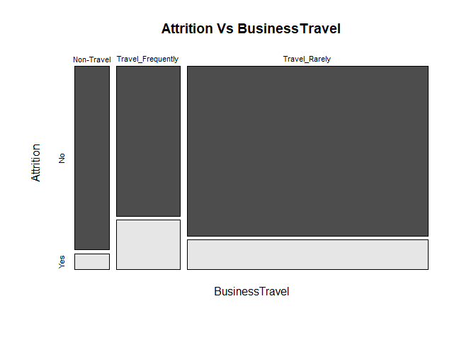<!-- -->

```
## 
##  
##    Cell Contents
## |-------------------------|
## |                       N |
## | Chi-square contribution |
## |           N / Row Total |
## |           N / Col Total |
## |         N / Table Total |
## |-------------------------|
## 
##  
## Total Observations in Table:  1470 
## 
##  
##                          | AttrDf$Attrition 
## AttrDf[, categoricalVar] |        No |       Yes | Row Total | 
## -------------------------|-----------|-----------|-----------|
##          Human Resources |        51 |        12 |        63 | 
##                          |     0.064 |     0.334 |           | 
##                          |     0.810 |     0.190 |     0.043 | 
##                          |     0.041 |     0.051 |           | 
##                          |     0.035 |     0.008 |           | 
## -------------------------|-----------|-----------|-----------|
##   Research & Development |       828 |       133 |       961 | 
##                          |     0.597 |     3.106 |           | 
##                          |     0.862 |     0.138 |     0.654 | 
##                          |     0.672 |     0.561 |           | 
##                          |     0.563 |     0.090 |           | 
## -------------------------|-----------|-----------|-----------|
##                    Sales |       354 |        92 |       446 | 
##                          |     1.079 |     5.615 |           | 
##                          |     0.794 |     0.206 |     0.303 | 
##                          |     0.287 |     0.388 |           | 
##                          |     0.241 |     0.063 |           | 
## -------------------------|-----------|-----------|-----------|
##             Column Total |      1233 |       237 |      1470 | 
##                          |     0.839 |     0.161 |           | 
## -------------------------|-----------|-----------|-----------|
## 
##  
## Statistics for All Table Factors
## 
## 
## Pearson's Chi-squared test 
## ------------------------------------------------------------
## Chi^2 =  10.79601     d.f. =  2     p =  0.004525607 
## 
## 
##  
## 
##  
##    Cell Contents
## |-------------------------|
## |                       N |
## | Chi-square contribution |
## |           N / Row Total |
## |           N / Col Total |
## |         N / Table Total |
## |-------------------------|
## 
##  
## Total Observations in Table:  1470 
## 
##  
##                          | AttrDf$Attrition 
## AttrDf[, categoricalVar] |        No |       Yes | Row Total | 
## -------------------------|-----------|-----------|-----------|
##          Human Resources |        51 |        12 |        63 | 
##                          |     0.064 |     0.334 |           | 
##                          |     0.810 |     0.190 |     0.043 | 
##                          |     0.041 |     0.051 |           | 
##                          |     0.035 |     0.008 |           | 
## -------------------------|-----------|-----------|-----------|
##   Research & Development |       828 |       133 |       961 | 
##                          |     0.597 |     3.106 |           | 
##                          |     0.862 |     0.138 |     0.654 | 
##                          |     0.672 |     0.561 |           | 
##                          |     0.563 |     0.090 |           | 
## -------------------------|-----------|-----------|-----------|
##                    Sales |       354 |        92 |       446 | 
##                          |     1.079 |     5.615 |           | 
##                          |     0.794 |     0.206 |     0.303 | 
##                          |     0.287 |     0.388 |           | 
##                          |     0.241 |     0.063 |           | 
## -------------------------|-----------|-----------|-----------|
##             Column Total |      1233 |       237 |      1470 | 
##                          |     0.839 |     0.161 |           | 
## -------------------------|-----------|-----------|-----------|
## 
## 
```

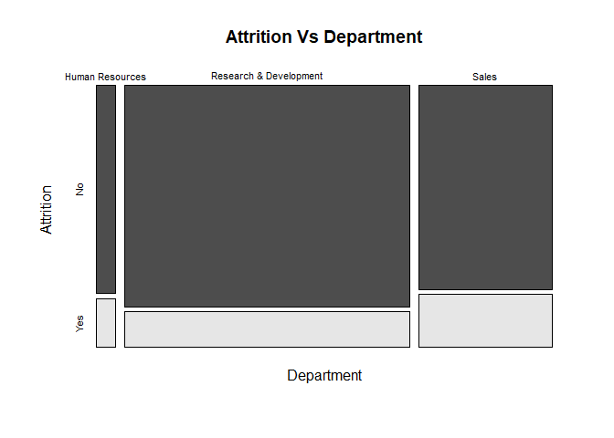<!-- -->

```
## 
##  
##    Cell Contents
## |-------------------------|
## |                       N |
## | Chi-square contribution |
## |           N / Row Total |
## |           N / Col Total |
## |         N / Table Total |
## |-------------------------|
## 
##  
## Total Observations in Table:  1470 
## 
##  
##                          | AttrDf$Attrition 
## AttrDf[, categoricalVar] |        No |       Yes | Row Total | 
## -------------------------|-----------|-----------|-----------|
##            Below College |       139 |        31 |       170 | 
##                          |     0.090 |     0.471 |           | 
##                          |     0.818 |     0.182 |     0.116 | 
##                          |     0.113 |     0.131 |           | 
##                          |     0.095 |     0.021 |           | 
## -------------------------|-----------|-----------|-----------|
##                  College |       238 |        44 |       282 | 
##                          |     0.009 |     0.047 |           | 
##                          |     0.844 |     0.156 |     0.192 | 
##                          |     0.193 |     0.186 |           | 
##                          |     0.162 |     0.030 |           | 
## -------------------------|-----------|-----------|-----------|
##                 Bachelor |       473 |        99 |       572 | 
##                          |     0.096 |     0.498 |           | 
##                          |     0.827 |     0.173 |     0.389 | 
##                          |     0.384 |     0.418 |           | 
##                          |     0.322 |     0.067 |           | 
## -------------------------|-----------|-----------|-----------|
##                   Master |       340 |        58 |       398 | 
##                          |     0.114 |     0.593 |           | 
##                          |     0.854 |     0.146 |     0.271 | 
##                          |     0.276 |     0.245 |           | 
##                          |     0.231 |     0.039 |           | 
## -------------------------|-----------|-----------|-----------|
##                   Doctor |        43 |         5 |        48 | 
##                          |     0.186 |     0.969 |           | 
##                          |     0.896 |     0.104 |     0.033 | 
##                          |     0.035 |     0.021 |           | 
##                          |     0.029 |     0.003 |           | 
## -------------------------|-----------|-----------|-----------|
##             Column Total |      1233 |       237 |      1470 | 
##                          |     0.839 |     0.161 |           | 
## -------------------------|-----------|-----------|-----------|
## 
##  
## Statistics for All Table Factors
## 
## 
## Pearson's Chi-squared test 
## ------------------------------------------------------------
## Chi^2 =  3.073961     d.f. =  4     p =  0.5455253 
## 
## 
##  
## 
##  
##    Cell Contents
## |-------------------------|
## |                       N |
## | Chi-square contribution |
## |           N / Row Total |
## |           N / Col Total |
## |         N / Table Total |
## |-------------------------|
## 
##  
## Total Observations in Table:  1470 
## 
##  
##                          | AttrDf$Attrition 
## AttrDf[, categoricalVar] |        No |       Yes | Row Total | 
## -------------------------|-----------|-----------|-----------|
##            Below College |       139 |        31 |       170 | 
##                          |     0.090 |     0.471 |           | 
##                          |     0.818 |     0.182 |     0.116 | 
##                          |     0.113 |     0.131 |           | 
##                          |     0.095 |     0.021 |           | 
## -------------------------|-----------|-----------|-----------|
##                  College |       238 |        44 |       282 | 
##                          |     0.009 |     0.047 |           | 
##                          |     0.844 |     0.156 |     0.192 | 
##                          |     0.193 |     0.186 |           | 
##                          |     0.162 |     0.030 |           | 
## -------------------------|-----------|-----------|-----------|
##                 Bachelor |       473 |        99 |       572 | 
##                          |     0.096 |     0.498 |           | 
##                          |     0.827 |     0.173 |     0.389 | 
##                          |     0.384 |     0.418 |           | 
##                          |     0.322 |     0.067 |           | 
## -------------------------|-----------|-----------|-----------|
##                   Master |       340 |        58 |       398 | 
##                          |     0.114 |     0.593 |           | 
##                          |     0.854 |     0.146 |     0.271 | 
##                          |     0.276 |     0.245 |           | 
##                          |     0.231 |     0.039 |           | 
## -------------------------|-----------|-----------|-----------|
##                   Doctor |        43 |         5 |        48 | 
##                          |     0.186 |     0.969 |           | 
##                          |     0.896 |     0.104 |     0.033 | 
##                          |     0.035 |     0.021 |           | 
##                          |     0.029 |     0.003 |           | 
## -------------------------|-----------|-----------|-----------|
##             Column Total |      1233 |       237 |      1470 | 
##                          |     0.839 |     0.161 |           | 
## -------------------------|-----------|-----------|-----------|
## 
## 
```

```
## Warning in chisq.test(t, correct = FALSE, ...): Chi-squared approximation
## may be incorrect
```

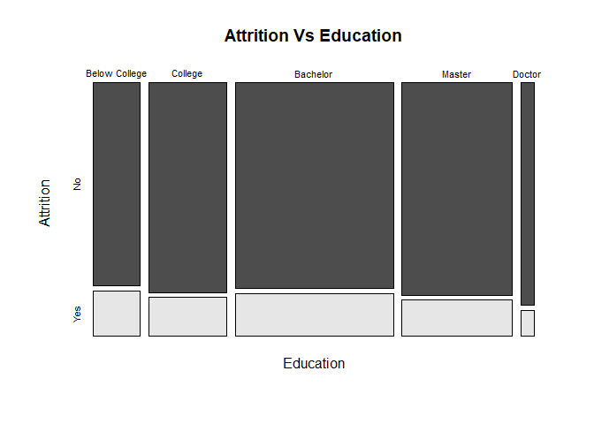<!-- -->

```
## 
##  
##    Cell Contents
## |-------------------------|
## |                       N |
## | Chi-square contribution |
## |           N / Row Total |
## |           N / Col Total |
## |         N / Table Total |
## |-------------------------|
## 
##  
## Total Observations in Table:  1470 
## 
##  
##                          | AttrDf$Attrition 
## AttrDf[, categoricalVar] |        No |       Yes | Row Total | 
## -------------------------|-----------|-----------|-----------|
##          Human Resources |        20 |         7 |        27 | 
##                          |     0.309 |     1.610 |           | 
##                          |     0.741 |     0.259 |     0.018 | 
##                          |     0.016 |     0.030 |           | 
##                          |     0.014 |     0.005 |           | 
## -------------------------|-----------|-----------|-----------|
##            Life Sciences |       517 |        89 |       606 | 
##                          |     0.149 |     0.775 |           | 
##                          |     0.853 |     0.147 |     0.412 | 
##                          |     0.419 |     0.376 |           | 
##                          |     0.352 |     0.061 |           | 
## -------------------------|-----------|-----------|-----------|
##                Marketing |       124 |        35 |       159 | 
##                          |     0.658 |     3.421 |           | 
##                          |     0.780 |     0.220 |     0.108 | 
##                          |     0.101 |     0.148 |           | 
##                          |     0.084 |     0.024 |           | 
## -------------------------|-----------|-----------|-----------|
##                  Medical |       401 |        63 |       464 | 
##                          |     0.358 |     1.864 |           | 
##                          |     0.864 |     0.136 |     0.316 | 
##                          |     0.325 |     0.266 |           | 
##                          |     0.273 |     0.043 |           | 
## -------------------------|-----------|-----------|-----------|
##                    Other |        71 |        11 |        82 | 
##                          |     0.072 |     0.373 |           | 
##                          |     0.866 |     0.134 |     0.056 | 
##                          |     0.058 |     0.046 |           | 
##                          |     0.048 |     0.007 |           | 
## -------------------------|-----------|-----------|-----------|
##         Technical Degree |       100 |        32 |       132 | 
##                          |     1.038 |     5.398 |           | 
##                          |     0.758 |     0.242 |     0.090 | 
##                          |     0.081 |     0.135 |           | 
##                          |     0.068 |     0.022 |           | 
## -------------------------|-----------|-----------|-----------|
##             Column Total |      1233 |       237 |      1470 | 
##                          |     0.839 |     0.161 |           | 
## -------------------------|-----------|-----------|-----------|
## 
##  
## Statistics for All Table Factors
## 
## 
## Pearson's Chi-squared test 
## ------------------------------------------------------------
## Chi^2 =  16.02467     d.f. =  5     p =  0.00677398 
## 
## 
##  
## 
##  
##    Cell Contents
## |-------------------------|
## |                       N |
## | Chi-square contribution |
## |           N / Row Total |
## |           N / Col Total |
## |         N / Table Total |
## |-------------------------|
## 
##  
## Total Observations in Table:  1470 
## 
##  
##                          | AttrDf$Attrition 
## AttrDf[, categoricalVar] |        No |       Yes | Row Total | 
## -------------------------|-----------|-----------|-----------|
##          Human Resources |        20 |         7 |        27 | 
##                          |     0.309 |     1.610 |           | 
##                          |     0.741 |     0.259 |     0.018 | 
##                          |     0.016 |     0.030 |           | 
##                          |     0.014 |     0.005 |           | 
## -------------------------|-----------|-----------|-----------|
##            Life Sciences |       517 |        89 |       606 | 
##                          |     0.149 |     0.775 |           | 
##                          |     0.853 |     0.147 |     0.412 | 
##                          |     0.419 |     0.376 |           | 
##                          |     0.352 |     0.061 |           | 
## -------------------------|-----------|-----------|-----------|
##                Marketing |       124 |        35 |       159 | 
##                          |     0.658 |     3.421 |           | 
##                          |     0.780 |     0.220 |     0.108 | 
##                          |     0.101 |     0.148 |           | 
##                          |     0.084 |     0.024 |           | 
## -------------------------|-----------|-----------|-----------|
##                  Medical |       401 |        63 |       464 | 
##                          |     0.358 |     1.864 |           | 
##                          |     0.864 |     0.136 |     0.316 | 
##                          |     0.325 |     0.266 |           | 
##                          |     0.273 |     0.043 |           | 
## -------------------------|-----------|-----------|-----------|
##                    Other |        71 |        11 |        82 | 
##                          |     0.072 |     0.373 |           | 
##                          |     0.866 |     0.134 |     0.056 | 
##                          |     0.058 |     0.046 |           | 
##                          |     0.048 |     0.007 |           | 
## -------------------------|-----------|-----------|-----------|
##         Technical Degree |       100 |        32 |       132 | 
##                          |     1.038 |     5.398 |           | 
##                          |     0.758 |     0.242 |     0.090 | 
##                          |     0.081 |     0.135 |           | 
##                          |     0.068 |     0.022 |           | 
## -------------------------|-----------|-----------|-----------|
##             Column Total |      1233 |       237 |      1470 | 
##                          |     0.839 |     0.161 |           | 
## -------------------------|-----------|-----------|-----------|
## 
## 
```

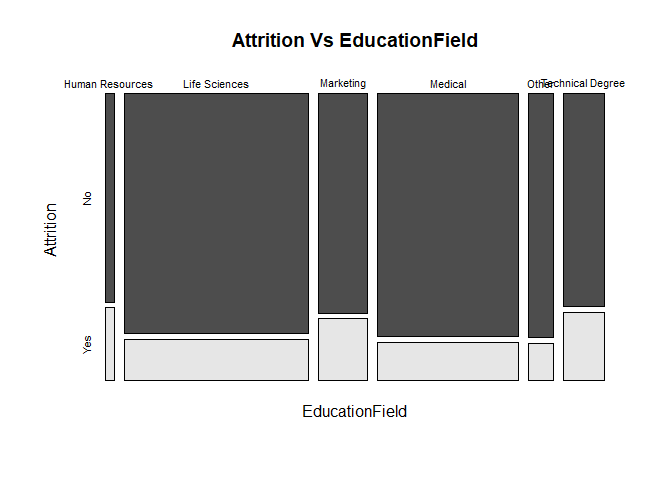<!-- -->

```
## 
##  
##    Cell Contents
## |-------------------------|
## |                       N |
## | Chi-square contribution |
## |           N / Row Total |
## |           N / Col Total |
## |         N / Table Total |
## |-------------------------|
## 
##  
## Total Observations in Table:  1470 
## 
##  
##                          | AttrDf$Attrition 
## AttrDf[, categoricalVar] |        No |       Yes | Row Total | 
## -------------------------|-----------|-----------|-----------|
##                      Low |       212 |        72 |       284 | 
##                          |     2.884 |    15.006 |           | 
##                          |     0.746 |     0.254 |     0.193 | 
##                          |     0.172 |     0.304 |           | 
##                          |     0.144 |     0.049 |           | 
## -------------------------|-----------|-----------|-----------|
##                   Medium |       244 |        43 |       287 | 
##                          |     0.044 |     0.231 |           | 
##                          |     0.850 |     0.150 |     0.195 | 
##                          |     0.198 |     0.181 |           | 
##                          |     0.166 |     0.029 |           | 
## -------------------------|-----------|-----------|-----------|
##                     High |       391 |        62 |       453 | 
##                          |     0.320 |     1.667 |           | 
##                          |     0.863 |     0.137 |     0.308 | 
##                          |     0.317 |     0.262 |           | 
##                          |     0.266 |     0.042 |           | 
## -------------------------|-----------|-----------|-----------|
##                Very High |       386 |        60 |       446 | 
##                          |     0.379 |     1.971 |           | 
##                          |     0.865 |     0.135 |     0.303 | 
##                          |     0.313 |     0.253 |           | 
##                          |     0.263 |     0.041 |           | 
## -------------------------|-----------|-----------|-----------|
##             Column Total |      1233 |       237 |      1470 | 
##                          |     0.839 |     0.161 |           | 
## -------------------------|-----------|-----------|-----------|
## 
##  
## Statistics for All Table Factors
## 
## 
## Pearson's Chi-squared test 
## ------------------------------------------------------------
## Chi^2 =  22.50388     d.f. =  3     p =  5.123469e-05 
## 
## 
##  
## 
##  
##    Cell Contents
## |-------------------------|
## |                       N |
## | Chi-square contribution |
## |           N / Row Total |
## |           N / Col Total |
## |         N / Table Total |
## |-------------------------|
## 
##  
## Total Observations in Table:  1470 
## 
##  
##                          | AttrDf$Attrition 
## AttrDf[, categoricalVar] |        No |       Yes | Row Total | 
## -------------------------|-----------|-----------|-----------|
##                      Low |       212 |        72 |       284 | 
##                          |     2.884 |    15.006 |           | 
##                          |     0.746 |     0.254 |     0.193 | 
##                          |     0.172 |     0.304 |           | 
##                          |     0.144 |     0.049 |           | 
## -------------------------|-----------|-----------|-----------|
##                   Medium |       244 |        43 |       287 | 
##                          |     0.044 |     0.231 |           | 
##                          |     0.850 |     0.150 |     0.195 | 
##                          |     0.198 |     0.181 |           | 
##                          |     0.166 |     0.029 |           | 
## -------------------------|-----------|-----------|-----------|
##                     High |       391 |        62 |       453 | 
##                          |     0.320 |     1.667 |           | 
##                          |     0.863 |     0.137 |     0.308 | 
##                          |     0.317 |     0.262 |           | 
##                          |     0.266 |     0.042 |           | 
## -------------------------|-----------|-----------|-----------|
##                Very High |       386 |        60 |       446 | 
##                          |     0.379 |     1.971 |           | 
##                          |     0.865 |     0.135 |     0.303 | 
##                          |     0.313 |     0.253 |           | 
##                          |     0.263 |     0.041 |           | 
## -------------------------|-----------|-----------|-----------|
##             Column Total |      1233 |       237 |      1470 | 
##                          |     0.839 |     0.161 |           | 
## -------------------------|-----------|-----------|-----------|
## 
## 
```

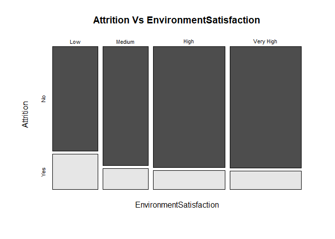<!-- -->

```
## 
##  
##    Cell Contents
## |-------------------------|
## |                       N |
## | Chi-square contribution |
## |           N / Row Total |
## |           N / Col Total |
## |         N / Table Total |
## |-------------------------|
## 
##  
## Total Observations in Table:  1470 
## 
##  
##                          | AttrDf$Attrition 
## AttrDf[, categoricalVar] |        No |       Yes | Row Total | 
## -------------------------|-----------|-----------|-----------|
##                   Female |       501 |        87 |       588 | 
##                          |     0.123 |     0.642 |           | 
##                          |     0.852 |     0.148 |     0.400 | 
##                          |     0.406 |     0.367 |           | 
##                          |     0.341 |     0.059 |           | 
## -------------------------|-----------|-----------|-----------|
##                     Male |       732 |       150 |       882 | 
##                          |     0.082 |     0.428 |           | 
##                          |     0.830 |     0.170 |     0.600 | 
##                          |     0.594 |     0.633 |           | 
##                          |     0.498 |     0.102 |           | 
## -------------------------|-----------|-----------|-----------|
##             Column Total |      1233 |       237 |      1470 | 
##                          |     0.839 |     0.161 |           | 
## -------------------------|-----------|-----------|-----------|
## 
##  
## Statistics for All Table Factors
## 
## 
## Pearson's Chi-squared test 
## ------------------------------------------------------------
## Chi^2 =  1.275216     d.f. =  1     p =  0.2587904 
## 
## Pearson's Chi-squared test with Yates' continuity correction 
## ------------------------------------------------------------
## Chi^2 =  1.116967     d.f. =  1     p =  0.2905724 
## 
##  
## 
##  
##    Cell Contents
## |-------------------------|
## |                       N |
## | Chi-square contribution |
## |           N / Row Total |
## |           N / Col Total |
## |         N / Table Total |
## |-------------------------|
## 
##  
## Total Observations in Table:  1470 
## 
##  
##                          | AttrDf$Attrition 
## AttrDf[, categoricalVar] |        No |       Yes | Row Total | 
## -------------------------|-----------|-----------|-----------|
##                   Female |       501 |        87 |       588 | 
##                          |     0.123 |     0.642 |           | 
##                          |     0.852 |     0.148 |     0.400 | 
##                          |     0.406 |     0.367 |           | 
##                          |     0.341 |     0.059 |           | 
## -------------------------|-----------|-----------|-----------|
##                     Male |       732 |       150 |       882 | 
##                          |     0.082 |     0.428 |           | 
##                          |     0.830 |     0.170 |     0.600 | 
##                          |     0.594 |     0.633 |           | 
##                          |     0.498 |     0.102 |           | 
## -------------------------|-----------|-----------|-----------|
##             Column Total |      1233 |       237 |      1470 | 
##                          |     0.839 |     0.161 |           | 
## -------------------------|-----------|-----------|-----------|
## 
## 
```

<!-- -->

```
## 
##  
##    Cell Contents
## |-------------------------|
## |                       N |
## | Chi-square contribution |
## |           N / Row Total |
## |           N / Col Total |
## |         N / Table Total |
## |-------------------------|
## 
##  
## Total Observations in Table:  1470 
## 
##  
##                          | AttrDf$Attrition 
## AttrDf[, categoricalVar] |        No |       Yes | Row Total | 
## -------------------------|-----------|-----------|-----------|
##                      Low |        55 |        28 |        83 | 
##                          |     3.070 |    15.969 |           | 
##                          |     0.663 |     0.337 |     0.056 | 
##                          |     0.045 |     0.118 |           | 
##                          |     0.037 |     0.019 |           | 
## -------------------------|-----------|-----------|-----------|
##                   Medium |       304 |        71 |       375 | 
##                          |     0.353 |     1.838 |           | 
##                          |     0.811 |     0.189 |     0.255 | 
##                          |     0.247 |     0.300 |           | 
##                          |     0.207 |     0.048 |           | 
## -------------------------|-----------|-----------|-----------|
##                     High |       743 |       125 |       868 | 
##                          |     0.307 |     1.596 |           | 
##                          |     0.856 |     0.144 |     0.590 | 
##                          |     0.603 |     0.527 |           | 
##                          |     0.505 |     0.085 |           | 
## -------------------------|-----------|-----------|-----------|
##                Very High |       131 |        13 |       144 | 
##                          |     0.864 |     4.496 |           | 
##                          |     0.910 |     0.090 |     0.098 | 
##                          |     0.106 |     0.055 |           | 
##                          |     0.089 |     0.009 |           | 
## -------------------------|-----------|-----------|-----------|
##             Column Total |      1233 |       237 |      1470 | 
##                          |     0.839 |     0.161 |           | 
## -------------------------|-----------|-----------|-----------|
## 
##  
## Statistics for All Table Factors
## 
## 
## Pearson's Chi-squared test 
## ------------------------------------------------------------
## Chi^2 =  28.49202     d.f. =  3     p =  2.863181e-06 
## 
## 
##  
## 
##  
##    Cell Contents
## |-------------------------|
## |                       N |
## | Chi-square contribution |
## |           N / Row Total |
## |           N / Col Total |
## |         N / Table Total |
## |-------------------------|
## 
##  
## Total Observations in Table:  1470 
## 
##  
##                          | AttrDf$Attrition 
## AttrDf[, categoricalVar] |        No |       Yes | Row Total | 
## -------------------------|-----------|-----------|-----------|
##                      Low |        55 |        28 |        83 | 
##                          |     3.070 |    15.969 |           | 
##                          |     0.663 |     0.337 |     0.056 | 
##                          |     0.045 |     0.118 |           | 
##                          |     0.037 |     0.019 |           | 
## -------------------------|-----------|-----------|-----------|
##                   Medium |       304 |        71 |       375 | 
##                          |     0.353 |     1.838 |           | 
##                          |     0.811 |     0.189 |     0.255 | 
##                          |     0.247 |     0.300 |           | 
##                          |     0.207 |     0.048 |           | 
## -------------------------|-----------|-----------|-----------|
##                     High |       743 |       125 |       868 | 
##                          |     0.307 |     1.596 |           | 
##                          |     0.856 |     0.144 |     0.590 | 
##                          |     0.603 |     0.527 |           | 
##                          |     0.505 |     0.085 |           | 
## -------------------------|-----------|-----------|-----------|
##                Very High |       131 |        13 |       144 | 
##                          |     0.864 |     4.496 |           | 
##                          |     0.910 |     0.090 |     0.098 | 
##                          |     0.106 |     0.055 |           | 
##                          |     0.089 |     0.009 |           | 
## -------------------------|-----------|-----------|-----------|
##             Column Total |      1233 |       237 |      1470 | 
##                          |     0.839 |     0.161 |           | 
## -------------------------|-----------|-----------|-----------|
## 
## 
```

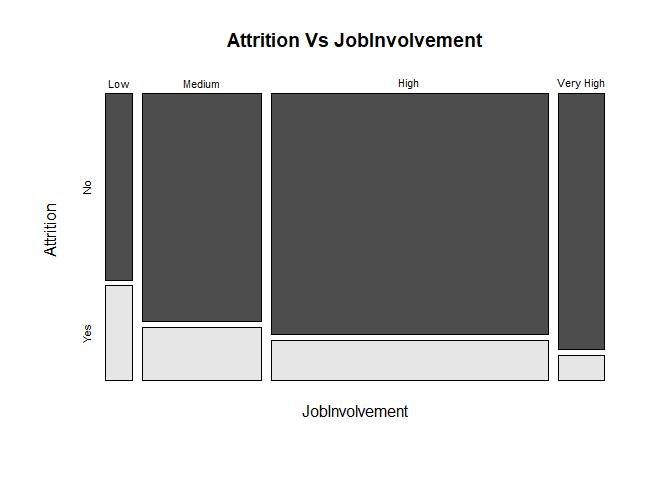<!-- -->

```
## 
##  
##    Cell Contents
## |-------------------------|
## |                       N |
## | Chi-square contribution |
## |           N / Row Total |
## |           N / Col Total |
## |         N / Table Total |
## |-------------------------|
## 
##  
## Total Observations in Table:  1470 
## 
##  
##                          | AttrDf$Attrition 
## AttrDf[, categoricalVar] |        No |       Yes | Row Total | 
## -------------------------|-----------|-----------|-----------|
##                    Entry |       400 |       143 |       543 | 
##                          |     6.752 |    35.128 |           | 
##                          |     0.737 |     0.263 |     0.369 | 
##                          |     0.324 |     0.603 |           | 
##                          |     0.272 |     0.097 |           | 
## -------------------------|-----------|-----------|-----------|
##              Experienced |       482 |        52 |       534 | 
##                          |     2.595 |    13.501 |           | 
##                          |     0.903 |     0.097 |     0.363 | 
##                          |     0.391 |     0.219 |           | 
##                          |     0.328 |     0.035 |           | 
## -------------------------|-----------|-----------|-----------|
##   First-Level Management |       186 |        32 |       218 | 
##                          |     0.054 |     0.282 |           | 
##                          |     0.853 |     0.147 |     0.148 | 
##                          |     0.151 |     0.135 |           | 
##                          |     0.127 |     0.022 |           | 
## -------------------------|-----------|-----------|-----------|
##  Middle-Level Management |       101 |         5 |       106 | 
##                          |     1.644 |     8.553 |           | 
##                          |     0.953 |     0.047 |     0.072 | 
##                          |     0.082 |     0.021 |           | 
##                          |     0.069 |     0.003 |           | 
## -------------------------|-----------|-----------|-----------|
##     Top-Level Management |        64 |         5 |        69 | 
##                          |     0.648 |     3.372 |           | 
##                          |     0.928 |     0.072 |     0.047 | 
##                          |     0.052 |     0.021 |           | 
##                          |     0.044 |     0.003 |           | 
## -------------------------|-----------|-----------|-----------|
##             Column Total |      1233 |       237 |      1470 | 
##                          |     0.839 |     0.161 |           | 
## -------------------------|-----------|-----------|-----------|
## 
##  
## Statistics for All Table Factors
## 
## 
## Pearson's Chi-squared test 
## ------------------------------------------------------------
## Chi^2 =  72.52901     d.f. =  4     p =  6.634685e-15 
## 
## 
##  
## 
##  
##    Cell Contents
## |-------------------------|
## |                       N |
## | Chi-square contribution |
## |           N / Row Total |
## |           N / Col Total |
## |         N / Table Total |
## |-------------------------|
## 
##  
## Total Observations in Table:  1470 
## 
##  
##                          | AttrDf$Attrition 
## AttrDf[, categoricalVar] |        No |       Yes | Row Total | 
## -------------------------|-----------|-----------|-----------|
##                    Entry |       400 |       143 |       543 | 
##                          |     6.752 |    35.128 |           | 
##                          |     0.737 |     0.263 |     0.369 | 
##                          |     0.324 |     0.603 |           | 
##                          |     0.272 |     0.097 |           | 
## -------------------------|-----------|-----------|-----------|
##              Experienced |       482 |        52 |       534 | 
##                          |     2.595 |    13.501 |           | 
##                          |     0.903 |     0.097 |     0.363 | 
##                          |     0.391 |     0.219 |           | 
##                          |     0.328 |     0.035 |           | 
## -------------------------|-----------|-----------|-----------|
##   First-Level Management |       186 |        32 |       218 | 
##                          |     0.054 |     0.282 |           | 
##                          |     0.853 |     0.147 |     0.148 | 
##                          |     0.151 |     0.135 |           | 
##                          |     0.127 |     0.022 |           | 
## -------------------------|-----------|-----------|-----------|
##  Middle-Level Management |       101 |         5 |       106 | 
##                          |     1.644 |     8.553 |           | 
##                          |     0.953 |     0.047 |     0.072 | 
##                          |     0.082 |     0.021 |           | 
##                          |     0.069 |     0.003 |           | 
## -------------------------|-----------|-----------|-----------|
##     Top-Level Management |        64 |         5 |        69 | 
##                          |     0.648 |     3.372 |           | 
##                          |     0.928 |     0.072 |     0.047 | 
##                          |     0.052 |     0.021 |           | 
##                          |     0.044 |     0.003 |           | 
## -------------------------|-----------|-----------|-----------|
##             Column Total |      1233 |       237 |      1470 | 
##                          |     0.839 |     0.161 |           | 
## -------------------------|-----------|-----------|-----------|
## 
## 
```

<!-- -->

```
## 
##  
##    Cell Contents
## |-------------------------|
## |                       N |
## | Chi-square contribution |
## |           N / Row Total |
## |           N / Col Total |
## |         N / Table Total |
## |-------------------------|
## 
##  
## Total Observations in Table:  1470 
## 
##  
##                           | AttrDf$Attrition 
##  AttrDf[, categoricalVar] |        No |       Yes | Row Total | 
## --------------------------|-----------|-----------|-----------|
## Healthcare Representative |       122 |         9 |       131 | 
##                           |     1.337 |     6.956 |           | 
##                           |     0.931 |     0.069 |     0.089 | 
##                           |     0.099 |     0.038 |           | 
##                           |     0.083 |     0.006 |           | 
## --------------------------|-----------|-----------|-----------|
##           Human Resources |        40 |        12 |        52 | 
##                           |     0.300 |     1.560 |           | 
##                           |     0.769 |     0.231 |     0.035 | 
##                           |     0.032 |     0.051 |           | 
##                           |     0.027 |     0.008 |           | 
## --------------------------|-----------|-----------|-----------|
##     Laboratory Technician |       197 |        62 |       259 | 
##                           |     1.886 |     9.813 |           | 
##                           |     0.761 |     0.239 |     0.176 | 
##                           |     0.160 |     0.262 |           | 
##                           |     0.134 |     0.042 |           | 
## --------------------------|-----------|-----------|-----------|
##                   Manager |        97 |         5 |       102 | 
##                           |     1.531 |     7.965 |           | 
##                           |     0.951 |     0.049 |     0.069 | 
##                           |     0.079 |     0.021 |           | 
##                           |     0.066 |     0.003 |           | 
## --------------------------|-----------|-----------|-----------|
##    Manufacturing Director |       135 |        10 |       145 | 
##                           |     1.471 |     7.655 |           | 
##                           |     0.931 |     0.069 |     0.099 | 
##                           |     0.109 |     0.042 |           | 
##                           |     0.092 |     0.007 |           | 
## --------------------------|-----------|-----------|-----------|
##         Research Director |        78 |         2 |        80 | 
##                           |     1.770 |     9.208 |           | 
##                           |     0.975 |     0.025 |     0.054 | 
##                           |     0.063 |     0.008 |           | 
##                           |     0.053 |     0.001 |           | 
## --------------------------|-----------|-----------|-----------|
##        Research Scientist |       245 |        47 |       292 | 
##                           |     0.000 |     0.000 |           | 
##                           |     0.839 |     0.161 |     0.199 | 
##                           |     0.199 |     0.198 |           | 
##                           |     0.167 |     0.032 |           | 
## --------------------------|-----------|-----------|-----------|
##           Sales Executive |       269 |        57 |       326 | 
##                           |     0.072 |     0.375 |           | 
##                           |     0.825 |     0.175 |     0.222 | 
##                           |     0.218 |     0.241 |           | 
##                           |     0.183 |     0.039 |           | 
## --------------------------|-----------|-----------|-----------|
##      Sales Representative |        50 |        33 |        83 | 
##                           |     5.528 |    28.762 |           | 
##                           |     0.602 |     0.398 |     0.056 | 
##                           |     0.041 |     0.139 |           | 
##                           |     0.034 |     0.022 |           | 
## --------------------------|-----------|-----------|-----------|
##              Column Total |      1233 |       237 |      1470 | 
##                           |     0.839 |     0.161 |           | 
## --------------------------|-----------|-----------|-----------|
## 
##  
## Statistics for All Table Factors
## 
## 
## Pearson's Chi-squared test 
## ------------------------------------------------------------
## Chi^2 =  86.19025     d.f. =  8     p =  2.752482e-15 
## 
## 
##  
## 
##  
##    Cell Contents
## |-------------------------|
## |                       N |
## | Chi-square contribution |
## |           N / Row Total |
## |           N / Col Total |
## |         N / Table Total |
## |-------------------------|
## 
##  
## Total Observations in Table:  1470 
## 
##  
##                           | AttrDf$Attrition 
##  AttrDf[, categoricalVar] |        No |       Yes | Row Total | 
## --------------------------|-----------|-----------|-----------|
## Healthcare Representative |       122 |         9 |       131 | 
##                           |     1.337 |     6.956 |           | 
##                           |     0.931 |     0.069 |     0.089 | 
##                           |     0.099 |     0.038 |           | 
##                           |     0.083 |     0.006 |           | 
## --------------------------|-----------|-----------|-----------|
##           Human Resources |        40 |        12 |        52 | 
##                           |     0.300 |     1.560 |           | 
##                           |     0.769 |     0.231 |     0.035 | 
##                           |     0.032 |     0.051 |           | 
##                           |     0.027 |     0.008 |           | 
## --------------------------|-----------|-----------|-----------|
##     Laboratory Technician |       197 |        62 |       259 | 
##                           |     1.886 |     9.813 |           | 
##                           |     0.761 |     0.239 |     0.176 | 
##                           |     0.160 |     0.262 |           | 
##                           |     0.134 |     0.042 |           | 
## --------------------------|-----------|-----------|-----------|
##                   Manager |        97 |         5 |       102 | 
##                           |     1.531 |     7.965 |           | 
##                           |     0.951 |     0.049 |     0.069 | 
##                           |     0.079 |     0.021 |           | 
##                           |     0.066 |     0.003 |           | 
## --------------------------|-----------|-----------|-----------|
##    Manufacturing Director |       135 |        10 |       145 | 
##                           |     1.471 |     7.655 |           | 
##                           |     0.931 |     0.069 |     0.099 | 
##                           |     0.109 |     0.042 |           | 
##                           |     0.092 |     0.007 |           | 
## --------------------------|-----------|-----------|-----------|
##         Research Director |        78 |         2 |        80 | 
##                           |     1.770 |     9.208 |           | 
##                           |     0.975 |     0.025 |     0.054 | 
##                           |     0.063 |     0.008 |           | 
##                           |     0.053 |     0.001 |           | 
## --------------------------|-----------|-----------|-----------|
##        Research Scientist |       245 |        47 |       292 | 
##                           |     0.000 |     0.000 |           | 
##                           |     0.839 |     0.161 |     0.199 | 
##                           |     0.199 |     0.198 |           | 
##                           |     0.167 |     0.032 |           | 
## --------------------------|-----------|-----------|-----------|
##           Sales Executive |       269 |        57 |       326 | 
##                           |     0.072 |     0.375 |           | 
##                           |     0.825 |     0.175 |     0.222 | 
##                           |     0.218 |     0.241 |           | 
##                           |     0.183 |     0.039 |           | 
## --------------------------|-----------|-----------|-----------|
##      Sales Representative |        50 |        33 |        83 | 
##                           |     5.528 |    28.762 |           | 
##                           |     0.602 |     0.398 |     0.056 | 
##                           |     0.041 |     0.139 |           | 
##                           |     0.034 |     0.022 |           | 
## --------------------------|-----------|-----------|-----------|
##              Column Total |      1233 |       237 |      1470 | 
##                           |     0.839 |     0.161 |           | 
## --------------------------|-----------|-----------|-----------|
## 
## 
```

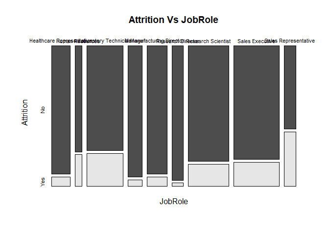<!-- -->

```
## 
##  
##    Cell Contents
## |-------------------------|
## |                       N |
## | Chi-square contribution |
## |           N / Row Total |
## |           N / Col Total |
## |         N / Table Total |
## |-------------------------|
## 
##  
## Total Observations in Table:  1470 
## 
##  
##                          | AttrDf$Attrition 
## AttrDf[, categoricalVar] |        No |       Yes | Row Total | 
## -------------------------|-----------|-----------|-----------|
##                      Low |       223 |        66 |       289 | 
##                          |     1.554 |     8.083 |           | 
##                          |     0.772 |     0.228 |     0.197 | 
##                          |     0.181 |     0.278 |           | 
##                          |     0.152 |     0.045 |           | 
## -------------------------|-----------|-----------|-----------|
##                   Medium |       234 |        46 |       280 | 
##                          |     0.003 |     0.016 |           | 
##                          |     0.836 |     0.164 |     0.190 | 
##                          |     0.190 |     0.194 |           | 
##                          |     0.159 |     0.031 |           | 
## -------------------------|-----------|-----------|-----------|
##                     High |       369 |        73 |       442 | 
##                          |     0.008 |     0.042 |           | 
##                          |     0.835 |     0.165 |     0.301 | 
##                          |     0.299 |     0.308 |           | 
##                          |     0.251 |     0.050 |           | 
## -------------------------|-----------|-----------|-----------|
##                Very High |       407 |        52 |       459 | 
##                          |     1.257 |     6.542 |           | 
##                          |     0.887 |     0.113 |     0.312 | 
##                          |     0.330 |     0.219 |           | 
##                          |     0.277 |     0.035 |           | 
## -------------------------|-----------|-----------|-----------|
##             Column Total |      1233 |       237 |      1470 | 
##                          |     0.839 |     0.161 |           | 
## -------------------------|-----------|-----------|-----------|
## 
##  
## Statistics for All Table Factors
## 
## 
## Pearson's Chi-squared test 
## ------------------------------------------------------------
## Chi^2 =  17.50508     d.f. =  3     p =  0.0005563005 
## 
## 
##  
## 
##  
##    Cell Contents
## |-------------------------|
## |                       N |
## | Chi-square contribution |
## |           N / Row Total |
## |           N / Col Total |
## |         N / Table Total |
## |-------------------------|
## 
##  
## Total Observations in Table:  1470 
## 
##  
##                          | AttrDf$Attrition 
## AttrDf[, categoricalVar] |        No |       Yes | Row Total | 
## -------------------------|-----------|-----------|-----------|
##                      Low |       223 |        66 |       289 | 
##                          |     1.554 |     8.083 |           | 
##                          |     0.772 |     0.228 |     0.197 | 
##                          |     0.181 |     0.278 |           | 
##                          |     0.152 |     0.045 |           | 
## -------------------------|-----------|-----------|-----------|
##                   Medium |       234 |        46 |       280 | 
##                          |     0.003 |     0.016 |           | 
##                          |     0.836 |     0.164 |     0.190 | 
##                          |     0.190 |     0.194 |           | 
##                          |     0.159 |     0.031 |           | 
## -------------------------|-----------|-----------|-----------|
##                     High |       369 |        73 |       442 | 
##                          |     0.008 |     0.042 |           | 
##                          |     0.835 |     0.165 |     0.301 | 
##                          |     0.299 |     0.308 |           | 
##                          |     0.251 |     0.050 |           | 
## -------------------------|-----------|-----------|-----------|
##                Very High |       407 |        52 |       459 | 
##                          |     1.257 |     6.542 |           | 
##                          |     0.887 |     0.113 |     0.312 | 
##                          |     0.330 |     0.219 |           | 
##                          |     0.277 |     0.035 |           | 
## -------------------------|-----------|-----------|-----------|
##             Column Total |      1233 |       237 |      1470 | 
##                          |     0.839 |     0.161 |           | 
## -------------------------|-----------|-----------|-----------|
## 
## 
```

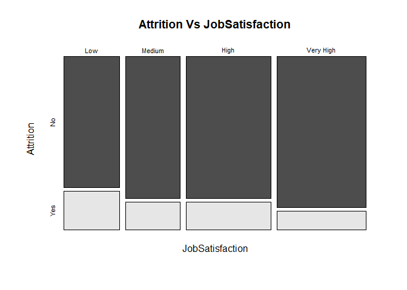<!-- -->

```
## 
##  
##    Cell Contents
## |-------------------------|
## |                       N |
## | Chi-square contribution |
## |           N / Row Total |
## |           N / Col Total |
## |         N / Table Total |
## |-------------------------|
## 
##  
## Total Observations in Table:  1470 
## 
##  
##                          | AttrDf$Attrition 
## AttrDf[, categoricalVar] |        No |       Yes | Row Total | 
## -------------------------|-----------|-----------|-----------|
##                 Divorced |       294 |        33 |       327 | 
##                          |     1.418 |     7.377 |           | 
##                          |     0.899 |     0.101 |     0.222 | 
##                          |     0.238 |     0.139 |           | 
##                          |     0.200 |     0.022 |           | 
## -------------------------|-----------|-----------|-----------|
##                  Married |       589 |        84 |       673 | 
##                          |     1.064 |     5.534 |           | 
##                          |     0.875 |     0.125 |     0.458 | 
##                          |     0.478 |     0.354 |           | 
##                          |     0.401 |     0.057 |           | 
## -------------------------|-----------|-----------|-----------|
##                   Single |       350 |       120 |       470 | 
##                          |     4.961 |    25.811 |           | 
##                          |     0.745 |     0.255 |     0.320 | 
##                          |     0.284 |     0.506 |           | 
##                          |     0.238 |     0.082 |           | 
## -------------------------|-----------|-----------|-----------|
##             Column Total |      1233 |       237 |      1470 | 
##                          |     0.839 |     0.161 |           | 
## -------------------------|-----------|-----------|-----------|
## 
##  
## Statistics for All Table Factors
## 
## 
## Pearson's Chi-squared test 
## ------------------------------------------------------------
## Chi^2 =  46.16368     d.f. =  2     p =  9.455511e-11 
## 
## 
##  
## 
##  
##    Cell Contents
## |-------------------------|
## |                       N |
## | Chi-square contribution |
## |           N / Row Total |
## |           N / Col Total |
## |         N / Table Total |
## |-------------------------|
## 
##  
## Total Observations in Table:  1470 
## 
##  
##                          | AttrDf$Attrition 
## AttrDf[, categoricalVar] |        No |       Yes | Row Total | 
## -------------------------|-----------|-----------|-----------|
##                 Divorced |       294 |        33 |       327 | 
##                          |     1.418 |     7.377 |           | 
##                          |     0.899 |     0.101 |     0.222 | 
##                          |     0.238 |     0.139 |           | 
##                          |     0.200 |     0.022 |           | 
## -------------------------|-----------|-----------|-----------|
##                  Married |       589 |        84 |       673 | 
##                          |     1.064 |     5.534 |           | 
##                          |     0.875 |     0.125 |     0.458 | 
##                          |     0.478 |     0.354 |           | 
##                          |     0.401 |     0.057 |           | 
## -------------------------|-----------|-----------|-----------|
##                   Single |       350 |       120 |       470 | 
##                          |     4.961 |    25.811 |           | 
##                          |     0.745 |     0.255 |     0.320 | 
##                          |     0.284 |     0.506 |           | 
##                          |     0.238 |     0.082 |           | 
## -------------------------|-----------|-----------|-----------|
##             Column Total |      1233 |       237 |      1470 | 
##                          |     0.839 |     0.161 |           | 
## -------------------------|-----------|-----------|-----------|
## 
## 
```

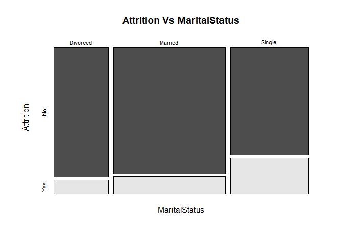<!-- -->

```
## 
##  
##    Cell Contents
## |-------------------------|
## |                       N |
## | Chi-square contribution |
## |           N / Row Total |
## |           N / Col Total |
## |         N / Table Total |
## |-------------------------|
## 
##  
## Total Observations in Table:  1470 
## 
##  
##                          | AttrDf$Attrition 
## AttrDf[, categoricalVar] |        No |       Yes | Row Total | 
## -------------------------|-----------|-----------|-----------|
##                       No |       944 |       110 |      1054 | 
##                          |     4.063 |    21.136 |           | 
##                          |     0.896 |     0.104 |     0.717 | 
##                          |     0.766 |     0.464 |           | 
##                          |     0.642 |     0.075 |           | 
## -------------------------|-----------|-----------|-----------|
##                      Yes |       289 |       127 |       416 | 
##                          |    10.293 |    53.552 |           | 
##                          |     0.695 |     0.305 |     0.283 | 
##                          |     0.234 |     0.536 |           | 
##                          |     0.197 |     0.086 |           | 
## -------------------------|-----------|-----------|-----------|
##             Column Total |      1233 |       237 |      1470 | 
##                          |     0.839 |     0.161 |           | 
## -------------------------|-----------|-----------|-----------|
## 
##  
## Statistics for All Table Factors
## 
## 
## Pearson's Chi-squared test 
## ------------------------------------------------------------
## Chi^2 =  89.04388     d.f. =  1     p =  3.861518e-21 
## 
## Pearson's Chi-squared test with Yates' continuity correction 
## ------------------------------------------------------------
## Chi^2 =  87.56429     d.f. =  1     p =  8.158424e-21 
## 
##  
## 
##  
##    Cell Contents
## |-------------------------|
## |                       N |
## | Chi-square contribution |
## |           N / Row Total |
## |           N / Col Total |
## |         N / Table Total |
## |-------------------------|
## 
##  
## Total Observations in Table:  1470 
## 
##  
##                          | AttrDf$Attrition 
## AttrDf[, categoricalVar] |        No |       Yes | Row Total | 
## -------------------------|-----------|-----------|-----------|
##                       No |       944 |       110 |      1054 | 
##                          |     4.063 |    21.136 |           | 
##                          |     0.896 |     0.104 |     0.717 | 
##                          |     0.766 |     0.464 |           | 
##                          |     0.642 |     0.075 |           | 
## -------------------------|-----------|-----------|-----------|
##                      Yes |       289 |       127 |       416 | 
##                          |    10.293 |    53.552 |           | 
##                          |     0.695 |     0.305 |     0.283 | 
##                          |     0.234 |     0.536 |           | 
##                          |     0.197 |     0.086 |           | 
## -------------------------|-----------|-----------|-----------|
##             Column Total |      1233 |       237 |      1470 | 
##                          |     0.839 |     0.161 |           | 
## -------------------------|-----------|-----------|-----------|
## 
## 
```

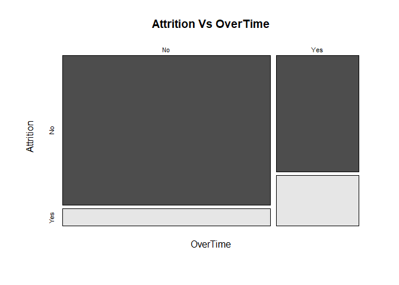<!-- -->

```
## 
##  
##    Cell Contents
## |-------------------------|
## |                       N |
## | Chi-square contribution |
## |           N / Row Total |
## |           N / Col Total |
## |         N / Table Total |
## |-------------------------|
## 
##  
## Total Observations in Table:  1470 
## 
##  
##                          | AttrDf$Attrition 
## AttrDf[, categoricalVar] |        No |       Yes | Row Total | 
## -------------------------|-----------|-----------|-----------|
##                      Low |      1044 |       200 |      1244 | 
##                          |     0.000 |     0.002 |           | 
##                          |     0.839 |     0.161 |     0.846 | 
##                          |     0.847 |     0.844 |           | 
##                          |     0.710 |     0.136 |           | 
## -------------------------|-----------|-----------|-----------|
##                     Good |       189 |        37 |       226 | 
##                          |     0.002 |     0.009 |           | 
##                          |     0.836 |     0.164 |     0.154 | 
##                          |     0.153 |     0.156 |           | 
##                          |     0.129 |     0.025 |           | 
## -------------------------|-----------|-----------|-----------|
##             Column Total |      1233 |       237 |      1470 | 
##                          |     0.839 |     0.161 |           | 
## -------------------------|-----------|-----------|-----------|
## 
##  
## Statistics for All Table Factors
## 
## 
## Pearson's Chi-squared test 
## ------------------------------------------------------------
## Chi^2 =  0.01226698     d.f. =  1     p =  0.9118095 
## 
## Pearson's Chi-squared test with Yates' continuity correction 
## ------------------------------------------------------------
## Chi^2 =  0.0001547544     d.f. =  1     p =  0.9900745 
## 
##  
## 
##  
##    Cell Contents
## |-------------------------|
## |                       N |
## | Chi-square contribution |
## |           N / Row Total |
## |           N / Col Total |
## |         N / Table Total |
## |-------------------------|
## 
##  
## Total Observations in Table:  1470 
## 
##  
##                          | AttrDf$Attrition 
## AttrDf[, categoricalVar] |        No |       Yes | Row Total | 
## -------------------------|-----------|-----------|-----------|
##                      Low |      1044 |       200 |      1244 | 
##                          |     0.000 |     0.002 |           | 
##                          |     0.839 |     0.161 |     0.846 | 
##                          |     0.847 |     0.844 |           | 
##                          |     0.710 |     0.136 |           | 
## -------------------------|-----------|-----------|-----------|
##                     Good |       189 |        37 |       226 | 
##                          |     0.002 |     0.009 |           | 
##                          |     0.836 |     0.164 |     0.154 | 
##                          |     0.153 |     0.156 |           | 
##                          |     0.129 |     0.025 |           | 
## -------------------------|-----------|-----------|-----------|
##             Column Total |      1233 |       237 |      1470 | 
##                          |     0.839 |     0.161 |           | 
## -------------------------|-----------|-----------|-----------|
## 
## 
```

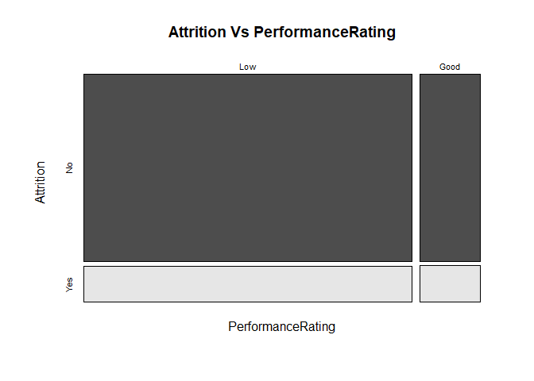<!-- -->

```
## 
##  
##    Cell Contents
## |-------------------------|
## |                       N |
## | Chi-square contribution |
## |           N / Row Total |
## |           N / Col Total |
## |         N / Table Total |
## |-------------------------|
## 
##  
## Total Observations in Table:  1470 
## 
##  
##                          | AttrDf$Attrition 
## AttrDf[, categoricalVar] |        No |       Yes | Row Total | 
## -------------------------|-----------|-----------|-----------|
##                      Low |       219 |        57 |       276 | 
##                          |     0.675 |     3.513 |           | 
##                          |     0.793 |     0.207 |     0.188 | 
##                          |     0.178 |     0.241 |           | 
##                          |     0.149 |     0.039 |           | 
## -------------------------|-----------|-----------|-----------|
##                   Medium |       258 |        45 |       303 | 
##                          |     0.058 |     0.304 |           | 
##                          |     0.851 |     0.149 |     0.206 | 
##                          |     0.209 |     0.190 |           | 
##                          |     0.176 |     0.031 |           | 
## -------------------------|-----------|-----------|-----------|
##                     High |       388 |        71 |       459 | 
##                          |     0.023 |     0.122 |           | 
##                          |     0.845 |     0.155 |     0.312 | 
##                          |     0.315 |     0.300 |           | 
##                          |     0.264 |     0.048 |           | 
## -------------------------|-----------|-----------|-----------|
##                Very High |       368 |        64 |       432 | 
##                          |     0.088 |     0.458 |           | 
##                          |     0.852 |     0.148 |     0.294 | 
##                          |     0.298 |     0.270 |           | 
##                          |     0.250 |     0.044 |           | 
## -------------------------|-----------|-----------|-----------|
##             Column Total |      1233 |       237 |      1470 | 
##                          |     0.839 |     0.161 |           | 
## -------------------------|-----------|-----------|-----------|
## 
##  
## Statistics for All Table Factors
## 
## 
## Pearson's Chi-squared test 
## ------------------------------------------------------------
## Chi^2 =  5.241068     d.f. =  3     p =  0.1549724 
## 
## 
##  
## 
##  
##    Cell Contents
## |-------------------------|
## |                       N |
## | Chi-square contribution |
## |           N / Row Total |
## |           N / Col Total |
## |         N / Table Total |
## |-------------------------|
## 
##  
## Total Observations in Table:  1470 
## 
##  
##                          | AttrDf$Attrition 
## AttrDf[, categoricalVar] |        No |       Yes | Row Total | 
## -------------------------|-----------|-----------|-----------|
##                      Low |       219 |        57 |       276 | 
##                          |     0.675 |     3.513 |           | 
##                          |     0.793 |     0.207 |     0.188 | 
##                          |     0.178 |     0.241 |           | 
##                          |     0.149 |     0.039 |           | 
## -------------------------|-----------|-----------|-----------|
##                   Medium |       258 |        45 |       303 | 
##                          |     0.058 |     0.304 |           | 
##                          |     0.851 |     0.149 |     0.206 | 
##                          |     0.209 |     0.190 |           | 
##                          |     0.176 |     0.031 |           | 
## -------------------------|-----------|-----------|-----------|
##                     High |       388 |        71 |       459 | 
##                          |     0.023 |     0.122 |           | 
##                          |     0.845 |     0.155 |     0.312 | 
##                          |     0.315 |     0.300 |           | 
##                          |     0.264 |     0.048 |           | 
## -------------------------|-----------|-----------|-----------|
##                Very High |       368 |        64 |       432 | 
##                          |     0.088 |     0.458 |           | 
##                          |     0.852 |     0.148 |     0.294 | 
##                          |     0.298 |     0.270 |           | 
##                          |     0.250 |     0.044 |           | 
## -------------------------|-----------|-----------|-----------|
##             Column Total |      1233 |       237 |      1470 | 
##                          |     0.839 |     0.161 |           | 
## -------------------------|-----------|-----------|-----------|
## 
## 
```

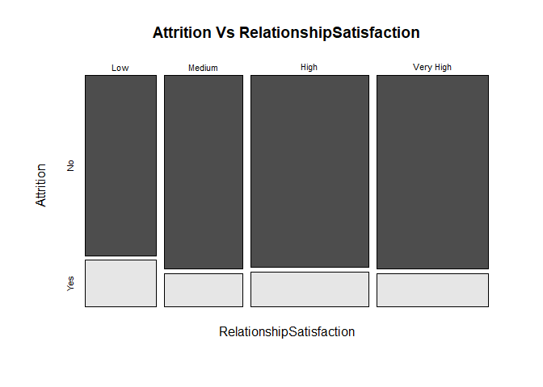<!-- -->

```
## 
##  
##    Cell Contents
## |-------------------------|
## |                       N |
## | Chi-square contribution |
## |           N / Row Total |
## |           N / Col Total |
## |         N / Table Total |
## |-------------------------|
## 
##  
## Total Observations in Table:  1470 
## 
##  
##                          | AttrDf$Attrition 
## AttrDf[, categoricalVar] |        No |       Yes | Row Total | 
## -------------------------|-----------|-----------|-----------|
##                        0 |       477 |       154 |       631 | 
##                          |     5.162 |    26.853 |           | 
##                          |     0.756 |     0.244 |     0.429 | 
##                          |     0.387 |     0.650 |           | 
##                          |     0.324 |     0.105 |           | 
## -------------------------|-----------|-----------|-----------|
##                        1 |       540 |        56 |       596 | 
##                          |     3.215 |    16.726 |           | 
##                          |     0.906 |     0.094 |     0.405 | 
##                          |     0.438 |     0.236 |           | 
##                          |     0.367 |     0.038 |           | 
## -------------------------|-----------|-----------|-----------|
##                        2 |       146 |        12 |       158 | 
##                          |     1.370 |     7.126 |           | 
##                          |     0.924 |     0.076 |     0.107 | 
##                          |     0.118 |     0.051 |           | 
##                          |     0.099 |     0.008 |           | 
## -------------------------|-----------|-----------|-----------|
##                        3 |        70 |        15 |        85 | 
##                          |     0.024 |     0.123 |           | 
##                          |     0.824 |     0.176 |     0.058 | 
##                          |     0.057 |     0.063 |           | 
##                          |     0.048 |     0.010 |           | 
## -------------------------|-----------|-----------|-----------|
##             Column Total |      1233 |       237 |      1470 | 
##                          |     0.839 |     0.161 |           | 
## -------------------------|-----------|-----------|-----------|
## 
##  
## Statistics for All Table Factors
## 
## 
## Pearson's Chi-squared test 
## ------------------------------------------------------------
## Chi^2 =  60.5983     d.f. =  3     p =  4.37939e-13 
## 
## 
##  
## 
##  
##    Cell Contents
## |-------------------------|
## |                       N |
## | Chi-square contribution |
## |           N / Row Total |
## |           N / Col Total |
## |         N / Table Total |
## |-------------------------|
## 
##  
## Total Observations in Table:  1470 
## 
##  
##                          | AttrDf$Attrition 
## AttrDf[, categoricalVar] |        No |       Yes | Row Total | 
## -------------------------|-----------|-----------|-----------|
##                        0 |       477 |       154 |       631 | 
##                          |     5.162 |    26.853 |           | 
##                          |     0.756 |     0.244 |     0.429 | 
##                          |     0.387 |     0.650 |           | 
##                          |     0.324 |     0.105 |           | 
## -------------------------|-----------|-----------|-----------|
##                        1 |       540 |        56 |       596 | 
##                          |     3.215 |    16.726 |           | 
##                          |     0.906 |     0.094 |     0.405 | 
##                          |     0.438 |     0.236 |           | 
##                          |     0.367 |     0.038 |           | 
## -------------------------|-----------|-----------|-----------|
##                        2 |       146 |        12 |       158 | 
##                          |     1.370 |     7.126 |           | 
##                          |     0.924 |     0.076 |     0.107 | 
##                          |     0.118 |     0.051 |           | 
##                          |     0.099 |     0.008 |           | 
## -------------------------|-----------|-----------|-----------|
##                        3 |        70 |        15 |        85 | 
##                          |     0.024 |     0.123 |           | 
##                          |     0.824 |     0.176 |     0.058 | 
##                          |     0.057 |     0.063 |           | 
##                          |     0.048 |     0.010 |           | 
## -------------------------|-----------|-----------|-----------|
##             Column Total |      1233 |       237 |      1470 | 
##                          |     0.839 |     0.161 |           | 
## -------------------------|-----------|-----------|-----------|
## 
## 
```

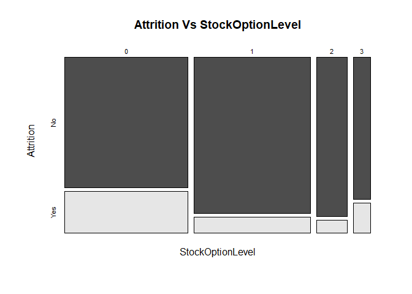<!-- -->

```
## 
##  
##    Cell Contents
## |-------------------------|
## |                       N |
## | Chi-square contribution |
## |           N / Row Total |
## |           N / Col Total |
## |         N / Table Total |
## |-------------------------|
## 
##  
## Total Observations in Table:  1470 
## 
##  
##                          | AttrDf$Attrition 
## AttrDf[, categoricalVar] |        No |       Yes | Row Total | 
## -------------------------|-----------|-----------|-----------|
##                      Bad |        55 |        25 |        80 | 
##                          |     2.183 |    11.355 |           | 
##                          |     0.688 |     0.312 |     0.054 | 
##                          |     0.045 |     0.105 |           | 
##                          |     0.037 |     0.017 |           | 
## -------------------------|-----------|-----------|-----------|
##                     Good |       286 |        58 |       344 | 
##                          |     0.022 |     0.116 |           | 
##                          |     0.831 |     0.169 |     0.234 | 
##                          |     0.232 |     0.245 |           | 
##                          |     0.195 |     0.039 |           | 
## -------------------------|-----------|-----------|-----------|
##                   Better |       766 |       127 |       893 | 
##                          |     0.385 |     2.001 |           | 
##                          |     0.858 |     0.142 |     0.607 | 
##                          |     0.621 |     0.536 |           | 
##                          |     0.521 |     0.086 |           | 
## -------------------------|-----------|-----------|-----------|
##                     Best |       126 |        27 |       153 | 
##                          |     0.042 |     0.221 |           | 
##                          |     0.824 |     0.176 |     0.104 | 
##                          |     0.102 |     0.114 |           | 
##                          |     0.086 |     0.018 |           | 
## -------------------------|-----------|-----------|-----------|
##             Column Total |      1233 |       237 |      1470 | 
##                          |     0.839 |     0.161 |           | 
## -------------------------|-----------|-----------|-----------|
## 
##  
## Statistics for All Table Factors
## 
## 
## Pearson's Chi-squared test 
## ------------------------------------------------------------
## Chi^2 =  16.3251     d.f. =  3     p =  0.0009725699 
## 
## 
##  
## 
##  
##    Cell Contents
## |-------------------------|
## |                       N |
## | Chi-square contribution |
## |           N / Row Total |
## |           N / Col Total |
## |         N / Table Total |
## |-------------------------|
## 
##  
## Total Observations in Table:  1470 
## 
##  
##                          | AttrDf$Attrition 
## AttrDf[, categoricalVar] |        No |       Yes | Row Total | 
## -------------------------|-----------|-----------|-----------|
##                      Bad |        55 |        25 |        80 | 
##                          |     2.183 |    11.355 |           | 
##                          |     0.688 |     0.312 |     0.054 | 
##                          |     0.045 |     0.105 |           | 
##                          |     0.037 |     0.017 |           | 
## -------------------------|-----------|-----------|-----------|
##                     Good |       286 |        58 |       344 | 
##                          |     0.022 |     0.116 |           | 
##                          |     0.831 |     0.169 |     0.234 | 
##                          |     0.232 |     0.245 |           | 
##                          |     0.195 |     0.039 |           | 
## -------------------------|-----------|-----------|-----------|
##                   Better |       766 |       127 |       893 | 
##                          |     0.385 |     2.001 |           | 
##                          |     0.858 |     0.142 |     0.607 | 
##                          |     0.621 |     0.536 |           | 
##                          |     0.521 |     0.086 |           | 
## -------------------------|-----------|-----------|-----------|
##                     Best |       126 |        27 |       153 | 
##                          |     0.042 |     0.221 |           | 
##                          |     0.824 |     0.176 |     0.104 | 
##                          |     0.102 |     0.114 |           | 
##                          |     0.086 |     0.018 |           | 
## -------------------------|-----------|-----------|-----------|
##             Column Total |      1233 |       237 |      1470 | 
##                          |     0.839 |     0.161 |           | 
## -------------------------|-----------|-----------|-----------|
## 
## 
```

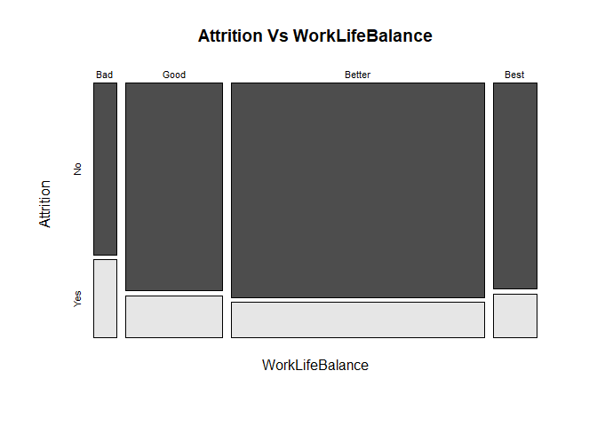<!-- -->

```r
## Do the same for Numeric Variables
numericVarVec <- c("Age", "DailyRate", "DistanceFromHome", "HourlyRate", "MonthlyIncome", "MonthlyRate", "NumCompaniesWorked", "PercentSalaryHike" , "TotalWorkingYears", "TrainingTimesLastYear", "YearsAtCompany", "YearsInCurrentRole", "YearsSinceLastPromotion", "YearsWithCurrManager")
# Recode the Attrition Var
AttrDf$RecodedAttrVar <- ifelse(AttrDf$Attrition == "Yes", 1, 0)
for(numericVar in numericVarVec){
  plot(x = AttrDf[ ,numericVar], y = AttrDf$RecodedAttrVar,main = paste("Attrition Vs", numericVar, sep = " "), xlab = numericVar, ylab = "Attrition")
}
```

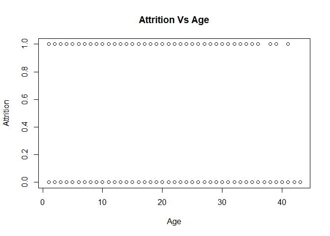<!-- -->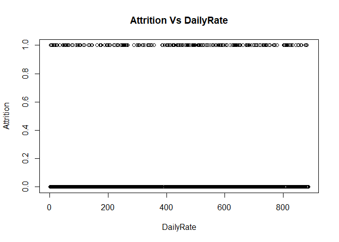<!-- -->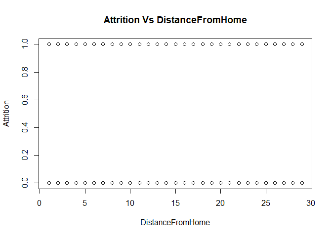<!-- -->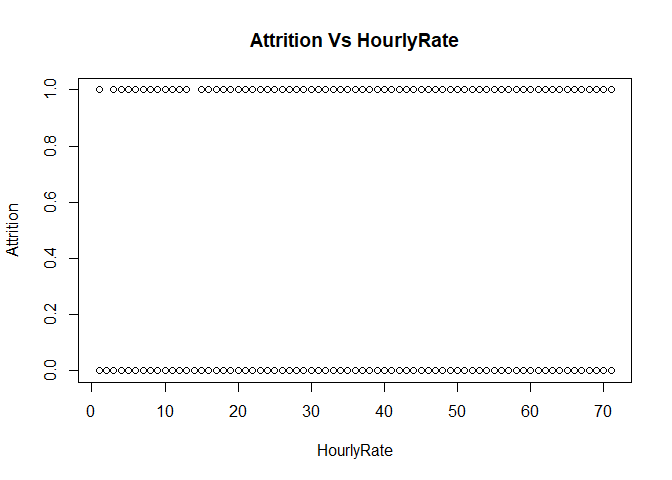<!-- -->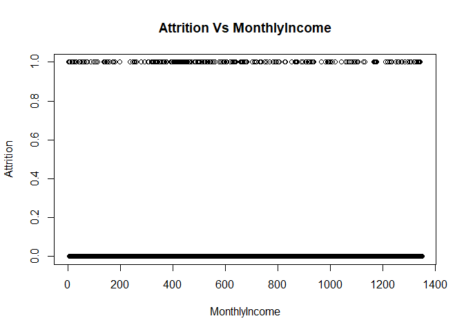<!-- -->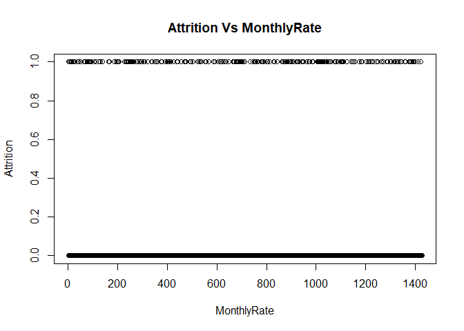<!-- -->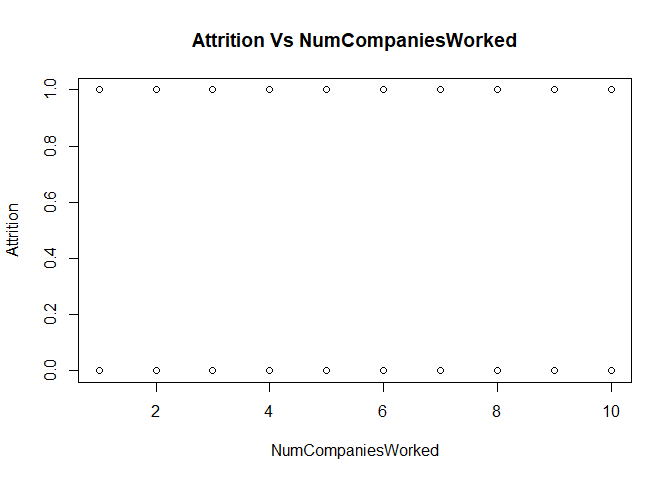<!-- -->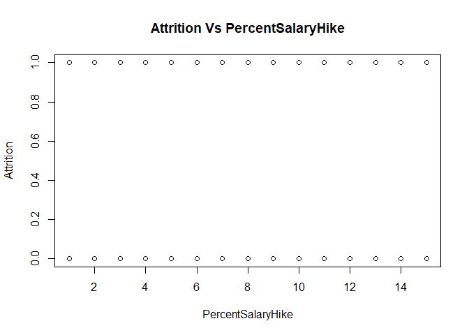<!-- -->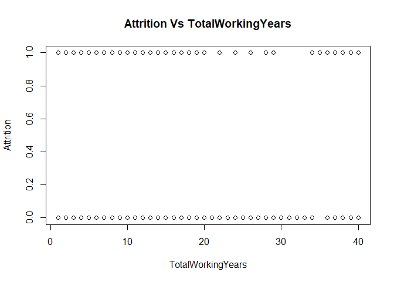<!-- -->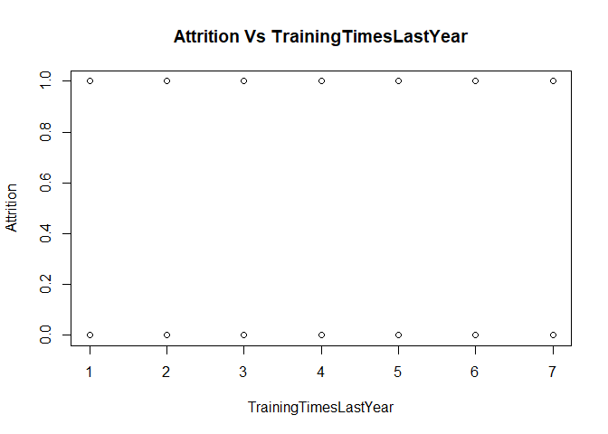<!-- -->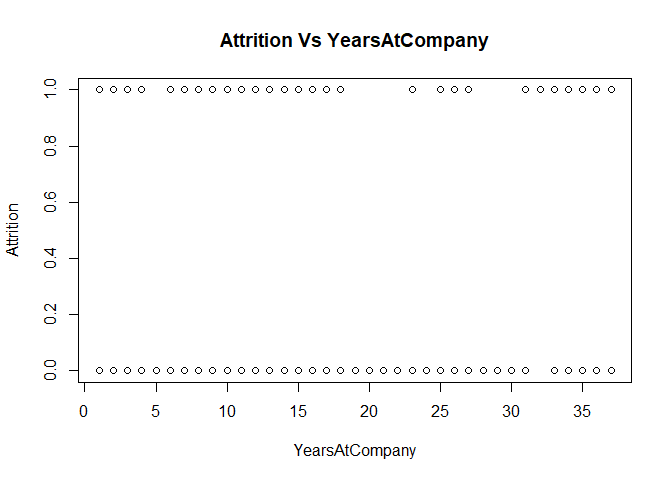<!-- -->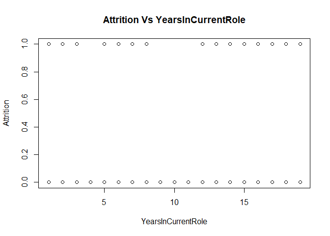<!-- -->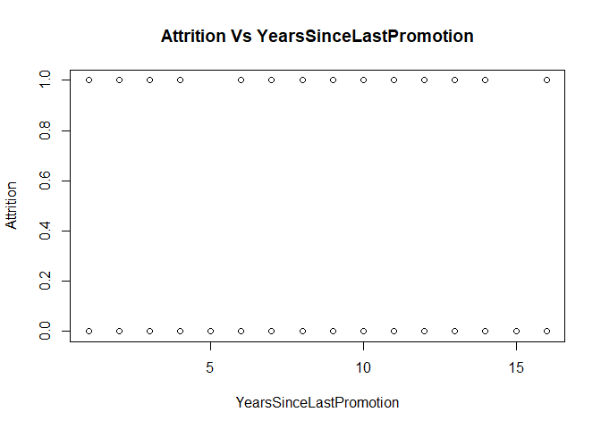<!-- -->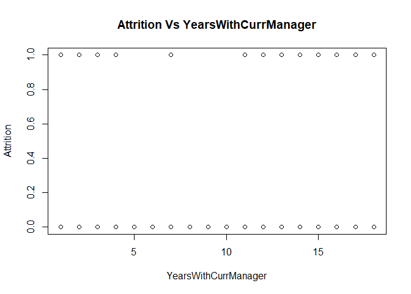<!-- -->

```r
# Drop the Recoded Attrition Column
AttrDf <- subset(AttrDf, select = -RecodedAttrVar)
```


```r
set.seed(99)
subAttrDf <- subset(AttrDf, select = -EmployeeNumber)
ModelRandomForest <- randomForest(Attrition ~ . , data=subAttrDf, proximity=T)
ModelRandomForest
```

```
## 
## Call:
##  randomForest(formula = Attrition ~ ., data = subAttrDf, proximity = T) 
##                Type of random forest: classification
##                      Number of trees: 500
## No. of variables tried at each split: 5
## 
##         OOB estimate of  error rate: 14.35%
## Confusion matrix:
##       No Yes class.error
## No  1223  10   0.0081103
## Yes  201  36   0.8481013
```


```r
oob.error.data <- data.frame(
  Trees=rep(1:nrow(ModelRandomForest$err.rate), times=3),
  Type=rep(c("OOB", "No", "Yes"), each=nrow(ModelRandomForest$err.rate)),
  Error=c(ModelRandomForest$err.rate[,"OOB"],
    ModelRandomForest$err.rate[,"No"],
    ModelRandomForest$err.rate[,"Yes"]))

ggplot(data=oob.error.data, aes(x=Trees, y=Error)) +
  geom_line(aes(color=Type))
```

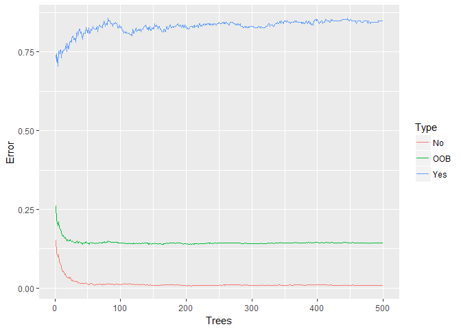<!-- -->

```r
# Adding More Trees to Forest and checking Out of Bag Error Rate
ModelRandomForestWith1000Trees <- randomForest(Attrition ~ . , data=subAttrDf, ntree = 1000,  proximity=T)
ModelRandomForestWith1000Trees
```

```
## 
## Call:
##  randomForest(formula = Attrition ~ ., data = subAttrDf, ntree = 1000,      proximity = T) 
##                Type of random forest: classification
##                      Number of trees: 1000
## No. of variables tried at each split: 5
## 
##         OOB estimate of  error rate: 14.42%
## Confusion matrix:
##       No Yes class.error
## No  1224   9  0.00729927
## Yes  203  34  0.85654008
```

```r
oob.error.data <- data.frame(
  Trees=rep(1:nrow(ModelRandomForestWith1000Trees$err.rate), times=3),
  Type=rep(c("OOB", "No", "Yes"), each=nrow(ModelRandomForestWith1000Trees$err.rate)),
  Error=c(ModelRandomForestWith1000Trees$err.rate[,"OOB"],
    ModelRandomForestWith1000Trees$err.rate[,"No"],
    ModelRandomForestWith1000Trees$err.rate[,"Yes"]))

ggplot(data=oob.error.data, aes(x=Trees, y=Error)) +
  geom_line(aes(color=Type))
```

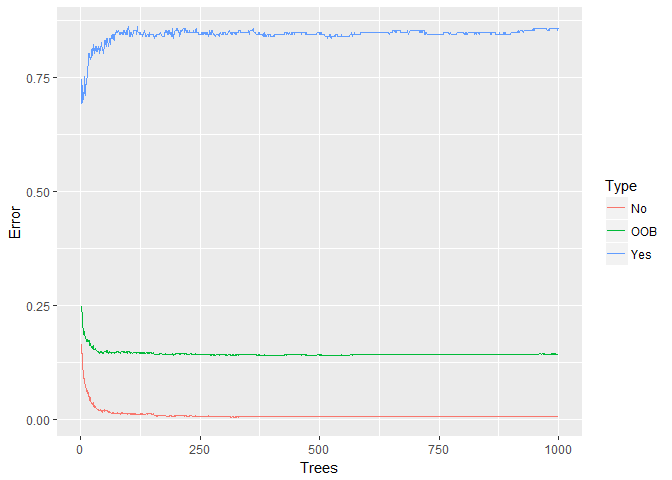<!-- -->


```r
outOfBagErrorValues <- vector(length = (dim(subAttrDf)[2] - 1))
for (randomVarCount in 1:length(outOfBagErrorValues)){
  testModel <- randomForest(Attrition ~ . , data=subAttrDf, ntree = 500,  mtry = randomVarCount)
  outOfBagErrorValues[randomVarCount] <- testModel$err.rate[nrow(testModel$err.rate),1]
}
outOfBagErrorValues
```

```
##  [1] 0.1612245 0.1489796 0.1476190 0.1428571 0.1401361 0.1401361 0.1374150
##  [8] 0.1394558 0.1380952 0.1353741 0.1340136 0.1387755 0.1360544 0.1401361
## [15] 0.1380952 0.1387755 0.1380952 0.1380952 0.1367347 0.1387755 0.1408163
## [22] 0.1401361 0.1374150 0.1401361 0.1421769 0.1408163 0.1394558 0.1401361
## [29] 0.1476190 0.1469388 0.1414966 0.1414966 0.1408163
```

```r
plot(outOfBagErrorValues, type = "o", col= "Blue")
```

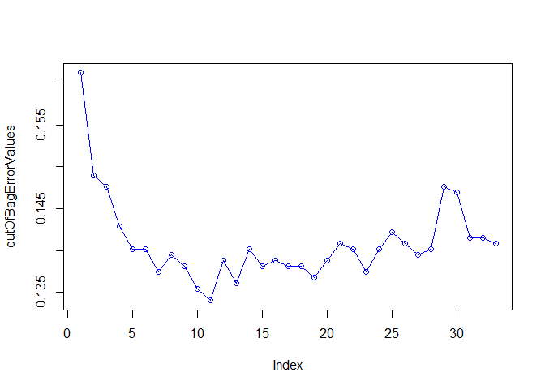<!-- -->


```r
# Appropriate ntree and mtry values for lowest out of bag error are as 500 and 11. Hence,
# fitting final model based on these
FinalFittedModel <- randomForest(Attrition ~ . , data=subAttrDf, ntree = 500, mtry = 11)
FinalFittedModel
```

```
## 
## Call:
##  randomForest(formula = Attrition ~ ., data = subAttrDf, ntree = 500,      mtry = 11) 
##                Type of random forest: classification
##                      Number of trees: 500
## No. of variables tried at each split: 11
## 
##         OOB estimate of  error rate: 13.95%
## Confusion matrix:
##       No Yes class.error
## No  1214  19  0.01540957
## Yes  186  51  0.78481013
```


```r
importanceMatrix <- importance(FinalFittedModel)
importanceMatrix[order(-importanceMatrix[,1]), ]
```

```
##            MonthlyIncome                      Age                 OverTime 
##               28.0741282               27.0818492               24.7509098 
##                  JobRole              MonthlyRate                DailyRate 
##               23.2064144               21.6113423               20.1652170 
##        TotalWorkingYears               HourlyRate           YearsAtCompany 
##               18.7184223               18.5757068               14.2887311 
##           EducationField         DistanceFromHome       NumCompaniesWorked 
##               13.7913934               13.6912861               13.4766871 
##  EnvironmentSatisfaction         StockOptionLevel        PercentSalaryHike 
##               12.8260550               12.7663783               12.7652253 
##     YearsWithCurrManager                 JobLevel          JobSatisfaction 
##               12.4377550               12.3335001               11.6819362 
##          WorkLifeBalance    TrainingTimesLastYear           JobInvolvement 
##               11.0342921               10.4023896                9.7810802 
## RelationshipSatisfaction                Education  YearsSinceLastPromotion 
##                9.4439126                9.0010703                8.4487907 
##       YearsInCurrentRole            MaritalStatus           BusinessTravel 
##                7.9012586                7.7619794                7.2262974 
##               Department                   Gender        PerformanceRating 
##                3.0062541                1.7528756                0.9067146 
##            EmployeeCount                   Over18            StandardHours 
##                0.0000000                0.0000000                0.0000000
```

```r
varImpPlot(FinalFittedModel)
```

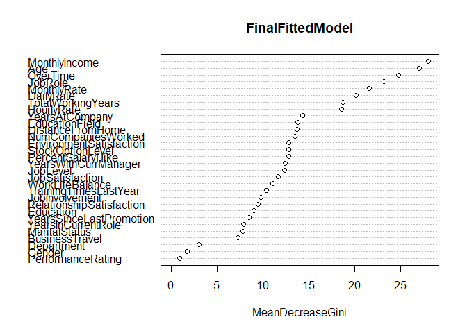<!-- -->


```r
subAttrDf <- subset(subAttrDf, select = -Over18)
cf1 <- cforest(Attrition ~ . , data=subAttrDf, control=cforest_unbiased(mtry=11,ntree=500))
#relativeImp_CondRandForest <- varimp(cf1, conditional=TRUE)
#relativeImp_CondRandForest <- relativeImp_CondRandForest[order(-relativeImp_CondRandForest[,1]), , drop = F]
#relativeImp_CondRandForest
# Importance based upon decrease in acuracy
relativeImp_CondRandForest_1 <-  varimpAUC(cf1, conditional = T)
#relativeImp_CondRandForest_1 <- relativeImp_CondRandForest_1[order(-relativeImp_CondRandForest_1[,1]), , drop = F]
relativeImp_CondRandForest_1
```

```
##                      Age           BusinessTravel                DailyRate 
##            -7.439620e-06            -1.890776e-05            -2.397409e-05 
##               Department         DistanceFromHome                Education 
##             2.363474e-05            -2.460535e-05            -2.182267e-05 
##           EducationField            EmployeeCount  EnvironmentSatisfaction 
##            -1.357014e-05             0.000000e+00             7.646820e-05 
##                   Gender               HourlyRate           JobInvolvement 
##            -1.025023e-05             3.865828e-05            -7.777211e-06 
##                 JobLevel                  JobRole          JobSatisfaction 
##             3.868522e-05             2.488938e-05             3.583972e-04 
##            MaritalStatus            MonthlyIncome              MonthlyRate 
##             2.609647e-05             0.000000e+00             0.000000e+00 
##       NumCompaniesWorked                 OverTime        PercentSalaryHike 
##             1.955023e-05             2.978261e-04            -5.935687e-07 
##        PerformanceRating RelationshipSatisfaction            StandardHours 
##            -5.318226e-07             1.480969e-05             0.000000e+00 
##         StockOptionLevel        TotalWorkingYears    TrainingTimesLastYear 
##             2.038295e-05            -1.685149e-05             2.114868e-05 
##          WorkLifeBalance           YearsAtCompany       YearsInCurrentRole 
##             3.371300e-05            -3.076057e-05             0.000000e+00 
##  YearsSinceLastPromotion     YearsWithCurrManager 
##            -4.811046e-08             1.681670e-05
```

```r
write.csv(relativeImp_CondRandForest_1, file = "Testing3.csv", row.names = T)
```


```r
names(subAttrDf)
```

```
##  [1] "Age"                      "Attrition"               
##  [3] "BusinessTravel"           "DailyRate"               
##  [5] "Department"               "DistanceFromHome"        
##  [7] "Education"                "EducationField"          
##  [9] "EmployeeCount"            "EnvironmentSatisfaction" 
## [11] "Gender"                   "HourlyRate"              
## [13] "JobInvolvement"           "JobLevel"                
## [15] "JobRole"                  "JobSatisfaction"         
## [17] "MaritalStatus"            "MonthlyIncome"           
## [19] "MonthlyRate"              "NumCompaniesWorked"      
## [21] "OverTime"                 "PercentSalaryHike"       
## [23] "PerformanceRating"        "RelationshipSatisfaction"
## [25] "StandardHours"            "StockOptionLevel"        
## [27] "TotalWorkingYears"        "TrainingTimesLastYear"   
## [29] "WorkLifeBalance"          "YearsAtCompany"          
## [31] "YearsInCurrentRole"       "YearsSinceLastPromotion" 
## [33] "YearsWithCurrManager"
```

```r
subAttrDf <- subset(subAttrDf, select = -c(StandardHours, EmployeeCount))
logisticModelFit <- glm(Attrition ~ ., data=subAttrDf, family = "binomial")
summary(logisticModelFit)
```

```
## 
## Call:
## glm(formula = Attrition ~ ., family = "binomial", data = subAttrDf)
## 
## Deviance Residuals: 
##     Min       1Q   Median       3Q      Max  
## -2.2393  -0.4529  -0.2216  -0.0758   3.5252  
## 
## Coefficients:
##                                     Estimate Std. Error z value Pr(>|z|)
## (Intercept)                       -8.880e+00  6.346e+02  -0.014 0.988834
## Age                               -4.387e-02  1.292e-02  -3.396 0.000684
## BusinessTravelTravel_Frequently    1.866e+00  4.196e-01   4.448 8.67e-06
## BusinessTravelTravel_Rarely        8.602e-01  3.855e-01   2.232 0.025644
## DailyRate                          4.472e-04  3.688e-04   1.212 0.225339
## DepartmentResearch & Development   1.325e+01  6.346e+02   0.021 0.983339
## DepartmentSales                    1.237e+01  6.346e+02   0.019 0.984450
## DistanceFromHome                   4.130e-03  9.612e-03   0.430 0.667481
## EducationCollege                   2.398e-01  3.438e-01   0.697 0.485542
## EducationBachelor                  2.547e-01  3.018e-01   0.844 0.398662
## EducationMaster                    3.024e-01  3.300e-01   0.916 0.359458
## EducationDoctor                    3.976e-01  6.343e-01   0.627 0.530790
## EducationFieldLife Sciences       -9.800e-01  8.549e-01  -1.146 0.251618
## EducationFieldMarketing           -4.184e-01  9.041e-01  -0.463 0.643520
## EducationFieldMedical             -9.787e-01  8.517e-01  -1.149 0.250508
## EducationFieldOther               -9.487e-01  9.259e-01  -1.025 0.305532
## EducationFieldTechnical Degree     9.255e-02  8.724e-01   0.106 0.915516
## EnvironmentSatisfactionMedium     -9.111e-01  2.859e-01  -3.187 0.001440
## EnvironmentSatisfactionHigh       -1.004e+00  2.594e-01  -3.869 0.000109
## EnvironmentSatisfactionVery High  -1.353e+00  2.687e-01  -5.036 4.76e-07
## GenderMale                         3.839e-01  1.937e-01   1.982 0.047491
## HourlyRate                         2.439e-03  4.659e-03   0.524 0.600549
## JobInvolvementMedium              -1.404e+00  3.800e-01  -3.696 0.000219
## JobInvolvementHigh                -1.597e+00  3.552e-01  -4.496 6.92e-06
## JobInvolvementVery High           -2.236e+00  4.925e-01  -4.541 5.60e-06
## JobLevelExperienced               -1.603e+00  4.557e-01  -3.518 0.000435
## JobLevelFirst-Level Management    -8.854e-01  5.381e-01  -1.645 0.099899
## JobLevelMiddle-Level Management   -2.055e+00  8.123e-01  -2.529 0.011426
## JobLevelTop-Level Management       3.145e-01  1.127e+00   0.279 0.780203
## JobRoleHuman Resources             1.348e+01  6.346e+02   0.021 0.983048
## JobRoleLaboratory Technician       3.320e-01  5.851e-01   0.567 0.570488
## JobRoleManager                    -1.141e+00  1.066e+00  -1.070 0.284674
## JobRoleManufacturing Director     -5.911e-02  5.580e-01  -0.106 0.915645
## JobRoleResearch Director          -2.723e+00  1.043e+00  -2.611 0.009022
## JobRoleResearch Scientist         -7.435e-01  6.004e-01  -1.238 0.215638
## JobRoleSales Executive             2.067e+00  1.284e+00   1.610 0.107356
## JobRoleSales Representative        1.496e+00  1.365e+00   1.096 0.273093
## JobSatisfactionMedium             -5.057e-01  2.827e-01  -1.789 0.073651
## JobSatisfactionHigh               -5.214e-01  2.499e-01  -2.087 0.036917
## JobSatisfactionVery High          -1.247e+00  2.700e-01  -4.618 3.87e-06
## MaritalStatusMarried               3.232e-01  2.865e-01   1.128 0.259313
## MaritalStatusSingle                7.611e-01  4.086e-01   1.862 0.062541
## MonthlyIncome                     -9.101e-04  3.494e-04  -2.605 0.009189
## MonthlyRate                       -2.835e-04  2.262e-04  -1.254 0.209991
## NumCompaniesWorked                 1.602e-01  3.866e-02   4.142 3.44e-05
## OverTimeYes                        2.066e+00  2.032e-01  10.167  < 2e-16
## PercentSalaryHike                 -1.637e-02  4.033e-02  -0.406 0.684753
## PerformanceRatingGood              2.216e-02  4.151e-01   0.053 0.957428
## RelationshipSatisfactionMedium    -8.852e-01  2.992e-01  -2.959 0.003088
## RelationshipSatisfactionHigh      -1.006e+00  2.673e-01  -3.766 0.000166
## RelationshipSatisfactionVery High -9.108e-01  2.635e-01  -3.457 0.000547
## StockOptionLevel1                 -1.030e+00  3.177e-01  -3.243 0.001183
## StockOptionLevel2                 -7.205e-01  4.522e-01  -1.593 0.111075
## StockOptionLevel3                 -1.768e-01  4.714e-01  -0.375 0.707581
## TotalWorkingYears                 -3.506e-03  7.555e-03  -0.464 0.642609
## TrainingTimesLastYear             -1.988e-01  7.496e-02  -2.652 0.008006
## WorkLifeBalanceGood               -1.039e+00  3.833e-01  -2.710 0.006738
## WorkLifeBalanceBetter             -1.495e+00  3.601e-01  -4.153 3.28e-05
## WorkLifeBalanceBest               -1.049e+00  4.362e-01  -2.405 0.016182
## YearsAtCompany                    -7.418e-03  9.921e-03  -0.748 0.454611
## YearsInCurrentRole                -4.213e-02  2.180e-02  -1.932 0.053304
## YearsSinceLastPromotion            5.907e-02  2.328e-02   2.537 0.011188
## YearsWithCurrManager              -2.879e-02  2.022e-02  -1.424 0.154452
##                                      
## (Intercept)                          
## Age                               ***
## BusinessTravelTravel_Frequently   ***
## BusinessTravelTravel_Rarely       *  
## DailyRate                            
## DepartmentResearch & Development     
## DepartmentSales                      
## DistanceFromHome                     
## EducationCollege                     
## EducationBachelor                    
## EducationMaster                      
## EducationDoctor                      
## EducationFieldLife Sciences          
## EducationFieldMarketing              
## EducationFieldMedical                
## EducationFieldOther                  
## EducationFieldTechnical Degree       
## EnvironmentSatisfactionMedium     ** 
## EnvironmentSatisfactionHigh       ***
## EnvironmentSatisfactionVery High  ***
## GenderMale                        *  
## HourlyRate                           
## JobInvolvementMedium              ***
## JobInvolvementHigh                ***
## JobInvolvementVery High           ***
## JobLevelExperienced               ***
## JobLevelFirst-Level Management    .  
## JobLevelMiddle-Level Management   *  
## JobLevelTop-Level Management         
## JobRoleHuman Resources               
## JobRoleLaboratory Technician         
## JobRoleManager                       
## JobRoleManufacturing Director        
## JobRoleResearch Director          ** 
## JobRoleResearch Scientist            
## JobRoleSales Executive               
## JobRoleSales Representative          
## JobSatisfactionMedium             .  
## JobSatisfactionHigh               *  
## JobSatisfactionVery High          ***
## MaritalStatusMarried                 
## MaritalStatusSingle               .  
## MonthlyIncome                     ** 
## MonthlyRate                          
## NumCompaniesWorked                ***
## OverTimeYes                       ***
## PercentSalaryHike                    
## PerformanceRatingGood                
## RelationshipSatisfactionMedium    ** 
## RelationshipSatisfactionHigh      ***
## RelationshipSatisfactionVery High ***
## StockOptionLevel1                 ** 
## StockOptionLevel2                    
## StockOptionLevel3                    
## TotalWorkingYears                    
## TrainingTimesLastYear             ** 
## WorkLifeBalanceGood               ** 
## WorkLifeBalanceBetter             ***
## WorkLifeBalanceBest               *  
## YearsAtCompany                       
## YearsInCurrentRole                .  
## YearsSinceLastPromotion           *  
## YearsWithCurrManager                 
## ---
## Signif. codes:  0 '***' 0.001 '**' 0.01 '*' 0.05 '.' 0.1 ' ' 1
## 
## (Dispersion parameter for binomial family taken to be 1)
## 
##     Null deviance: 1298.58  on 1469  degrees of freedom
## Residual deviance:  806.14  on 1407  degrees of freedom
## AIC: 932.14
## 
## Number of Fisher Scoring iterations: 15
```

```r
relativeImp <- varImp(logisticModelFit, scale = F)
relativeImp <- relativeImp[order(-relativeImp[,1]), , drop = F]
relativeImp
```

```
##                                       Overall
## OverTimeYes                       10.16656284
## EnvironmentSatisfactionVery High   5.03592183
## JobSatisfactionVery High           4.61815741
## JobInvolvementVery High            4.54079906
## JobInvolvementHigh                 4.49627183
## BusinessTravelTravel_Frequently    4.44787726
## WorkLifeBalanceBetter              4.15329804
## NumCompaniesWorked                 4.14216042
## EnvironmentSatisfactionHigh        3.86877957
## RelationshipSatisfactionHigh       3.76553793
## JobInvolvementMedium               3.69623405
## JobLevelExperienced                3.51797828
## RelationshipSatisfactionVery High  3.45667497
## Age                                3.39577669
## StockOptionLevel1                  3.24297354
## EnvironmentSatisfactionMedium      3.18659905
## RelationshipSatisfactionMedium     2.95884110
## WorkLifeBalanceGood                2.70952072
## TrainingTimesLastYear              2.65183138
## JobRoleResearch Director           2.61120604
## MonthlyIncome                      2.60495982
## YearsSinceLastPromotion            2.53677488
## JobLevelMiddle-Level Management    2.52938369
## WorkLifeBalanceBest                2.40479310
## BusinessTravelTravel_Rarely        2.23156395
## JobSatisfactionHigh                2.08668560
## GenderMale                         1.98189930
## YearsInCurrentRole                 1.93245352
## MaritalStatusSingle                1.86244394
## JobSatisfactionMedium              1.78877277
## JobLevelFirst-Level Management     1.64534420
## JobRoleSales Executive             1.61019028
## StockOptionLevel2                  1.59337934
## YearsWithCurrManager               1.42398216
## MonthlyRate                        1.25358925
## JobRoleResearch Scientist          1.23821015
## DailyRate                          1.21245384
## EducationFieldMedical              1.14911599
## EducationFieldLife Sciences        1.14642776
## MaritalStatusMarried               1.12801723
## JobRoleSales Representative        1.09596674
## JobRoleManager                     1.06987799
## EducationFieldOther                1.02464191
## EducationMaster                    0.91639757
## EducationBachelor                  0.84401414
## YearsAtCompany                     0.74774943
## EducationCollege                   0.69741736
## EducationDoctor                    0.62680083
## JobRoleLaboratory Technician       0.56733321
## HourlyRate                         0.52361073
## TotalWorkingYears                  0.46405424
## EducationFieldMarketing            0.46278331
## DistanceFromHome                   0.42960769
## PercentSalaryHike                  0.40598616
## StockOptionLevel3                  0.37510726
## JobLevelTop-Level Management       0.27905483
## EducationFieldTechnical Degree     0.10608304
## JobRoleManufacturing Director      0.10592151
## PerformanceRatingGood              0.05338205
## JobRoleHuman Resources             0.02124735
## DepartmentResearch & Development   0.02088251
## DepartmentSales                    0.01948985
```

