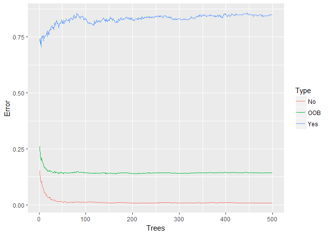
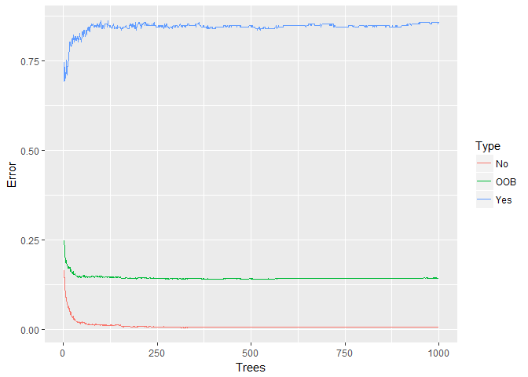
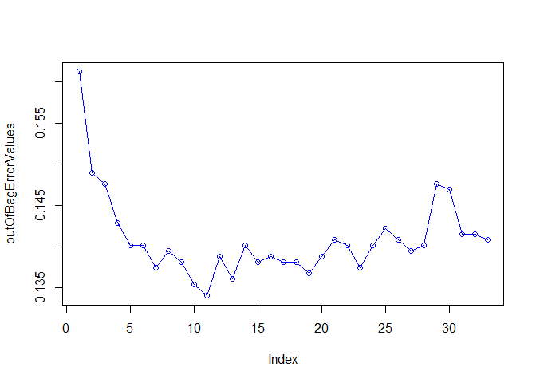
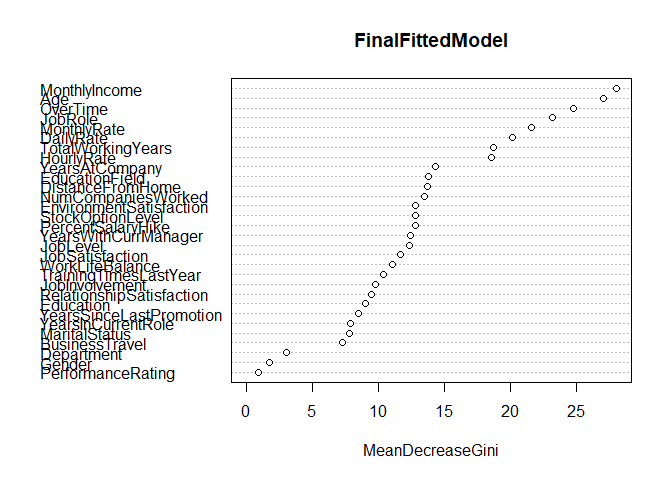

```r
library(randomForest)
```

```
## Warning: package 'randomForest' was built under R version 3.5.1
```

```
## randomForest 4.6-14
```

```
## Type rfNews() to see new features/changes/bug fixes.
```

```r
library(ggplot2)
```

```
## 
## Attaching package: 'ggplot2'
```

```
## The following object is masked from 'package:randomForest':
## 
##     margin
```

```r
library(stringr)
library(dplyr)
```

```
## 
## Attaching package: 'dplyr'
```

```
## The following object is masked from 'package:randomForest':
## 
##     combine
```

```
## The following objects are masked from 'package:stats':
## 
##     filter, lag
```

```
## The following objects are masked from 'package:base':
## 
##     intersect, setdiff, setequal, union
```

```r
library(tidyr)
library(xlsx)
library(reshape2)
```

```
## 
## Attaching package: 'reshape2'
```

```
## The following object is masked from 'package:tidyr':
## 
##     smiths
```

```r
sessionInfo()
```

```
## R version 3.5.0 (2018-04-23)
## Platform: x86_64-w64-mingw32/x64 (64-bit)
## Running under: Windows 10 x64 (build 17134)
## 
## Matrix products: default
## 
## locale:
## [1] LC_COLLATE=English_United States.1252 
## [2] LC_CTYPE=English_United States.1252   
## [3] LC_MONETARY=English_United States.1252
## [4] LC_NUMERIC=C                          
## [5] LC_TIME=English_United States.1252    
## 
## attached base packages:
## [1] stats     graphics  grDevices utils     datasets  methods   base     
## 
## other attached packages:
## [1] reshape2_1.4.3      xlsx_0.6.1          tidyr_0.8.0        
## [4] dplyr_0.7.4         stringr_1.3.1       ggplot2_2.2.1      
## [7] randomForest_4.6-14
## 
## loaded via a namespace (and not attached):
##  [1] Rcpp_0.12.16     bindr_0.1.1      knitr_1.20       magrittr_1.5    
##  [5] munsell_0.4.3    colorspace_1.3-2 R6_2.2.2         rlang_0.2.0     
##  [9] plyr_1.8.4       tools_3.5.0      grid_3.5.0       gtable_0.2.0    
## [13] htmltools_0.3.6  assertthat_0.2.0 yaml_2.1.19      lazyeval_0.2.1  
## [17] rprojroot_1.3-2  digest_0.6.15    tibble_1.4.2     bindrcpp_0.2.2  
## [21] rJava_0.9-10     purrr_0.2.4      xlsxjars_0.6.1   glue_1.2.0      
## [25] evaluate_0.10.1  rmarkdown_1.9    stringi_1.1.7    compiler_3.5.0  
## [29] pillar_1.2.2     scales_0.5.0     backports_1.1.2  pkgconfig_2.0.1
```


```r
AttrDf <- read.xlsx2(file = "CaseStudy2-data.xlsx",sheetName = "HR-employee-attrition Data",header = T)
dim(AttrDf)
```

```
## [1] 1470   35
```

```r
str(AttrDf)
```

```
## 'data.frame':	1470 obs. of  35 variables:
##  $ Age                     : Factor w/ 43 levels "18","19","20",..: 24 32 20 16 10 15 42 13 21 19 ...
##  $ Attrition               : Factor w/ 2 levels "No","Yes": 2 1 2 1 1 1 1 1 1 1 ...
##  $ BusinessTravel          : Factor w/ 3 levels "Non-Travel","Travel_Frequently",..: 3 2 3 2 3 2 3 3 2 3 ...
##  $ DailyRate               : Factor w/ 886 levels "1001","1002",..: 63 431 262 278 630 4 224 250 396 202 ...
##  $ Department              : Factor w/ 3 levels "Human Resources",..: 3 2 2 2 2 2 2 2 2 2 ...
##  $ DistanceFromHome        : Factor w/ 29 levels "1","10","11",..: 1 28 12 23 12 12 23 17 16 20 ...
##  $ Education               : Factor w/ 5 levels "1","2","3","4",..: 2 1 2 4 1 2 3 1 3 3 ...
##  $ EducationField          : Factor w/ 6 levels "Human Resources",..: 2 2 5 2 4 2 4 2 2 4 ...
##  $ EmployeeCount           : Factor w/ 1 level "1": 1 1 1 1 1 1 1 1 1 1 ...
##  $ EmployeeNumber          : Factor w/ 1470 levels "1","10","100",..: 1 787 998 1089 1241 1315 2 85 159 243 ...
##  $ EnvironmentSatisfaction : Factor w/ 4 levels "1","2","3","4": 2 3 4 4 1 4 3 4 4 3 ...
##  $ Gender                  : Factor w/ 2 levels "Female","Male": 1 2 2 1 2 2 1 2 2 2 ...
##  $ HourlyRate              : Factor w/ 71 levels "100","30","31",..: 66 33 64 28 12 51 53 39 16 66 ...
##  $ JobInvolvement          : Factor w/ 4 levels "1","2","3","4": 3 2 2 3 3 3 4 3 2 3 ...
##  $ JobLevel                : Factor w/ 5 levels "1","2","3","4",..: 2 2 1 1 1 1 1 1 3 2 ...
##  $ JobRole                 : Factor w/ 9 levels "Healthcare Representative",..: 8 7 3 7 3 3 3 3 5 1 ...
##  $ JobSatisfaction         : Factor w/ 4 levels "1","2","3","4": 4 2 3 3 2 4 1 3 3 3 ...
##  $ MaritalStatus           : Factor w/ 3 levels "Divorced","Married",..: 3 2 3 2 2 3 2 1 3 2 ...
##  $ MonthlyIncome           : Factor w/ 1349 levels "10008","10048",..: 1087 960 340 591 677 624 516 524 1316 979 ...
##  $ MonthlyRate             : Factor w/ 1427 levels "10007","10022",..: 533 883 831 775 380 101 1424 182 1350 375 ...
##  $ NumCompaniesWorked      : Factor w/ 10 levels "0","1","2","3",..: 9 2 7 2 10 1 5 2 1 7 ...
##  $ Over18                  : Factor w/ 1 level "Y": 1 1 1 1 1 1 1 1 1 1 ...
##  $ OverTime                : Factor w/ 2 levels "No","Yes": 2 1 2 2 1 1 2 1 1 1 ...
##  $ PercentSalaryHike       : Factor w/ 15 levels "11","12","13",..: 1 13 5 1 2 3 10 12 11 3 ...
##  $ PerformanceRating       : Factor w/ 2 levels "3","4": 1 2 1 1 1 1 2 2 2 1 ...
##  $ RelationshipSatisfaction: Factor w/ 4 levels "1","2","3","4": 1 4 2 3 4 3 1 2 2 2 ...
##  $ StandardHours           : Factor w/ 1 level "80": 1 1 1 1 1 1 1 1 1 1 ...
##  $ StockOptionLevel        : Factor w/ 4 levels "0","1","2","3": 1 2 1 1 2 1 4 2 1 3 ...
##  $ TotalWorkingYears       : Factor w/ 40 levels "0","1","10","11",..: 39 3 38 39 37 39 5 2 3 10 ...
##  $ TrainingTimesLastYear   : Factor w/ 7 levels "0","1","2","3",..: 1 4 4 4 4 3 4 3 3 4 ...
##  $ WorkLifeBalance         : Factor w/ 4 levels "1","2","3","4": 1 3 3 3 3 2 2 3 3 2 ...
##  $ YearsAtCompany          : Factor w/ 37 levels "0","1","10","11",..: 34 3 1 36 13 35 2 2 37 35 ...
##  $ YearsInCurrentRole      : Factor w/ 19 levels "0","1","10","11",..: 14 17 1 17 12 17 1 1 17 17 ...
##  $ YearsSinceLastPromotion : Factor w/ 16 levels "0","1","10","11",..: 1 2 1 10 9 10 1 1 2 14 ...
##  $ YearsWithCurrManager    : Factor w/ 18 levels "0","1","10","11",..: 14 16 1 1 11 15 1 1 17 16 ...
```


```r
as.data.frame(apply(AttrDf, 2, function(x) length(unique(x))))
```

```
##                          apply(AttrDf, 2, function(x) length(unique(x)))
## Age                                                                   43
## Attrition                                                              2
## BusinessTravel                                                         3
## DailyRate                                                            886
## Department                                                             3
## DistanceFromHome                                                      29
## Education                                                              5
## EducationField                                                         6
## EmployeeCount                                                          1
## EmployeeNumber                                                      1470
## EnvironmentSatisfaction                                                4
## Gender                                                                 2
## HourlyRate                                                            71
## JobInvolvement                                                         4
## JobLevel                                                               5
## JobRole                                                                9
## JobSatisfaction                                                        4
## MaritalStatus                                                          3
## MonthlyIncome                                                       1349
## MonthlyRate                                                         1427
## NumCompaniesWorked                                                    10
## Over18                                                                 1
## OverTime                                                               2
## PercentSalaryHike                                                     15
## PerformanceRating                                                      2
## RelationshipSatisfaction                                               4
## StandardHours                                                          1
## StockOptionLevel                                                       4
## TotalWorkingYears                                                     40
## TrainingTimesLastYear                                                  7
## WorkLifeBalance                                                        4
## YearsAtCompany                                                        37
## YearsInCurrentRole                                                    19
## YearsSinceLastPromotion                                               16
## YearsWithCurrManager                                                  18
```

```r
# Variables as Age, Daily rate that have very high frequency are better represented as numerics than as factors
convertToNumeric <- c("Age", "DailyRate", "DistanceFromHome", "EmployeeNumber", "EmployeeCount", "HourlyRate", "MonthlyIncome", "MonthlyRate", "NumCompaniesWorked", "PercentSalaryHike", "StandardHours" , "TotalWorkingYears", "TrainingTimesLastYear", "YearsAtCompany", "YearsInCurrentRole", "YearsSinceLastPromotion", "YearsWithCurrManager")
for(columnName in convertToNumeric){
  AttrDf[,columnName] <- as.numeric(AttrDf[,columnName])
}
# Extra Debug--Remove
lapply(AttrDf, function(x){if(is.factor(x)) levels(x)})
```

```
## $Age
## NULL
## 
## $Attrition
## [1] "No"  "Yes"
## 
## $BusinessTravel
## [1] "Non-Travel"        "Travel_Frequently" "Travel_Rarely"    
## 
## $DailyRate
## NULL
## 
## $Department
## [1] "Human Resources"        "Research & Development"
## [3] "Sales"                 
## 
## $DistanceFromHome
## NULL
## 
## $Education
## [1] "1" "2" "3" "4" "5"
## 
## $EducationField
## [1] "Human Resources"  "Life Sciences"    "Marketing"       
## [4] "Medical"          "Other"            "Technical Degree"
## 
## $EmployeeCount
## NULL
## 
## $EmployeeNumber
## NULL
## 
## $EnvironmentSatisfaction
## [1] "1" "2" "3" "4"
## 
## $Gender
## [1] "Female" "Male"  
## 
## $HourlyRate
## NULL
## 
## $JobInvolvement
## [1] "1" "2" "3" "4"
## 
## $JobLevel
## [1] "1" "2" "3" "4" "5"
## 
## $JobRole
## [1] "Healthcare Representative" "Human Resources"          
## [3] "Laboratory Technician"     "Manager"                  
## [5] "Manufacturing Director"    "Research Director"        
## [7] "Research Scientist"        "Sales Executive"          
## [9] "Sales Representative"     
## 
## $JobSatisfaction
## [1] "1" "2" "3" "4"
## 
## $MaritalStatus
## [1] "Divorced" "Married"  "Single"  
## 
## $MonthlyIncome
## NULL
## 
## $MonthlyRate
## NULL
## 
## $NumCompaniesWorked
## NULL
## 
## $Over18
## [1] "Y"
## 
## $OverTime
## [1] "No"  "Yes"
## 
## $PercentSalaryHike
## NULL
## 
## $PerformanceRating
## [1] "3" "4"
## 
## $RelationshipSatisfaction
## [1] "1" "2" "3" "4"
## 
## $StandardHours
## NULL
## 
## $StockOptionLevel
## [1] "0" "1" "2" "3"
## 
## $TotalWorkingYears
## NULL
## 
## $TrainingTimesLastYear
## NULL
## 
## $WorkLifeBalance
## [1] "1" "2" "3" "4"
## 
## $YearsAtCompany
## NULL
## 
## $YearsInCurrentRole
## NULL
## 
## $YearsSinceLastPromotion
## NULL
## 
## $YearsWithCurrManager
## NULL
```

```r
levelsInfoDf <- read.xlsx2(file = "CaseStudy2-data.xlsx",sheetName = "Data Definitions", startRow = 3, header = F)
str(levelsInfoDf)
```

```
## 'data.frame':	35 obs. of  2 variables:
##  $ X1: Factor w/ 8 levels "","Education",..: 2 1 1 1 1 1 3 1 1 1 ...
##  $ X2: Factor w/ 16 levels "","1 'Bad'","1 'Below College'",..: 3 5 8 13 16 1 4 7 11 15 ...
```

```r
levelsInfoDf[ , c("levelNo", "levelName")] <- colsplit(levelsInfoDf$X2, " ", c("levelNo", "levelName"))
levelsInfoDf$levelName <- gsub('[[:punct:]]+','',levelsInfoDf$levelName)
levelsInfoDf
```

```
##                          X1                X2 levelNo     levelName
## 1                 Education 1 'Below College'       1 Below College
## 2                                 2 'College'       2       College
## 3                                3 'Bachelor'       3      Bachelor
## 4                                  4 'Master'       4        Master
## 5                                  5 'Doctor'       5        Doctor
## 6                                                  NA              
## 7   EnvironmentSatisfaction           1 'Low'       1           Low
## 8                                  2 'Medium'       2        Medium
## 9                                    3 'High'       3          High
## 10                              4 'Very High'       4     Very High
## 11                                                 NA              
## 12           JobInvolvement           1 'Low'       1           Low
## 13                                 2 'Medium'       2        Medium
## 14                                   3 'High'       3          High
## 15                              4 'Very High'       4     Very High
## 16                                                 NA              
## 17          JobSatisfaction           1 'Low'       1           Low
## 18                                 2 'Medium'       2        Medium
## 19                                   3 'High'       3          High
## 20                              4 'Very High'       4     Very High
## 21                                                 NA              
## 22        PerformanceRating           1 'Low'       1           Low
## 23                                   2 'Good'       2          Good
## 24                              3 'Excellent'       3     Excellent
## 25                            4 'Outstanding'       4   Outstanding
## 26                                                 NA              
## 27 RelationshipSatisfaction           1 'Low'       1           Low
## 28                                 2 'Medium'       2        Medium
## 29                                   3 'High'       3          High
## 30                              4 'Very High'       4     Very High
## 31                                                 NA              
## 32          WorkLifeBalance           1 'Bad'       1           Bad
## 33                                   2 'Good'       2          Good
## 34                                 3 'Better'       3        Better
## 35                                   4 'Best'       4          Best
```

```r
# Give Meaningful Category Names to Levels of factors that have levels as "1", "2" etc 
# This will be done based upon the data definations present in the case study sheet
levels(AttrDf$Education) <- levelsInfoDf[1:5, "levelName"]
levels(AttrDf$EnvironmentSatisfaction) <- levelsInfoDf[7:10, "levelName"]
levels(AttrDf$JobInvolvement) <- levelsInfoDf[12:15, "levelName"]
levels(AttrDf$JobSatisfaction) <- levelsInfoDf[17:20, "levelName"]
levels(AttrDf$PerformanceRating) <- levelsInfoDf[22:25, "levelName"]
levels(AttrDf$RelationshipSatisfaction) <- levelsInfoDf[27:30, "levelName"]
levels(AttrDf$WorkLifeBalance) <- levelsInfoDf[32:35, "levelName"]
# Assigning Levels to variables Job Level and Stock Options as these are not mentioned in data defination sheet
levels(AttrDf$JobLevel) <- c("Entry", "Experienced", "First-Level Management", "Middle-Level Management", "Top-Level Management")
lapply(AttrDf, function(x){if(is.factor(x)) levels(x)})
```

```
## $Age
## NULL
## 
## $Attrition
## [1] "No"  "Yes"
## 
## $BusinessTravel
## [1] "Non-Travel"        "Travel_Frequently" "Travel_Rarely"    
## 
## $DailyRate
## NULL
## 
## $Department
## [1] "Human Resources"        "Research & Development"
## [3] "Sales"                 
## 
## $DistanceFromHome
## NULL
## 
## $Education
## [1] "Below College" "College"       "Bachelor"      "Master"       
## [5] "Doctor"       
## 
## $EducationField
## [1] "Human Resources"  "Life Sciences"    "Marketing"       
## [4] "Medical"          "Other"            "Technical Degree"
## 
## $EmployeeCount
## NULL
## 
## $EmployeeNumber
## NULL
## 
## $EnvironmentSatisfaction
## [1] "Low"       "Medium"    "High"      "Very High"
## 
## $Gender
## [1] "Female" "Male"  
## 
## $HourlyRate
## NULL
## 
## $JobInvolvement
## [1] "Low"       "Medium"    "High"      "Very High"
## 
## $JobLevel
## [1] "Entry"                   "Experienced"            
## [3] "First-Level Management"  "Middle-Level Management"
## [5] "Top-Level Management"   
## 
## $JobRole
## [1] "Healthcare Representative" "Human Resources"          
## [3] "Laboratory Technician"     "Manager"                  
## [5] "Manufacturing Director"    "Research Director"        
## [7] "Research Scientist"        "Sales Executive"          
## [9] "Sales Representative"     
## 
## $JobSatisfaction
## [1] "Low"       "Medium"    "High"      "Very High"
## 
## $MaritalStatus
## [1] "Divorced" "Married"  "Single"  
## 
## $MonthlyIncome
## NULL
## 
## $MonthlyRate
## NULL
## 
## $NumCompaniesWorked
## NULL
## 
## $Over18
## [1] "Y"
## 
## $OverTime
## [1] "No"  "Yes"
## 
## $PercentSalaryHike
## NULL
## 
## $PerformanceRating
## [1] "Low"         "Good"        "Excellent"   "Outstanding"
## 
## $RelationshipSatisfaction
## [1] "Low"       "Medium"    "High"      "Very High"
## 
## $StandardHours
## NULL
## 
## $StockOptionLevel
## [1] "0" "1" "2" "3"
## 
## $TotalWorkingYears
## NULL
## 
## $TrainingTimesLastYear
## NULL
## 
## $WorkLifeBalance
## [1] "Bad"    "Good"   "Better" "Best"  
## 
## $YearsAtCompany
## NULL
## 
## $YearsInCurrentRole
## NULL
## 
## $YearsSinceLastPromotion
## NULL
## 
## $YearsWithCurrManager
## NULL
```

```r
all(complete.cases(AttrDf))
```

```
## [1] TRUE
```


```r
set.seed(99)
subAttrDf <- subset(AttrDf, select = -EmployeeNumber)
ModelRandomForest <- randomForest(Attrition ~ . , data=subAttrDf, proximity=T)
ModelRandomForest
```

```
## 
## Call:
##  randomForest(formula = Attrition ~ ., data = subAttrDf, proximity = T) 
##                Type of random forest: classification
##                      Number of trees: 500
## No. of variables tried at each split: 5
## 
##         OOB estimate of  error rate: 14.35%
## Confusion matrix:
##       No Yes class.error
## No  1223  10   0.0081103
## Yes  201  36   0.8481013
```


```r
oob.error.data <- data.frame(
  Trees=rep(1:nrow(ModelRandomForest$err.rate), times=3),
  Type=rep(c("OOB", "No", "Yes"), each=nrow(ModelRandomForest$err.rate)),
  Error=c(ModelRandomForest$err.rate[,"OOB"],
    ModelRandomForest$err.rate[,"No"],
    ModelRandomForest$err.rate[,"Yes"]))

ggplot(data=oob.error.data, aes(x=Trees, y=Error)) +
  geom_line(aes(color=Type))
```

<!-- -->

```r
# Adding More Trees to Forest and checking Out of Bag Error Rate
ModelRandomForestWith1000Trees <- randomForest(Attrition ~ . , data=subAttrDf, ntree = 1000,  proximity=T)
ModelRandomForestWith1000Trees
```

```
## 
## Call:
##  randomForest(formula = Attrition ~ ., data = subAttrDf, ntree = 1000,      proximity = T) 
##                Type of random forest: classification
##                      Number of trees: 1000
## No. of variables tried at each split: 5
## 
##         OOB estimate of  error rate: 14.42%
## Confusion matrix:
##       No Yes class.error
## No  1224   9  0.00729927
## Yes  203  34  0.85654008
```

```r
oob.error.data <- data.frame(
  Trees=rep(1:nrow(ModelRandomForestWith1000Trees$err.rate), times=3),
  Type=rep(c("OOB", "No", "Yes"), each=nrow(ModelRandomForestWith1000Trees$err.rate)),
  Error=c(ModelRandomForestWith1000Trees$err.rate[,"OOB"],
    ModelRandomForestWith1000Trees$err.rate[,"No"],
    ModelRandomForestWith1000Trees$err.rate[,"Yes"]))

ggplot(data=oob.error.data, aes(x=Trees, y=Error)) +
  geom_line(aes(color=Type))
```

<!-- -->


```r
outOfBagErrorValues <- vector(length = (dim(subAttrDf)[2] - 1))
for (randomVarCount in 1:length(outOfBagErrorValues)){
  testModel <- randomForest(Attrition ~ . , data=subAttrDf, ntree = 500,  mtry = randomVarCount)
  outOfBagErrorValues[randomVarCount] <- testModel$err.rate[nrow(testModel$err.rate),1]
}
outOfBagErrorValues
```

```
##  [1] 0.1612245 0.1489796 0.1476190 0.1428571 0.1401361 0.1401361 0.1374150
##  [8] 0.1394558 0.1380952 0.1353741 0.1340136 0.1387755 0.1360544 0.1401361
## [15] 0.1380952 0.1387755 0.1380952 0.1380952 0.1367347 0.1387755 0.1408163
## [22] 0.1401361 0.1374150 0.1401361 0.1421769 0.1408163 0.1394558 0.1401361
## [29] 0.1476190 0.1469388 0.1414966 0.1414966 0.1408163
```

```r
plot(outOfBagErrorValues, type = "o", col= "Blue")
```

<!-- -->


```r
# Appropriate ntree and mtry values for lowest out of bag error are as 500 and 11. Hence,
# fitting final model based on these
FinalFittedModel <- randomForest(Attrition ~ . , data=subAttrDf, ntree = 500, mtry = 11)
FinalFittedModel
```

```
## 
## Call:
##  randomForest(formula = Attrition ~ ., data = subAttrDf, ntree = 500,      mtry = 11) 
##                Type of random forest: classification
##                      Number of trees: 500
## No. of variables tried at each split: 11
## 
##         OOB estimate of  error rate: 13.95%
## Confusion matrix:
##       No Yes class.error
## No  1214  19  0.01540957
## Yes  186  51  0.78481013
```


```r
importanceMatrix <- importance(FinalFittedModel)
importanceMatrix[order(-importanceMatrix[,1]), ]
```

```
##            MonthlyIncome                      Age                 OverTime 
##               28.0741282               27.0818492               24.7509098 
##                  JobRole              MonthlyRate                DailyRate 
##               23.2064144               21.6113423               20.1652170 
##        TotalWorkingYears               HourlyRate           YearsAtCompany 
##               18.7184223               18.5757068               14.2887311 
##           EducationField         DistanceFromHome       NumCompaniesWorked 
##               13.7913934               13.6912861               13.4766871 
##  EnvironmentSatisfaction         StockOptionLevel        PercentSalaryHike 
##               12.8260550               12.7663783               12.7652253 
##     YearsWithCurrManager                 JobLevel          JobSatisfaction 
##               12.4377550               12.3335001               11.6819362 
##          WorkLifeBalance    TrainingTimesLastYear           JobInvolvement 
##               11.0342921               10.4023896                9.7810802 
## RelationshipSatisfaction                Education  YearsSinceLastPromotion 
##                9.4439126                9.0010703                8.4487907 
##       YearsInCurrentRole            MaritalStatus           BusinessTravel 
##                7.9012586                7.7619794                7.2262974 
##               Department                   Gender        PerformanceRating 
##                3.0062541                1.7528756                0.9067146 
##            EmployeeCount                   Over18            StandardHours 
##                0.0000000                0.0000000                0.0000000
```

```r
varImpPlot(FinalFittedModel)
```

<!-- -->
